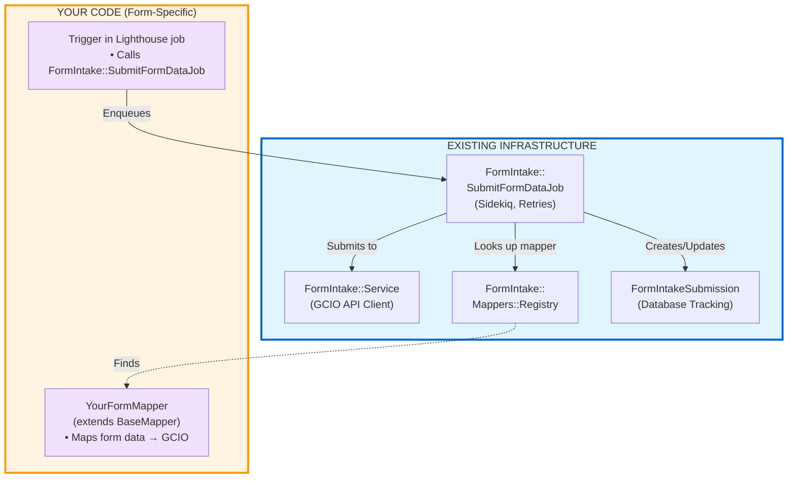
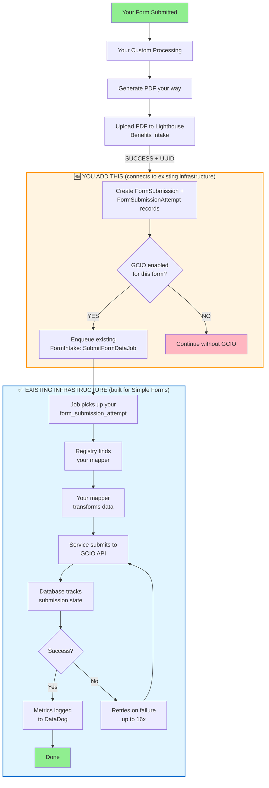

# Non-Simple Forms Integration Guide for GCIO

> ## 💡 Key Concept: You're Extending, Not Building
> 
> **The GCIO integration infrastructure is already built and running for Simple Forms.** You're not building a new integration—you're connecting your form to the existing system.
> 
> **What already exists** (built for Simple Forms):
> - ✅ GCIO API client (`FormIntake::Service`)
> - ✅ Sidekiq job with retry logic (`FormIntake::SubmitFormDataJob`)
> - ✅ Mapper registry and base class
> - ✅ Database tracking and state management
> - ✅ Feature flag system
> - ✅ Error handling, logging, and monitoring
> 
> **What you add** (form-specific):
> - 🆕 Your mapper (extends existing `BaseMapper`)
> - 🆕 Trigger call (calls existing job after Lighthouse upload)
> 
> **Time to integrate**: ~4-6 hours (vs weeks to build from scratch)

---

## Quick Start

**Adding any non-simple form to GCIO integration** (leveraging existing Simple Forms infrastructure):

1. Create mapper: `lib/form_intake/mappers/vba_21_526ez_mapper.rb`
2. Register it: Add one line to `registry.rb`
3. Add trigger: Integrate GCIO submission into your form's Lighthouse upload flow
4. Configure: Add to `ELIGIBLE_FORMS` and `FORM_FEATURE_FLAGS`
5. Add feature flag: `config/features.yml`
6. Write tests: `spec/lib/form_intake/mappers/vba_21_526ez_mapper_spec.rb`
7. Enable: `Flipper.enable_percentage_of_actors(:form_intake_integration_526ez, 1)`

**Time estimate**: ~4-6 hours per form (mapper + trigger + tests)

**Changes needed**: Your form's Lighthouse submission flow (wherever you upload to Benefits Intake API)

---

## Overview

**Good news**: The GCIO integration infrastructure was already built for Simple Forms and is ready to use! 

For non-simple forms, you're **reusing the same infrastructure** that Simple Forms use. You just need to:
1. **Create a mapper** that transforms your form's data to GCIO JSON format (same as Simple Forms)
2. **Add a trigger** to connect your form to the existing GCIO pipeline

This guide applies to any form that doesn't use the Simple Forms API architecture.

---

## What Simple Forms Already Built (That You'll Reuse)

The Simple Forms GCIO integration (already implemented and in production) created these components that **you will reuse**:

> 💡 **Key Insight**: You don't need to build any of this! It's already running in production for Simple Forms.

| Component | What It Does | You Use It By... |
|-----------|--------------|------------------|
| `FormIntake::SubmitFormDataJob` | Async Sidekiq job with retry logic | Calling `perform_async(form_submission_attempt.id)` |
| `FormIntake::Service` | GCIO API client (handles HTTP, auth, errors) | Automatically used by the job |
| `FormIntake::Mappers::Registry` | Finds the right mapper for each form | Registering your mapper |
| `FormIntake::Mappers::BaseMapper` | Base class with helper methods | Inheriting from it |
| `FormIntakeSubmission` | Database tracking with state machine | Automatically created by the job |
| Feature flag system | Per-form rollout control | Using `FormIntake.enabled_for_form?` |
| Error handling | Retries, logging, metrics | Built into the job |

**You don't build any of this** - it's ready to use!

### Visual: What You're Adding to Existing Infrastructure



**You add ~150 lines of code to leverage thousands of lines of existing infrastructure!**

---

## What Are "Non-Simple Forms"?

**Simple Forms** use the Simple Forms API (`SimpleFormsApi::V1::UploadsController`) with automatic GCIO integration.

**Non-Simple Forms** include:
- ✅ SavedClaim-based forms (21-526EZ, 21P-527EZ, 21-4142)
- ✅ Module-specific forms (Burials, Pensions, Dependents Verification)
- ✅ Custom form implementations
- ✅ Any form with custom Lighthouse integration
- ✅ Forms that don't use FormSubmissionAttempt callbacks

**Key difference**: You control when/how the GCIO integration is triggered.

---

## Simple Forms vs Non-Simple Forms: Both Use Same Infrastructure

| Step | Simple Forms (Done) | Non-Simple Forms (You) | Infrastructure |
|------|---------------------|------------------------|----------------|
| **1. Build GCIO API client** | ✅ Already built | ✅ **Reuse** `FormIntake::Service` | Shared |
| **2. Build Sidekiq job** | ✅ Already built | ✅ **Reuse** `FormIntake::SubmitFormDataJob` | Shared |
| **3. Build mapper system** | ✅ Already built | ✅ **Reuse** `Mappers::Registry` + `BaseMapper` | Shared |
| **4. Build database tracking** | ✅ Already built | ✅ **Reuse** `FormIntakeSubmission` model | Shared |
| **5. Build feature flags** | ✅ Already built | ✅ **Reuse** `FormIntake.enabled_for_form?` | Shared |
| **6. Create form mapper** | ✅ Done for their forms | 🆕 **You create yours** | Per-form |
| **7. Add trigger** | ✅ Auto-callback | 🆕 **You add manual call** | Per-form |

**Key Takeaway**: Steps 1-5 (the hard parts) are already done. You only do steps 6-7!

---

## Architecture Comparison

| Aspect | Simple Forms | Non-Simple Forms (You) |
|--------|-------------|------------------------|
| **GCIO Infrastructure** | ✅ Built and in use | ✅ **Reuse the same infrastructure** |
| **API Endpoint** | `/simple_forms_api/v1/uploads` | Custom endpoints |
| **GCIO Trigger** | Automatic (`FormSubmissionAttempt.after_commit`) | Manual (you add ~30 lines of code) |
| **Trigger Location** | Built-in callback | Your Lighthouse upload code |
| **Integration Effort** | 2-4 hours (mapper only) | 4-6 hours (mapper + trigger) |
| **What You Build** | Mapper | Mapper + trigger connection |
| **What You Reuse** | Everything else | Everything else |

---

## How It Works



**Existing infrastructure you'll reuse** (built for Simple Forms):
- ✅ `FormIntake::SubmitFormDataJob` - Sidekiq job with retry logic
- ✅ `FormIntake::Service` - GCIO API client
- ✅ `FormIntake::Mappers::Registry` - Mapper discovery
- ✅ `FormIntake::Mappers::BaseMapper` - Base class with helpers
- ✅ `FormIntakeSubmission` - Database tracking with AASM
- ✅ Feature flag system - Per-form control
- ✅ Error handling - Retries, logging, metrics

**What you add** (connects your form to existing infrastructure):
1. Your form's mapper (inherits from existing `BaseMapper`)
2. Trigger code (~30 lines to enqueue the existing job)

---

## Adding Your Form to GCIO (5 Steps)

### Prerequisites

Before starting, ensure:
- [ ] Your form successfully uploads PDFs to Lighthouse Benefits Intake
- [ ] You have sample form data for testing
- [ ] You know the GCIO API format for your form type
- [ ] You know where in your code the Lighthouse upload happens
- [ ] Feature flag name decided (e.g., `form_intake_integration_526ez` for 21-526EZ)

---

### Step 1: Create Your Form Mapper (Reuse BaseMapper)

Create a mapper in `lib/form_intake/mappers/` that inherits from the **existing** `BaseMapper` class (built for Simple Forms).

**Example: Disability Compensation Form**

```ruby
# lib/form_intake/mappers/vba_21_526ez_mapper.rb
# frozen_string_literal: true

module FormIntake
  module Mappers
    class Vba21526ezMapper < BaseMapper
      FORM_NUMBER = '21-526EZ'

      def to_gcio_payload
        {
          form_number: FORM_NUMBER,
          benefits_intake_uuid: benefits_intake_uuid,
          submission_date: submission_date,
          
          # Veteran information
          veteran: veteran_info,
          
          # Form-specific data
          disabilities: map_disabilities,
          service_information: service_info,
          treatment_records: map_treatment_records
        }.compact
      end

      private

      def veteran_info
        {
          first_name: form_data.dig('veteranFullName', 'first'),
          last_name: form_data.dig('veteranFullName', 'last'),
          middle_name: form_data.dig('veteranFullName', 'middle'),
          ssn: form_data['veteranSocialSecurityNumber'],
          date_of_birth: form_data['veteranDateOfBirth']
        }.compact
      end

      def map_disabilities
        return [] unless form_data['disabilities'].present?

        form_data['disabilities'].map do |disability|
          {
            name: disability['name'],
            disability_type: disability['disabilityType'],
            approximate_date: disability['approximateDate']
          }.compact
        end
      end

      def service_info
        {
          branch: form_data.dig('serviceInformation', 'serviceBranch'),
          service_start_date: form_data.dig('serviceInformation', 'serviceStartDate'),
          service_end_date: form_data.dig('serviceInformation', 'serviceEndDate')
        }.compact
      end

      def map_treatment_records
        return [] unless form_data['treatments'].present?

        form_data['treatments'].map do |treatment|
          {
            facility_name: treatment['facilityName'],
            treatment_start_date: treatment['startDate'],
            treatment_end_date: treatment['endDate']
          }.compact
        end
      end

      def submission_date
        form_submission&.created_at&.iso8601
      end
    end
  end
end
```

**Key Points**:
- ✅ Inherit from **existing** `FormIntake::Mappers::BaseMapper` (same as Simple Forms)
- ✅ Implement `to_gcio_payload` method (same pattern as Simple Forms)
- ✅ Use helper methods to keep code organized
- ✅ Use `.compact` to remove nil values
- ✅ Access form data via `form_data` hash (parsed JSON)
- ✅ Available methods from BaseMapper: `form_type`, `benefits_intake_uuid`, `user_account`, `form_submission`

**This is the exact same pattern Simple Forms use!** Look at `Vba21p601Mapper` or `Vba210966Mapper` for examples.

---

### Step 2: Register Your Mapper (Use Existing Registry)

Add one line to the **existing** mapper registry (same registry Simple Forms use).

```ruby
# lib/form_intake/mappers/registry.rb
# This file already exists with Simple Forms mappers
module FormIntake
  module Mappers
    class Registry
      MAPPERS = {
        # Existing Simple Forms (already in registry)
        '21P-601' => 'FormIntake::Mappers::Vba21p601Mapper',
        '21-0966' => 'FormIntake::Mappers::Vba210966Mapper',
        '20-10207' => 'FormIntake::Mappers::Vba2010207Mapper',
        
        # === ADD YOUR NON-SIMPLE FORM HERE ===
        '21-526EZ' => 'FormIntake::Mappers::Vba21526ezMapper', # <-- ADD THIS LINE
        # =====================================
      }.freeze

      # This lookup logic already exists - you don't modify it
      def self.for(form_type)
        mapper_class_name = MAPPERS[form_type]
        return nil unless mapper_class_name

        mapper_class_name.constantize
      rescue NameError => e
        Rails.logger.error("FormIntake mapper not found: #{mapper_class_name} - #{e.message}")
        nil
      end
    end
  end
end
```

**What's happening**:
- The registry already exists (built for Simple Forms)
- Simple Form mappers are already registered
- You're just adding your form to the same registry
- The lookup logic (`self.for`) already exists and works for your form too

---

### Step 3: Add Trigger to Your Lighthouse Upload Code

This is **the key difference from Simple Forms** - connecting your form to the existing GCIO pipeline.

Simple Forms have an automatic callback that triggers GCIO submission. For non-simple forms, you add this trigger manually in your code.

#### Required: FormSubmission and FormSubmissionAttempt

The **existing** GCIO job (`FormIntake::SubmitFormDataJob`) needs these records to exist. If your form doesn't already create them, you'll add that in the trigger code below.

#### Universal Trigger Pattern

Add this code **after successful Lighthouse upload** in your form's submission flow.

This code **connects your form to the existing GCIO infrastructure** (built for Simple Forms):

```ruby
# After successful Lighthouse upload
if lighthouse_response.success?
  # 1. Ensure FormSubmission + FormSubmissionAttempt exist
  form_submission_attempt = ensure_gcio_records(
    form_type: 'YOUR-FORM-ID',
    form_data: your_form_data_json,
    benefits_intake_uuid: lighthouse_uuid,
    user_account: user_account_if_available
  )
  
  # 2. Trigger GCIO submission if enabled (uses existing infrastructure)
  trigger_gcio_submission(form_submission_attempt)
end

private

# Creates records needed by the existing GCIO job
def ensure_gcio_records(form_type:, form_data:, benefits_intake_uuid:, user_account: nil, saved_claim: nil)
  # Create FormSubmission if it doesn't exist
  form_submission = FormSubmission.find_or_create_by!(
    form_type: form_type,
    # Use saved_claim association if available, otherwise just store form_data
    saved_claim_id: saved_claim&.id
  ) do |fs|
    fs.form_data = form_data.is_a?(String) ? form_data : form_data.to_json
    fs.saved_claim = saved_claim if saved_claim
  end

  # Create FormSubmissionAttempt
  FormSubmissionAttempt.find_or_create_by!(
    form_submission: form_submission,
    benefits_intake_uuid: benefits_intake_uuid
  )
rescue => e
  Rails.logger.error(
    "Failed to create GCIO records: #{e.message}",
    { form_type: form_type, benefits_intake_uuid: benefits_intake_uuid }
  )
  nil
end

# Enqueues the existing GCIO job (same job Simple Forms use)
def trigger_gcio_submission(form_submission_attempt)
  return unless form_submission_attempt&.id
  
  # Use existing feature flag helper (built for Simple Forms)
  return unless FormIntake.enabled_for_form?(
    form_submission_attempt.form_submission.form_type,
    form_submission_attempt.form_submission.user_account
  )

  Rails.logger.info(
    'Enqueuing GCIO form intake job',
    {
      form_submission_attempt_id: form_submission_attempt.id,
      form_type: form_submission_attempt.form_submission.form_type,
      benefits_intake_uuid: form_submission_attempt.benefits_intake_uuid
    }
  )

  # Enqueue the EXISTING GCIO job (built for Simple Forms, works for all forms)
  FormIntake::SubmitFormDataJob.perform_async(form_submission_attempt.id)
rescue => e
  # Non-blocking: Log error but don't fail the main flow
  Rails.logger.error(
    'Failed to enqueue GCIO submission',
    {
      error: e.message,
      form_submission_attempt_id: form_submission_attempt&.id
    }
  )
  StatsD.increment('form_intake.enqueue.failure')
end
```

#### Where to Add This Code

The trigger location depends on your form's architecture:

##### Example A: Sidekiq Job (Most Common)

```ruby
# app/sidekiq/lighthouse/submit_benefits_intake_claim.rb
module Lighthouse
  class SubmitBenefitsIntakeClaim
    include Sidekiq::Job

    def perform(saved_claim_id)
      @claim = SavedClaim.find(saved_claim_id)
      
      # Generate and upload PDF
      pdf_path = generate_pdf(@claim)
      response = lighthouse_service.upload_doc(pdf_path)
      
      raise BenefitsIntakeClaimError, response.body unless response.success?
      
      # === ADD GCIO TRIGGER HERE ===
      form_submission_attempt = ensure_gcio_records(
        form_type: @claim.form_id,
        form_data: @claim.form,
        benefits_intake_uuid: lighthouse_service.uuid,
        user_account: @claim.user_account,
        saved_claim: @claim
      )
      trigger_gcio_submission(form_submission_attempt)
      # =============================
      
      send_confirmation_email
      lighthouse_service.uuid
    end
    
    # Add the helper methods here (ensure_gcio_records, trigger_gcio_submission)
  end
end
```

##### Example B: Service Class

```ruby
# app/services/my_form/submission_service.rb
module MyForm
  class SubmissionService
    def submit(form_data, user)
      # Your existing submission logic
      pdf = generate_pdf(form_data)
      lighthouse_response = upload_to_lighthouse(pdf)
      
      if lighthouse_response.success?
        # === ADD GCIO TRIGGER HERE ===
        form_submission_attempt = ensure_gcio_records(
          form_type: 'MY-FORM-ID',
          form_data: form_data,
          benefits_intake_uuid: lighthouse_response.uuid,
          user_account: user.user_account
        )
        trigger_gcio_submission(form_submission_attempt)
        # =============================
      end
      
      lighthouse_response
    end
    
    # Add the helper methods here
  end
end
```

##### Example C: Controller (Direct Integration)

```ruby
# app/controllers/my_form/submissions_controller.rb
class MyForm::SubmissionsController < ApplicationController
  def create
    form_data = params[:form]
    
    # Your existing logic
    pdf = MyForm::PdfGenerator.new(form_data).generate
    lighthouse_response = lighthouse_service.upload(pdf)
    
    if lighthouse_response.success?
      # === ADD GCIO TRIGGER HERE ===
      form_submission_attempt = ensure_gcio_records(
        form_type: 'MY-FORM-ID',
        form_data: form_data.to_json,
        benefits_intake_uuid: lighthouse_response.uuid,
        user_account: current_user&.user_account
      )
      trigger_gcio_submission(form_submission_attempt)
      # =============================
    end
    
    render json: { status: 'success' }
  end
  
  private
  
  # Add the helper methods here
end
```

##### Example D: Module-Specific Job

```ruby
# modules/burials/lib/burials/benefits_intake/submit_claim_job.rb
module Burials
  module BenefitsIntake
    class SubmitClaimJob
      include Sidekiq::Job

      def perform(saved_claim_id, user_account_uuid = nil)
        @claim = Burials::SavedClaim.find(saved_claim_id)
        @user_account = UserAccount.find(user_account_uuid) if user_account_uuid
        
        # Generate and upload
        form_path = @claim.to_pdf
        response = intake_service.upload(form_path)
        
        # === ADD GCIO TRIGGER HERE ===
        if response.success?
          form_submission_attempt = ensure_gcio_records(
            form_type: @claim.form_id,
            form_data: @claim.form,
            benefits_intake_uuid: intake_service.uuid,
            user_account: @user_account,
            saved_claim: @claim
          )
          trigger_gcio_submission(form_submission_attempt)
        end
        # =============================
        
        send_email
      end
      
      # Add helper methods here
    end
  end
end
```

**Critical Requirements**:
1. ✅ Only trigger **after successful** Lighthouse upload
2. ✅ Wrap in rescue block (non-blocking - don't fail main flow)
3. ✅ Check feature flag via **existing** `FormIntake.enabled_for_form?` helper
4. ✅ Ensure `FormSubmission` and `FormSubmissionAttempt` exist (needed by existing job)
5. ✅ Pass `form_submission_attempt.id` to **existing** GCIO job
6. ✅ Include `benefits_intake_uuid` (the Lighthouse UUID for correlation)

**Once you enqueue the job, the existing GCIO infrastructure takes over** - no other code needed!

---

### Step 4: Configure Form in FormIntake Module (Existing Module)

Add your form to the **existing** `FormIntake` module's eligible forms list (same list Simple Forms use).

```ruby
# lib/form_intake.rb
# This module already exists with Simple Forms configuration
module FormIntake
  ELIGIBLE_FORMS = [
    # Existing Simple Forms (already here)
    '21P-601',
    '21-0966',
    '20-10207',
    
    # === ADD YOUR NON-SIMPLE FORM HERE ===
    '21-526EZ', # <-- ADD YOUR FORM
    # =====================================
  ].freeze

  FORM_FEATURE_FLAGS = {
    # Existing Simple Forms flags (already here)
    '21P-601' => :form_intake_integration_601,
    '21-0966' => :form_intake_integration_0966,
    '20-10207' => :form_intake_integration_10207,
    
    # === ADD YOUR FORM'S FLAG HERE ===
    '21-526EZ' => :form_intake_integration_526ez, # <-- ADD YOUR FLAG
    # ==================================
  }.freeze

  # This method already exists - you don't modify it
  # It works for both Simple Forms and your non-simple form
  def self.enabled_for_form?(form_type, user_account = nil)
    return false unless ELIGIBLE_FORMS.include?(form_type)

    flag = FORM_FEATURE_FLAGS[form_type]
    return false unless flag

    if user_account
      Flipper.enabled?(flag, user_account)
    else
      Flipper.enabled?(flag)
    end
  end
end
```

**What's happening**:
- The `FormIntake` module already exists
- Simple Forms are already configured here
- The `enabled_for_form?` method already exists and works for all forms
- You're just adding your form to the same configuration

---

### Step 5: Add Feature Flag (Same System as Simple Forms)

Add your feature flag to the **existing** `features.yml` (same file Simple Forms use).

```yaml
# config/features.yml
features:
  # ... existing flags ...
  
  form_intake_integration_526ez:
    actor_type: user_account
    description: >
      Enable GCIO form intake integration for 21-526EZ disability compensation claims.
      When enabled, sends structured JSON to GCIO immediately after successful Lighthouse upload.
```

---

### Step 6: Write Tests

#### Test Your Mapper

```ruby
# spec/lib/form_intake/mappers/vba_21_526ez_mapper_spec.rb
require 'rails_helper'

RSpec.describe FormIntake::Mappers::Vba21526ezMapper do
  let(:user_account) { create(:user_account) }
  let(:form_submission) do
    create(:form_submission,
           form_type: '21-526EZ',
           form_data: sample_form_json)
  end
  let(:form_submission_attempt) do
    create(:form_submission_attempt,
           form_submission: form_submission,
           benefits_intake_uuid: 'test-uuid-123')
  end

  let(:mapper) { described_class.new(form_submission_attempt) }
  let(:sample_form_json) do
    {
      veteranFullName: { first: 'John', last: 'Doe' },
      veteranSocialSecurityNumber: '123456789',
      disabilities: [
        { name: 'PTSD', disabilityType: 'NEW' }
      ]
    }.to_json
  end

  describe '#to_gcio_payload' do
    let(:payload) { mapper.to_gcio_payload }

    it 'returns required fields' do
      expect(payload[:form_number]).to eq('21-526EZ')
      expect(payload[:benefits_intake_uuid]).to eq('test-uuid-123')
      expect(payload[:veteran]).to be_present
    end

    it 'maps veteran information correctly' do
      expect(payload[:veteran][:first_name]).to eq('John')
      expect(payload[:veteran][:last_name]).to eq('Doe')
    end

    it 'maps disabilities array' do
      expect(payload[:disabilities]).to be_an(Array)
      expect(payload[:disabilities].first[:name]).to eq('PTSD')
    end
  end
end
```

#### Test Your Trigger

Test wherever you added the GCIO trigger:

```ruby
# spec/sidekiq/your_lighthouse_job_spec.rb (or wherever you added the trigger)
RSpec.describe YourLighthouseJob do
  let(:form_data) { { test: 'data' }.to_json }
  let(:user_account) { create(:user_account) }

  before do
    # Mock Lighthouse service
    allow_any_instance_of(LighthouseService).to receive(:upload).and_return(
      double(success?: true, uuid: 'test-uuid-123')
    )
  end

  context 'when GCIO integration is enabled' do
    before do
      Flipper.enable(:form_intake_integration_yourform, user_account)
    end

    it 'enqueues GCIO submission job after successful upload' do
      expect(FormIntake::SubmitFormDataJob).to receive(:perform_async)
      
      described_class.new.perform(test_data)
    end

    it 'creates FormSubmission and FormSubmissionAttempt' do
      expect {
        described_class.new.perform(test_data)
      }.to change(FormSubmission, :count).by(1)
       .and change(FormSubmissionAttempt, :count).by(1)
    end
  end

  context 'when feature flag is disabled' do
    before do
      Flipper.disable(:form_intake_integration_yourform)
    end

    it 'does not enqueue GCIO job' do
      expect(FormIntake::SubmitFormDataJob).not_to receive(:perform_async)
      
      described_class.new.perform(test_data)
    end
  end

  context 'when GCIO enqueue fails' do
    before do
      Flipper.enable(:form_intake_integration_yourform, user_account)
      allow(FormIntake::SubmitFormDataJob).to receive(:perform_async).and_raise('Error')
    end

    it 'does not fail the main job' do
      expect {
        described_class.new.perform(test_data)
      }.not_to raise_error
    end

    it 'logs the error' do
      expect(Rails.logger).to receive(:error).with(/Failed to enqueue GCIO submission/)
      described_class.new.perform(test_data)
    end
  end
end
```

---

## Testing Your Integration

You'll test the same way Simple Forms do, plus testing your trigger code.

### 1. Unit Test Your Mapper (Same as Simple Forms)

```bash
bundle exec rspec spec/lib/form_intake/mappers/your_mapper_spec.rb
```

**Note**: Look at Simple Forms mapper tests for examples (`vba_21p_601_mapper_spec.rb`)

### 2. Test in Rails Console (Development - Same as Simple Forms)

```ruby
# Test mapper directly (same way Simple Forms test)
form_submission = FormSubmission.create(
  form_type: 'YOUR-FORM-ID',
  form_data: test_form_json
)

attempt = FormSubmissionAttempt.create(
  form_submission: form_submission,
  benefits_intake_uuid: 'test-uuid-123'
)

# Your mapper uses the same BaseMapper as Simple Forms
mapper = FormIntake::Mappers::YourMapper.new(attempt)
payload = mapper.to_gcio_payload

# Inspect payload
pp payload

# Verify it can be processed by existing GCIO job
FormIntake::SubmitFormDataJob.new.perform(attempt.id)  # Dry run
```

### 3. Test End-to-End (Staging - Same as Simple Forms)

```ruby
# Enable for test user (same feature flag system as Simple Forms)
user = UserAccount.find_by(icn: 'your-test-icn')
Flipper.enable_actor(:form_intake_integration_yourform, user)

# Submit a test form through your normal flow
# The existing GCIO infrastructure will process it

# Check logs for "Enqueuing GCIO form intake job"
# Check Sidekiq for FormIntake::SubmitFormDataJob (same job Simple Forms use)
# Check database (same tables Simple Forms use)
FormIntakeSubmission.where(form_type: 'YOUR-FORM-ID').last

# Monitor the same way Simple Forms are monitored
# Same DataDog metrics, same Sidekiq dashboard, same database queries
```

---

## Common Patterns

### Handling Complex Nested Data

```ruby
def map_nested_array(array_key)
  return [] unless form_data[array_key].present?
  
  form_data[array_key].map do |item|
    yield(item)
  end
end

def map_treatment_records
  map_nested_array('treatments') do |treatment|
    {
      facility_name: treatment['facilityName'],
      start_date: treatment['startDate']
    }.compact
  end
end
```

### Handling Conditional Sections

```ruby
def direct_deposit_info
  return nil unless form_data['useDirectDeposit'] == true
  
  {
    account_type: form_data.dig('directDeposit', 'accountType'),
    account_number: form_data.dig('directDeposit', 'accountNumber')
  }.compact
end
```

### Date Formatting

```ruby
def format_date(date_string)
  return nil unless date_string.present?
  Date.parse(date_string).iso8601
rescue ArgumentError
  nil
end
```

---

## FAQ

### Q: What existing infrastructure am I reusing?
**A:** Everything except the trigger! You're using the same Sidekiq job, API client, mapper base class, database tables, feature flags, and monitoring that Simple Forms use. You just add ~30 lines of trigger code and your mapper.

### Q: Can I look at Simple Forms code as examples?
**A:** Absolutely! Check out:
- Mappers: `lib/form_intake/mappers/vba_21p_601_mapper.rb`
- Tests: `spec/lib/form_intake/mappers/vba_21p_601_mapper_spec.rb`
- Job: `app/sidekiq/form_intake/submit_form_data_job.rb` (you use this directly)
- Service: `app/services/form_intake/service.rb` (you use this directly)

### Q: Where exactly should I add the trigger code?
**A:** Wherever you currently upload to Lighthouse. Look for code that calls the Benefits Intake API and add the trigger after successful response.

### Q: What if I don't use Sidekiq for my form?
**A:** Your form can use any processing approach. The GCIO job (which you call) uses Sidekiq, but your trigger can be in a controller, service, or wherever you need it.

### Q: Do I need to modify my controller?
**A:** Possibly. It depends on where your Lighthouse upload happens. If it's in a background job, no controller changes needed.

### Q: What if the existing GCIO job fails?
**A:** It retries 16 times (same as Simple Forms). Your form submission still succeeds - GCIO is non-blocking. Errors are logged and monitored the same way Simple Forms are.

### Q: My form doesn't create FormSubmission records. Do I need to?
**A:** Yes. The existing GCIO job requires these records to exist. Use the `ensure_gcio_records` helper provided in Step 3.

### Q: Can I test without affecting production?
**A:** Yes. Use the same percentage-based feature flags Simple Forms use. Start with 1%, monitor, then increase gradually.

### Q: What if GCIO doesn't support my form yet?
**A:** Don't add it to `ELIGIBLE_FORMS`. Your form continues to work normally with Lighthouse only.

### Q: How do I monitor my form's GCIO submissions?
**A:** Use the same monitoring Simple Forms use:
- DataDog metrics: `gcio.submit_form_data_job.*`
- Database: `FormIntakeSubmission` table
- Sidekiq dashboard: `FormIntake::SubmitFormDataJob` queue
- Same dashboards, same queries, same alerts

---

## Rollout Strategy

See **[ROLLOUT-STRATEGY.md](./ROLLOUT-STRATEGY.md)** for detailed guidance.

**TL;DR**:
1. **Week 1**: Enable for 1% of users, monitor closely
2. **Week 2**: Increase to 10% → 25% → 50%
3. **Week 3**: Enable for 100%
4. **Monitor**: DataDog metrics, database state, logs

---

## Architecture References

- **[Integration Comparison](./INTEGRATION-COMPARISON.md)** - Simple vs Non-Simple forms
- **[C4 Diagrams](./c4-diagrams.md)** - Visual architecture
- **[ADR-001](./adrs/001-submission-trigger-mechanism.md)** - Why trigger after Lighthouse
- **[Simple Forms Guide](./SIMPLE-FORMS-INTEGRATION.md)** - Comparison reference
- **[README](./README.md)** - Overview

---

## Complete Example: Authorization Form

Here's a complete example for a common form type:

```ruby
# lib/form_intake/mappers/vba_21_4142_mapper.rb
module FormIntake
  module Mappers
    class Vba214142Mapper < BaseMapper
      FORM_NUMBER = '21-4142'

      def to_gcio_payload
        {
          form_number: FORM_NUMBER,
          benefits_intake_uuid: benefits_intake_uuid,
          submission_date: form_submission&.created_at&.iso8601,
          
          veteran: {
            first_name: form_data.dig('veteranFullName', 'first'),
            last_name: form_data.dig('veteranFullName', 'last'),
            ssn: form_data['veteranSocialSecurityNumber']
          }.compact,
          
          authorization: {
            start_date: form_data['authorizationStartDate'],
            end_date: form_data['authorizationEndDate'],
            purpose: form_data['purposeOfAuthorization']
          }.compact,
          
          medical_providers: map_medical_providers
        }.compact
      end

      private

      def map_medical_providers
        return [] unless form_data['medicalProviders'].present?

        form_data['medicalProviders'].map do |provider|
          {
            name: provider['name'],
            address: map_address(provider['address']),
            phone: provider['phone']
          }.compact
        end
      end

      def map_address(address)
        return nil unless address.present?

        {
          street: address['street'],
          city: address['city'],
          state: address['state'],
          zip_code: address['zipCode']
        }.compact
      end
    end
  end
end
```

---

## That's It!

Your form is now integrated with GCIO using the **existing infrastructure** built for Simple Forms.

**The existing infrastructure handles** (you get this for free):
- ✅ Async job processing with retries (FormIntake::SubmitFormDataJob)
- ✅ GCIO API communication (FormIntake::Service)
- ✅ Error handling and logging
- ✅ Database tracking (FormIntakeSubmission)
- ✅ Metrics and monitoring (DataDog)
- ✅ Feature flag control (FormIntake module)
- ✅ State machine (pending → submitted → success/failed)
- ✅ Retry logic (up to 16 retries)

**You provided** (connects your form to existing infrastructure):
- ✅ Form-specific mapping logic (your mapper class)
- ✅ Trigger in your submission flow (~30 lines of code)

Your form now benefits from all improvements made to the GCIO infrastructure! 🎉
