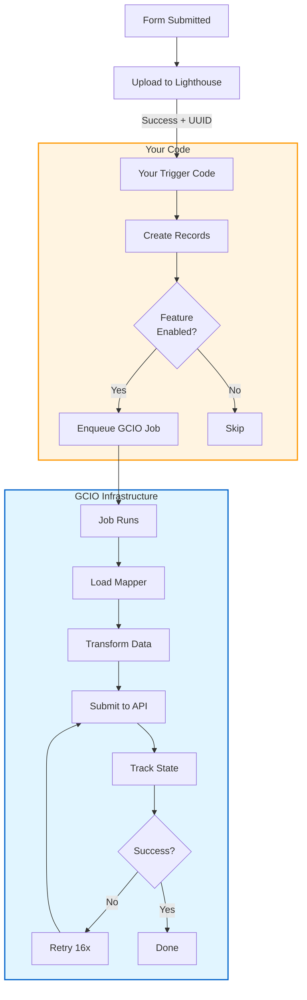

# Non-Simple Forms Integration Guide for GCIO

## Overview

This guide shows you how to integrate any non-simple form with the GCIO digitization API. The integration sends structured JSON data to GCIO immediately after successful Lighthouse PDF upload, enabling IBM Mail Automation to process forms with enhanced accuracy.

**Prerequisites**:
- Your form successfully uploads PDFs to Lighthouse Benefits Intake
- You have sample form data for testing
- You know the GCIO API format for your form type
- You know where in your code the Lighthouse upload happens

**Time estimate**: 4-6 hours per form

---

## What You'll Build

You'll add two components:

1. **Mapper**: Transforms your form data into GCIO JSON format
2. **Trigger**: Calls the GCIO submission job after Lighthouse upload succeeds

Both plug into existing infrastructure that handles API communication, retries, error handling, and monitoring.

---

## Integration Steps

### Step 1: Create Your Form Mapper

Create a mapper class that transforms your form data to GCIO's expected format.

**File**: `lib/form_intake/mappers/vba_21_526ez_mapper.rb`

```ruby
# frozen_string_literal: true

module FormIntake
  module Mappers
    class Vba21526ezMapper < BaseMapper
      FORM_NUMBER = '21-526EZ'

      def to_gcio_payload
        {
          form_number: FORM_NUMBER,
          benefits_intake_uuid: benefits_intake_uuid,
          submission_date: submission_date,
          veteran: veteran_info,
          disabilities: map_disabilities,
          service_information: service_info
        }.compact
      end

      private

      def veteran_info
        {
          first_name: form_data.dig('veteranFullName', 'first'),
          last_name: form_data.dig('veteranFullName', 'last'),
          ssn: form_data['veteranSocialSecurityNumber'],
          date_of_birth: form_data['veteranDateOfBirth']
        }.compact
      end

      def map_disabilities
        return [] unless form_data['disabilities'].present?

        form_data['disabilities'].map do |disability|
          {
            name: disability['name'],
            disability_type: disability['disabilityType'],
            approximate_date: disability['approximateDate']
          }.compact
        end
      end

      def service_info
        {
          branch: form_data.dig('serviceInformation', 'serviceBranch'),
          service_start_date: form_data.dig('serviceInformation', 'serviceStartDate'),
          service_end_date: form_data.dig('serviceInformation', 'serviceEndDate')
        }.compact
      end

      def submission_date
        form_submission&.created_at&.iso8601
      end
    end
  end
end
```

**Key points**:
- Inherit from `BaseMapper`
- Implement `to_gcio_payload` method
- Use `.compact` to remove nil values
- Access data via `form_data`, `form_type`, `benefits_intake_uuid`, `user_account`, `form_submission`

---

### Step 2: Register Your Mapper

Add your mapper to the registry so the GCIO job can find it.

**File**: `lib/form_intake/mappers/registry.rb`

```ruby
module FormIntake
  module Mappers
    class Registry
      MAPPERS = {
        '21P-601' => 'FormIntake::Mappers::Vba21p601Mapper',
        '21-0966' => 'FormIntake::Mappers::Vba210966Mapper',
        '21-526EZ' => 'FormIntake::Mappers::Vba21526ezMapper', # <-- Add this line
      }.freeze

      def self.for(form_type)
        mapper_class_name = MAPPERS[form_type]
        return nil unless mapper_class_name

        mapper_class_name.constantize
      rescue NameError => e
        Rails.logger.error("FormIntake mapper not found: #{mapper_class_name} - #{e.message}")
        nil
      end
    end
  end
end
```

---

### Step 3: Add Trigger After Lighthouse Upload

Add code that enqueues the GCIO job after successful Lighthouse upload.

#### Choose Your Integration Point

Find where your form uploads to Lighthouse and add the trigger there. Common locations:

**Option A: Sidekiq Job** (most common)
**Option B: Service Class**
**Option C: Controller**
**Option D: Module-Specific Job**

#### Add These Two Helper Methods

Add these methods wherever you're adding the trigger:

```ruby
private

# Creates records needed by GCIO job
def ensure_gcio_records(form_type:, form_data:, benefits_intake_uuid:, user_account: nil, saved_claim: nil)
  form_submission = FormSubmission.find_or_create_by!(
    form_type: form_type,
    saved_claim_id: saved_claim&.id
  ) do |fs|
    fs.form_data = form_data.is_a?(String) ? form_data : form_data.to_json
    fs.saved_claim = saved_claim if saved_claim
  end

  FormSubmissionAttempt.find_or_create_by!(
    form_submission: form_submission,
    benefits_intake_uuid: benefits_intake_uuid
  )
rescue => e
  Rails.logger.error(
    "Failed to create GCIO records: #{e.message}",
    { form_type: form_type, benefits_intake_uuid: benefits_intake_uuid }
  )
  nil
end

# Enqueues GCIO submission job
def trigger_gcio_submission(form_submission_attempt)
  return unless form_submission_attempt&.id
  return unless FormIntake.enabled_for_form?(
    form_submission_attempt.form_submission.form_type,
    form_submission_attempt.form_submission.user_account
  )

  Rails.logger.info(
    'Enqueuing GCIO form intake job',
    {
      form_submission_attempt_id: form_submission_attempt.id,
      form_type: form_submission_attempt.form_submission.form_type,
      benefits_intake_uuid: form_submission_attempt.benefits_intake_uuid
    }
  )

  FormIntake::SubmitFormDataJob.perform_async(form_submission_attempt.id)
rescue => e
  Rails.logger.error('Failed to enqueue GCIO submission', { error: e.message })
  StatsD.increment('form_intake.enqueue.failure')
end
```

#### Call the Trigger After Lighthouse Success

**Example: In a Sidekiq Job**

```ruby
# app/sidekiq/lighthouse/submit_benefits_intake_claim.rb
module Lighthouse
  class SubmitBenefitsIntakeClaim
    include Sidekiq::Job

    def perform(saved_claim_id)
      @claim = SavedClaim.find(saved_claim_id)
      
      # Your existing Lighthouse upload code
      pdf_path = generate_pdf(@claim)
      response = lighthouse_service.upload_doc(pdf_path)
      raise BenefitsIntakeClaimError unless response.success?
      
      # === ADD THIS ===
      if response.success?
        form_submission_attempt = ensure_gcio_records(
          form_type: @claim.form_id,
          form_data: @claim.form,
          benefits_intake_uuid: lighthouse_service.uuid,
          user_account: @claim.user_account,
          saved_claim: @claim
        )
        trigger_gcio_submission(form_submission_attempt)
      end
      # ================
      
      send_confirmation_email
      lighthouse_service.uuid
    end
    
    # Add helper methods here (ensure_gcio_records, trigger_gcio_submission)
  end
end
```

**Example: In a Service Class**

```ruby
# app/services/my_form/submission_service.rb
module MyForm
  class SubmissionService
    def submit(form_data, user)
      pdf = generate_pdf(form_data)
      response = upload_to_lighthouse(pdf)
      
      # === ADD THIS ===
      if response.success?
        form_submission_attempt = ensure_gcio_records(
          form_type: 'MY-FORM-ID',
          form_data: form_data,
          benefits_intake_uuid: response.uuid,
          user_account: user.user_account
        )
        trigger_gcio_submission(form_submission_attempt)
      end
      # ================
      
      response
    end
    
    # Add helper methods here
  end
end
```

**Critical Requirements**:
- ✅ Only trigger after successful Lighthouse upload
- ✅ Wrap in rescue (non-blocking - don't fail main flow)
- ✅ Include `benefits_intake_uuid` for correlation
- ✅ Pass `form_submission_attempt.id` to the job

---

### Step 4: Configure Eligible Forms

Add your form to the eligible forms list.

**File**: `lib/form_intake.rb`

```ruby
module FormIntake
  ELIGIBLE_FORMS = [
    '21P-601',
    '21-0966',
    '21-526EZ', # <-- Add your form
  ].freeze

  FORM_FEATURE_FLAGS = {
    '21P-601' => :form_intake_integration_601,
    '21-0966' => :form_intake_integration_0966,
    '21-526EZ' => :form_intake_integration_526ez, # <-- Add your flag
  }.freeze

  def self.enabled_for_form?(form_type, user_account = nil)
    return false unless ELIGIBLE_FORMS.include?(form_type)
    flag = FORM_FEATURE_FLAGS[form_type]
    return false unless flag

    if user_account
      Flipper.enabled?(flag, user_account)
    else
      Flipper.enabled?(flag)
    end
  end
end
```

---

### Step 5: Add Feature Flag

Define your feature flag in the configuration.

**File**: `config/features.yml`

```yaml
features:
  form_intake_integration_526ez:
    actor_type: user_account
    description: >
      Enable GCIO form intake integration for 21-526EZ disability compensation.
      Sends structured JSON to GCIO immediately after Lighthouse upload.
```

---

### Step 6: Write Tests

#### Test Your Mapper

**File**: `spec/lib/form_intake/mappers/vba_21_526ez_mapper_spec.rb`

```ruby
require 'rails_helper'

RSpec.describe FormIntake::Mappers::Vba21526ezMapper do
  let(:form_submission) do
    create(:form_submission,
           form_type: '21-526EZ',
           form_data: { veteranFullName: { first: 'John', last: 'Doe' } }.to_json)
  end
  
  let(:attempt) do
    create(:form_submission_attempt,
           form_submission: form_submission,
           benefits_intake_uuid: 'test-uuid-123')
  end

  let(:mapper) { described_class.new(attempt) }

  describe '#to_gcio_payload' do
    let(:payload) { mapper.to_gcio_payload }

    it 'includes required fields' do
      expect(payload[:form_number]).to eq('21-526EZ')
      expect(payload[:benefits_intake_uuid]).to eq('test-uuid-123')
      expect(payload[:veteran]).to be_present
    end

    it 'maps veteran information' do
      expect(payload[:veteran][:first_name]).to eq('John')
      expect(payload[:veteran][:last_name]).to eq('Doe')
    end
  end
end
```

#### Test Your Trigger

```ruby
# spec/sidekiq/your_lighthouse_job_spec.rb
RSpec.describe YourLighthouseJob do
  let(:user_account) { create(:user_account) }

  before do
    allow_any_instance_of(LighthouseService)
      .to receive(:upload)
      .and_return(double(success?: true, uuid: 'test-uuid'))
  end

  context 'when GCIO enabled' do
    before { Flipper.enable(:form_intake_integration_yourform, user_account) }

    it 'enqueues GCIO job' do
      expect(FormIntake::SubmitFormDataJob).to receive(:perform_async)
      described_class.new.perform(test_data)
    end
  end

  context 'when GCIO disabled' do
    it 'does not enqueue GCIO job' do
      expect(FormIntake::SubmitFormDataJob).not_to receive(:perform_async)
      described_class.new.perform(test_data)
    end
  end

  context 'when trigger fails' do
    before do
      Flipper.enable(:form_intake_integration_yourform, user_account)
      allow(FormIntake::SubmitFormDataJob).to receive(:perform_async).and_raise('Error')
    end

    it 'does not fail main job' do
      expect { described_class.new.perform(test_data) }.not_to raise_error
    end
  end
end
```

---

## Testing Your Integration

### 1. Unit Test Mapper

```bash
bundle exec rspec spec/lib/form_intake/mappers/your_mapper_spec.rb
```

### 2. Test in Rails Console

```ruby
# Create test records
form_submission = FormSubmission.create(
  form_type: 'YOUR-FORM-ID',
  form_data: test_json
)

attempt = FormSubmissionAttempt.create(
  form_submission: form_submission,
  benefits_intake_uuid: 'test-uuid'
)

# Test mapper
mapper = FormIntake::Mappers::YourMapper.new(attempt)
payload = mapper.to_gcio_payload
pp payload

# Dry run job
FormIntake::SubmitFormDataJob.new.perform(attempt.id)
```

### 3. Test End-to-End in Staging

```ruby
# Enable for test user
user = UserAccount.find_by(icn: 'your-test-icn')
Flipper.enable_actor(:form_intake_integration_yourform, user)

# Submit test form through normal flow
# Check logs for "Enqueuing GCIO form intake job"
# Check database
FormIntakeSubmission.where(form_type: 'YOUR-FORM-ID').last
```

---

## Rollout

Follow a gradual rollout strategy:

### Week 1: Pilot (1%)
```ruby
Flipper.enable_percentage_of_actors(:form_intake_integration_yourform, 1)
```

**Monitor**:
- Success rate > 95%
- No impact on Lighthouse submissions
- Average processing time < 30s

### Week 2: Scale Up
```ruby
# If metrics good, increase gradually
Flipper.enable_percentage_of_actors(:form_intake_integration_yourform, 10)
# Wait 48h, monitor, then continue
Flipper.enable_percentage_of_actors(:form_intake_integration_yourform, 25)
Flipper.enable_percentage_of_actors(:form_intake_integration_yourform, 50)
```

### Week 3: Full Rollout
```ruby
Flipper.enable(:form_intake_integration_yourform)
```

---

## Monitoring

### DataDog Metrics

```ruby
# Success/failure counts
gcio.submit_form_data_job.attempt
gcio.submit_form_data_job.success
gcio.submit_form_data_job.failure

# Filter by form type
form_type:21-526EZ
```

### Database Queries

```ruby
# Check submission states
FormIntakeSubmission.where(form_type: 'YOUR-FORM-ID').group(:aasm_state).count

# Recent submissions
FormIntakeSubmission.where(form_type: 'YOUR-FORM-ID').order(created_at: :desc).limit(10)

# Failed submissions
FormIntakeSubmission.where(form_type: 'YOUR-FORM-ID', aasm_state: 'failed')
```

### Sidekiq Dashboard

Monitor the `FormIntake::SubmitFormDataJob` queue for retries and failures.

---

## Troubleshooting

### Mapper Issues

**Problem**: "Mapper not found"  
**Solution**: Check registry registration and class name matches

**Problem**: Missing data in GCIO payload  
**Solution**: Check `form_data` structure, ensure fields exist

### Trigger Issues

**Problem**: Job not enqueuing  
**Solution**: Check feature flag enabled, verify trigger code placement

**Problem**: FormSubmission/Attempt not created  
**Solution**: Check `ensure_gcio_records` helper is present

### Job Failures

**Problem**: Job retrying repeatedly  
**Solution**: Check GCIO API connectivity, verify payload format

**Problem**: Job exhausted retries  
**Solution**: Check logs for error details, fix mapper, job will retry on next submission

---

## FAQ

**Q: Do I need to modify my controller?**  
A: Only if your Lighthouse upload happens in the controller. Usually it's in a background job.

**Q: What if GCIO job fails?**  
A: It retries 16 times automatically. Your form submission still succeeds - GCIO is non-blocking.

**Q: Can I test without affecting production?**  
A: Yes, use percentage-based feature flags. Start at 1%.

**Q: Where can I see examples?**  
A: Look at Simple Forms mappers: `lib/form_intake/mappers/vba_21p_601_mapper.rb`

**Q: What if my form doesn't create FormSubmission records?**  
A: The `ensure_gcio_records` helper creates them for you.

**Q: How do I monitor my form?**  
A: Same DataDog metrics, Sidekiq dashboard, and database queries as other forms.

---

## Architecture Reference

### How It Works



### Components

| Component | Purpose | Location |
|-----------|---------|----------|
| `FormIntake::SubmitFormDataJob` | Processes submissions | `app/sidekiq/form_intake/` |
| `FormIntake::Service` | GCIO API client | `lib/form_intake/service.rb` |
| `FormIntake::Mappers::BaseMapper` | Base class for mappers | `lib/form_intake/mappers/base_mapper.rb` |
| `FormIntakeSubmission` | Tracks submission state | `app/models/form_intake_submission.rb` |

---

## Additional Resources

- **[Simple Forms Integration Guide](./SIMPLE-FORMS-INTEGRATION.md)** - For Simple Forms API
- **[Integration Comparison](./INTEGRATION-COMPARISON.md)** - Differences between form types
- **[C4 Diagrams](./c4-diagrams.md)** - Architecture visualizations
- **[Rollout Strategy](./ROLLOUT-STRATEGY.md)** - Detailed deployment plan
- **[ADR-001](./adrs/001-submission-trigger-mechanism.md)** - Why trigger after Lighthouse

---

## Summary

You've integrated your form with GCIO! Here's what you built:

✅ **Mapper** - Transforms your form data to GCIO format  
✅ **Trigger** - Enqueues GCIO job after Lighthouse success  
✅ **Configuration** - Feature flag and form registration  
✅ **Tests** - Mapper and trigger coverage

The infrastructure handles:
- API communication with GCIO
- Retries (16 attempts)
- Error handling and logging
- Database state tracking
- Metrics and monitoring

Your form now benefits from the same robust GCIO integration as Simple Forms!

#