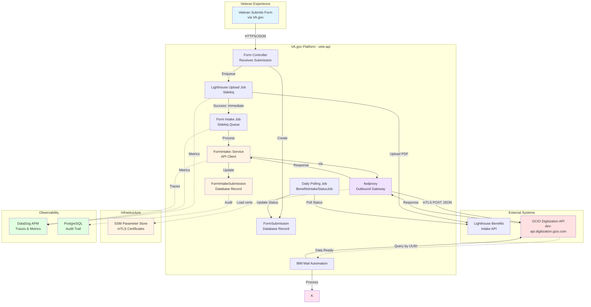
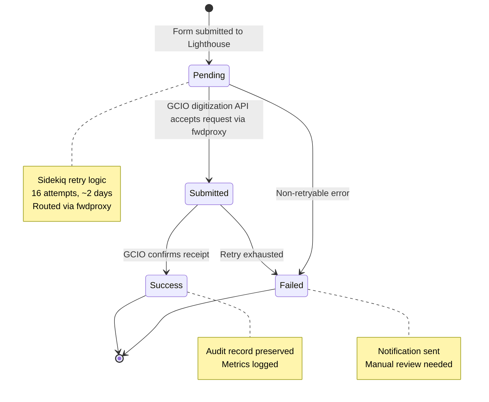

# GCIO Form Intake Integration Solution Brief

## Executive Summary

This solution enables automatic transmission of veteran form data to GCIO's digitization API endpoint after successful processing by the VA's Lighthouse Benefits Intake system. The integration extends the existing form submission pipeline with minimal risk through feature-flagged, asynchronous processing with comprehensive retry logic and audit trails.

> **Note**: GCIO (GovCIO) is the contractor providing the form digitization API endpoint. This integration sends structured JSON form data to their API at `dev-api.digitization.gcio.com`.

**Business Value:**
- Automates manual data transmission processes
- Ensures timely delivery of form data to downstream digitization systems
- Provides full audit trail for compliance and troubleshooting
- Enables gradual rollout with feature flags

**Technical Highlights:**
- Leverages existing vets-api infrastructure (Sidekiq, AASM, Lockbox)
- Routes through fwdproxy with mTLS authentication
- Non-blocking asynchronous processing
- Enterprise-grade retry logic (~2 days, 16 attempts)
- Comprehensive monitoring and alerting
- Zero impact to existing Lighthouse integration

---

## Problem Statement

When veterans submit benefit forms through VA.gov, the data flows through Lighthouse Benefits Intake for document processing. Once Lighthouse confirms successful processing (`vbms` status), the structured form data must be transmitted to GCIO's digitization API for additional downstream processing.

**Current Gap:** No automated mechanism to trigger form data submission to GCIO upon successful Lighthouse processing.

**Requirements:**
- Trigger form intake submission only after Lighthouse confirms success
- Route through fwdproxy with proper mTLS authentication
- Handle transient API failures gracefully with retries
- Maintain complete audit trail for compliance
- Support gradual rollout per form type
- Follow existing architectural patterns

---

## High-Level Solution Architecture



**Flow Description:**
1. Veteran submits form → Stored in database
2. Background job uploads PDF to Lighthouse
3. **IMMEDIATELY after successful upload** → Enqueue GCIO submission job (if enabled)
4. GCIO job sends JSON payload via fwdproxy with mTLS
5. fwdproxy loads certificates from SSM Parameter Store
6. fwdproxy forwards request to GCIO digitization API
7. Structured data available at GCIO within seconds
8. IBM Mail Automation queries GCIO (using Lighthouse UUID)
9. IBM processes PDF to VBMS using structured data
10. Results tracked in database with full audit trail

### Why Immediate Trigger is Critical

```
Timeline Comparison:

OLD (After vbms status):
T+0s:      PDF uploaded
T+24-72h:  Polling detects vbms status
T+72h:     Trigger GCIO ❌ TOO LATE
           IBM already processed PDF without data

NEW (After Lighthouse upload):
T+0s:      PDF uploaded
T+1s:      Trigger GCIO ✅ IMMEDIATE
T+5-30s:   Data available at GCIO
T+minutes: IBM queries GCIO, finds data
T+minutes: IBM processes with structured data
```

---

## Solution Approach

### Architecture Pattern: Event-Driven State Machine

The solution uses **AASM (state machine) callbacks** to trigger form intake submissions when Lighthouse processing completes successfully. This approach:

- ✅ Leverages existing state machine infrastructure
- ✅ Maintains clear separation of concerns
- ✅ Enables easy testing and debugging
- ✅ Provides reliable event triggering

### Key Components

#### 1. **Trigger Mechanism**
- **Component**: Trigger logic in `Lighthouse::SubmitBenefitsIntakeClaim`
- **Location**: Immediately after successful PDF upload to Lighthouse
- **Timing**: Within seconds of upload (not days)
- **Function**: Enqueues GCIO submission job if enabled
- **Controls**: Feature flags, form type eligibility
- **Critical**: Ensures structured data ready before IBM automation processes PDF

#### 2. **Asynchronous Processing**
- **Component**: `FormIntake::SubmitFormDataJob`
- **Queue**: Sidekiq `low` queue
- **Strategy**: Non-blocking, doesn't impact Lighthouse flow
- **Retry**: 16 attempts over ~2 days with exponential backoff

#### 3. **API Integration**
- **Component**: `FormIntake::Service`
- **Pattern**: Follows `Common::Client::Base` pattern
- **Features**: Circuit breaker, timeout handling, error classification
- **Routing**: Through fwdproxy with mTLS authentication
- **Endpoint**: `dev-api.digitization.gcio.com` (DEV), similar for staging/prod

#### 4. **Forward Proxy & mTLS**
- **Component**: fwdproxy (VA Platform infrastructure)
- **Purpose**: Secure outbound gateway for external API calls
- **Authentication**: Mutual TLS (mTLS) with client certificates
- **Certificate Storage**: AWS SSM Parameter Store
- **DEV Cert Paths**:
  - `/dsva-vagov/vets-api/dev/tls/bio/dev-api.digitization.gcio.com.crt`
  - `/dsva-vagov/vets-api/dev/tls/bio/dev-api.digitization.gcio.com.key`
- **Configuration**: PR https://github.com/department-of-veterans-affairs/vsp-platform-fwdproxy/pull/816

#### 5. **Data Persistence**
- **Component**: `FormIntakeSubmission` model
- **Storage**: PostgreSQL with encrypted PII fields
- **Encryption**: Lockbox + KMS (matches existing patterns)
- **States**: pending → submitted → success/failed

#### 6. **Observability**
- **Metrics**: StatsD → DataDog dashboards
- **Tracing**: DataDog APM for request tracking
- **Logging**: Structured Rails logs at each step
- **Monitoring**: Sidekiq UI for queue health
- **Correlation**: All metrics and logs include `benefits_intake_uuid` to correlate Lighthouse PDF submission with GCIO JSON submission

### Retry Strategy

```
Attempt │ Delay    │ Cumulative │ Action
────────┼──────────┼────────────┼─────────────────────
1       │ ~25s     │ 25s        │ Quick retry
2       │ ~55s     │ 1m 20s     │ 
3       │ ~2m      │ 3m 20s     │ Short-term transient
...     │ ...      │ ...        │ 
8       │ ~1h      │ 2h 21m     │ Medium-term recovery
...     │ ...      │ ...        │ 
16      │ ~11h     │ ~2d 1h     │ Final attempt
────────┴──────────┴────────────┴─────────────────────
Result: Mark as failed → Notify → Manual review
```

**Error Classification:**
- **Non-retryable** (400, 401, 403, 404, 422): Immediate failure, no retry
- **Retryable** (408, 429, 5xx, network): Exponential backoff retry
- **Exhaustion**: After 16 attempts, mark failed and notify

### Data Flow & State Management



### Configuration & Control

**Form-Specific Feature Flags** (Independent Rollout Per Form):
```yaml
form_intake_integration_526:     # For 21-526EZ
form_intake_integration_0966:    # For 21-0966  
form_intake_integration_4138:    # For 21-4138
form_intake_integration_10207:   # For 20-10207
  - Each form has its own flag
  - Enable/disable per user account
  - Percentage-based rollout per form
  - Independent emergency disable

form_intake_failure_notifications:
  - Optional failure email alerts
```

**Rollout Example**:
```ruby
# Week 1: Enable 526 for 1% of users
Flipper.enable_percentage_of_actors(:form_intake_integration_526, 1)

# Week 2: Increase 526, add 0966
Flipper.enable_percentage_of_actors(:form_intake_integration_526, 25)
Flipper.enable_percentage_of_actors(:form_intake_integration_0966, 1)

# Problem with 526? Disable it independently
Flipper.disable(:form_intake_integration_526)  # 0966 still works
```

### Security & Compliance

- **PII Protection**: All sensitive data encrypted at rest (Lockbox + KMS)
- **Transport Security**: mTLS for API communication via fwdproxy
- **Certificate Management**: Stored in AWS SSM Parameter Store
- **Audit Trail**: Complete submission history with timestamps
- **Access Control**: Feature flags limit who can trigger submissions
- **Monitoring**: All actions logged for security review
- **Traceability**: Benefits Intake UUID tracked in all logs and metrics for end-to-end correlation

### UUID Correlation for Tracking

**Critical Requirement**: All logging and metrics must include the `benefits_intake_uuid` to enable correlation between:
- The original PDF submission to Lighthouse Benefits Intake
- The subsequent JSON form data submission to GCIO

**Implementation**:
```ruby
# In FormIntake::SubmissionHandler
Rails.logger.info(
  'FormIntake handler invoked',
  form_submission_id: form_submission.id,
  form_type: form_submission.form_type,
  benefits_intake_uuid: form_submission_attempt.benefits_intake_uuid
)

# In FormIntake::SubmitFormDataJob
StatsD.increment('gcio.submit_form_data_job.attempt', tags: [
  "form_type:#{form_type}",
  "benefits_intake_uuid:#{benefits_intake_uuid}"
])

Datadog::Tracing.active_trace&.set_tag('benefits_intake_uuid', benefits_intake_uuid)
```

**Benefits**:
- Track complete journey from PDF upload → GCIO JSON submission
- Debug issues by correlating Lighthouse and GCIO logs
- Generate reports linking both submission types
- Monitor end-to-end success rates

### Forward Proxy Architecture

The fwdproxy handles secure outbound connections:

1. **Certificate Retrieval**: fwdproxy retrieves mTLS certificates from SSM on startup
2. **Service Configuration**: Each external service has a defined entry in fwdproxy
3. **Request Routing**: vets-api sends requests through fwdproxy
4. **mTLS Handshake**: fwdproxy presents client certificate to GCIO digitization endpoint
5. **Response Forwarding**: API response routed back to vets-api

**fwdproxy Configuration Files**:
- Certificate template: `gcio-form-intake.pem.j2`
- Service definition: Routes requests to `dev-api.digitization.gcio.com`
- mTLS bundle: Combined certificate + private key

---

## Risk Mitigation

| Risk | Impact | Mitigation |
|------|--------|------------|
| GCIO digitization API unavailable | High | 16-retry strategy spans 2 days; manual remediation tools |
| mTLS certificate expiry | Critical | Certificate monitoring; rotation process |
| fwdproxy outage | High | Fwdproxy redundancy; fallback mechanisms |
| Data loss | Critical | Database persistence before API call; encrypted at rest |
| Performance impact | Medium | Async processing; separate queue; won't block Lighthouse |
| Duplicate submissions | Medium | Idempotency check before enqueuing; unique constraints |
| Rollout issues | High | Feature flags enable instant disable; gradual rollout |

---

## Implementation Phases

### Phase 1: Foundation (Week 1)
- [ ] Database migration
- [ ] Model and associations  
- [ ] Feature flag setup
- [ ] Unit tests

### Phase 2: Integration (Week 2)
- [ ] FormIntake service and configuration
- [ ] fwdproxy integration (cert loading, routing)
- [ ] Sidekiq job implementation
- [ ] Handler callback integration
- [ ] Integration tests

### Phase 3: Observability (Week 3)
- [ ] Metrics and monitoring
- [ ] DataDog dashboard
- [ ] Alert configuration
- [ ] Operational runbook

### Phase 4: Rollout (Week 4+)
- [ ] Deploy to staging
- [ ] Enable for test users
- [ ] Monitor metrics
- [ ] Gradual production rollout
- [ ] Documentation updates

---

## Success Metrics

**Operational:**
- **Success Rate**: >95% of submissions succeed within 16 retries
- **Latency**: <30s average API response time (including fwdproxy)
- **Availability**: <1% retry exhaustion rate
- **Certificate Health**: 0 expired certificates

**Business:**
- **Automation**: 100% of eligible forms automatically submitted
- **Timeliness**: 99% submitted within 24 hours of Lighthouse success
- **Compliance**: 100% audit trail coverage

---

## Documentation Structure

Detailed technical documentation is organized as follows:

- **[C4 Architecture Diagrams](./c4-diagrams.md)** - Multi-level architectural views
  - System Context, Container, and Component diagrams
  - Sequence diagrams for success and failure flows
  - Data flow and dependency diagrams
  
- **[Architecture Decision Records (ADRs)](./adrs/)** - Key architectural decisions
  - [ADR-001: Submission Trigger Mechanism](./adrs/001-submission-trigger-mechanism.md)
  - [ADR-002: Retry Strategy](./adrs/002-retry-strategy.md)
  - [ADR-003: Data Storage Approach](./adrs/003-data-storage-approach.md)
  - [ADR-004: Timing - Trigger Before VBMS](./adrs/004-timing-trigger-before-vbms.md)
  - [ADR-005: Form-Specific Feature Flags](./adrs/005-form-specific-feature-flags.md)
  
- **[Rollout Strategy Guide](./ROLLOUT-STRATEGY.md)** - Production rollout procedures
  - Form-by-form enablement
  - Percentage-based rollout
  - Emergency procedures
  - Monitoring and metrics
  
- **[Simple Forms Integration Guide](./SIMPLE-FORMS-INTEGRATION.md)** - How to integrate simple forms
  - Observer/callback pattern (zero controller changes)
  - Mapper registry pattern
  - Form-specific mapper examples (21P-601)
  - Component-level flow diagrams

---

## Team Contacts & Resources

**Development Team:**
- Platform Team: #vsp-platform-support
- Backend Team: #vets-api-engineers

**Infrastructure:**
- fwdproxy Team: #vsp-platform-infrastructure
- Certificate Management: #vsp-operations

**External Dependencies:**
- GCIO Support: Contact via Platform team

**Key Resources:**
- [VA Platform Documentation](https://depo-platform-documentation.scrollhelp.site/)
- [Lighthouse Benefits Intake API Docs](https://developer.va.gov/explore/api/benefits-intake/docs)
- [fwdproxy Configuration PR](https://github.com/department-of-veterans-affairs/vsp-platform-fwdproxy/pull/816)
- [DataDog Dashboard](https://vagov.ddog-gov.com/dashboard/4d8-3fn-dbp/benefits-intake-form-submission-tracking)

