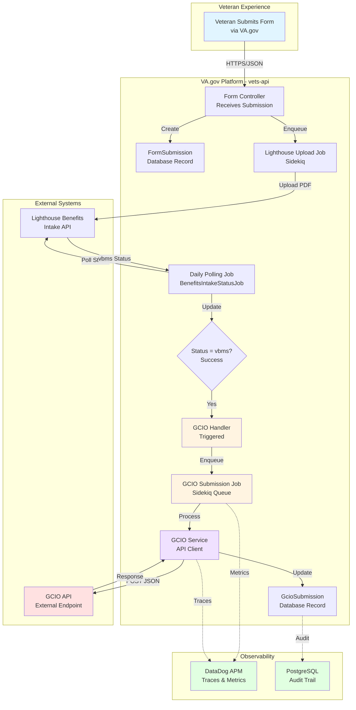
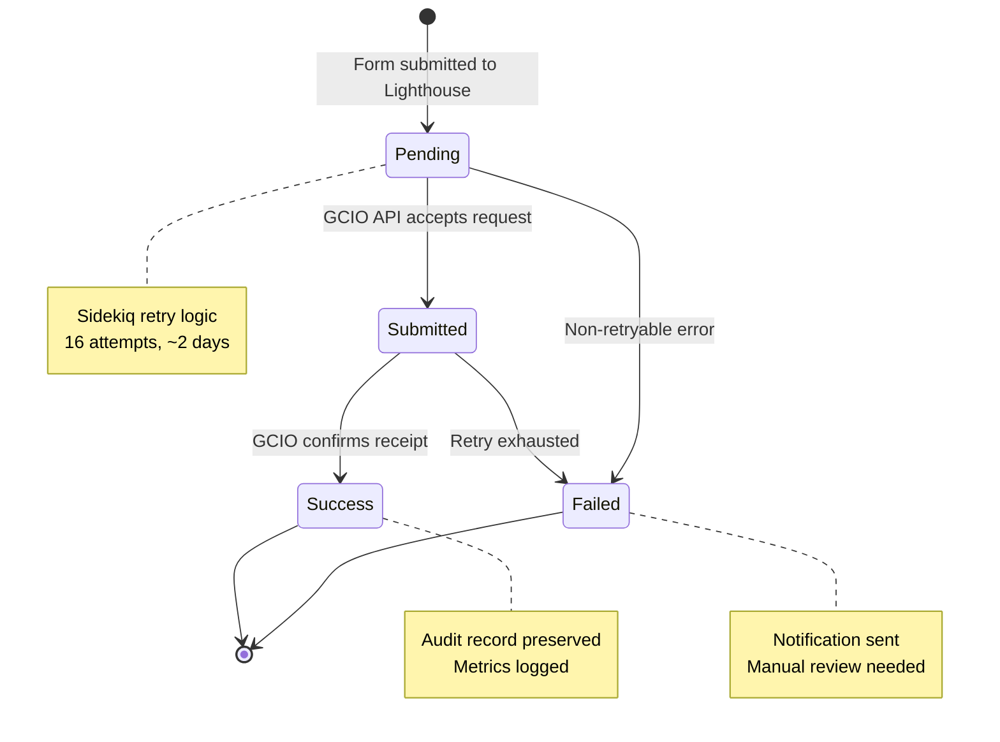

# GCIO Integration Solution Brief

## Executive Summary

This solution enables automatic transmission of veteran form data to the Government Customer Information Office (GCIO) API after successful processing by the VA's Lighthouse Benefits Intake system. The integration extends the existing form submission pipeline with minimal risk through feature-flagged, asynchronous processing with comprehensive retry logic and audit trails.

**Business Value:**
- Automates manual data transmission processes
- Ensures timely delivery of form data to downstream systems
- Provides full audit trail for compliance and troubleshooting
- Enables gradual rollout with feature flags

**Technical Highlights:**
- Leverages existing vets-api infrastructure (Sidekiq, AASM, Lockbox)
- Non-blocking asynchronous processing
- Enterprise-grade retry logic (~2 days, 16 attempts)
- Comprehensive monitoring and alerting
- Zero impact to existing Lighthouse integration

---

## Problem Statement

When veterans submit benefit forms through VA.gov, the data flows through Lighthouse Benefits Intake for document processing. Once Lighthouse confirms successful processing (`vbms` status), the form data must be transmitted to GCIO for additional downstream processing. 

**Current Gap:** No automated mechanism to trigger GCIO submission upon successful Lighthouse processing.

**Requirements:**
- Trigger GCIO submission only after Lighthouse confirms success
- Handle transient API failures gracefully with retries
- Maintain complete audit trail for compliance
- Support gradual rollout per form type
- Follow existing architectural patterns

---

## High-Level Solution Architecture



**Flow Description:**
1. Veteran submits form → Stored in database
2. Background job uploads PDF to Lighthouse
3. Daily polling job checks Lighthouse status
4. When status = `vbms` (success) → Trigger GCIO handler
5. Handler enqueues GCIO submission job (if enabled)
6. Job sends JSON payload to GCIO API
7. Results tracked in database with full audit trail

---

## Solution Approach

### Architecture Pattern: Event-Driven State Machine

The solution uses **AASM (state machine) callbacks** to trigger GCIO submissions when Lighthouse processing completes successfully. This approach:

- ✅ Leverages existing state machine infrastructure
- ✅ Maintains clear separation of concerns
- ✅ Enables easy testing and debugging
- ✅ Provides reliable event triggering

### Key Components

#### 1. **Trigger Mechanism**
- **Component**: `Gcio::SubmissionHandler`
- **Location**: Callback on `FormSubmissionAttempt.vbms!` event
- **Function**: Decides if GCIO submission should be triggered
- **Controls**: Feature flags, form type eligibility

#### 2. **Asynchronous Processing**
- **Component**: `Gcio::SubmitFormDataJob`
- **Queue**: Sidekiq `low` queue
- **Strategy**: Non-blocking, doesn't impact Lighthouse flow
- **Retry**: 16 attempts over ~2 days with exponential backoff

#### 3. **API Integration**
- **Component**: `Gcio::Service`
- **Pattern**: Follows `Common::Client::Base` pattern
- **Features**: Circuit breaker, timeout handling, error classification
- **Security**: API key authentication, encrypted payloads

#### 4. **Data Persistence**
- **Component**: `GcioSubmission` model
- **Storage**: PostgreSQL with encrypted PII fields
- **Encryption**: Lockbox + KMS (matches existing patterns)
- **States**: pending → submitted → success/failed

#### 5. **Observability**
- **Metrics**: StatsD → DataDog dashboards
- **Tracing**: DataDog APM for request tracking
- **Logging**: Structured Rails logs at each step
- **Monitoring**: Sidekiq UI for queue health

### Retry Strategy

```
Attempt │ Delay    │ Cumulative │ Action
────────┼──────────┼────────────┼─────────────────────
1       │ ~25s     │ 25s        │ Quick retry
2       │ ~55s     │ 1m 20s     │ 
3       │ ~2m      │ 3m 20s     │ Short-term transient
...     │ ...      │ ...        │ 
8       │ ~1h      │ 2h 21m     │ Medium-term recovery
...     │ ...      │ ...        │ 
16      │ ~11h     │ ~2d 1h     │ Final attempt
────────┴──────────┴────────────┴─────────────────────
Result: Mark as failed → Notify → Manual review
```

**Error Classification:**
- **Non-retryable** (400, 401, 403, 404, 422): Immediate failure, no retry
- **Retryable** (408, 429, 5xx, network): Exponential backoff retry
- **Exhaustion**: After 16 attempts, mark failed and notify

### Data Flow & State Management



### Configuration & Control

**Feature Flags** (Gradual Rollout):
```yaml
gcio_integration: 
  - Enable/disable per user account
  - Percentage-based rollout
  - Emergency kill switch

gcio_failure_notifications:
  - Optional failure email alerts
```

**Form Type Control**:
```ruby
GCIO_ENABLED_FORMS = %w[
  21-526EZ    # Disability compensation
  21-0966     # Intent to file
  21-4138     # Statement in support
]
```

### Security & Compliance

- **PII Protection**: All sensitive data encrypted at rest (Lockbox + KMS)
- **Audit Trail**: Complete submission history with timestamps
- **Access Control**: Feature flags limit who can trigger submissions
- **API Security**: API key authentication, HTTPS only
- **Monitoring**: All actions logged for security review

---

## Risk Mitigation

| Risk | Impact | Mitigation |
|------|--------|------------|
| GCIO API unavailable | High | 16-retry strategy spans 2 days; manual remediation tools |
| Data loss | Critical | Database persistence before API call; encrypted at rest |
| Performance impact | Medium | Async processing; separate queue; won't block Lighthouse |
| Duplicate submissions | Medium | Idempotency check before enqueuing; unique constraints |
| Rollout issues | High | Feature flags enable instant disable; gradual rollout |

---

## Implementation Phases

### Phase 1: Foundation (Week 1)
- [ ] Database migration
- [ ] Model and associations
- [ ] Feature flag setup
- [ ] Unit tests

### Phase 2: Integration (Week 2)
- [ ] GCIO service and configuration
- [ ] Sidekiq job implementation
- [ ] Handler callback integration
- [ ] Integration tests

### Phase 3: Observability (Week 3)
- [ ] Metrics and monitoring
- [ ] DataDog dashboard
- [ ] Alert configuration
- [ ] Operational runbook

### Phase 4: Rollout (Week 4+)
- [ ] Deploy to staging
- [ ] Enable for test users
- [ ] Monitor metrics
- [ ] Gradual production rollout
- [ ] Documentation updates

---

## Success Metrics

**Operational:**
- **Success Rate**: >95% of submissions succeed within 16 retries
- **Latency**: <30s average API response time
- **Availability**: <1% retry exhaustion rate

**Business:**
- **Automation**: 100% of eligible forms automatically submitted
- **Timeliness**: 99% submitted within 24 hours of Lighthouse success
- **Compliance**: 100% audit trail coverage

---

## Documentation Structure

Detailed technical documentation is organized as follows:

- **[C4 Architecture Diagrams](./c4-diagrams.md)** - Multi-level architectural views
  - System Context, Container, and Component diagrams
  - Sequence diagrams for success and failure flows
  - Data flow and dependency diagrams
  
- **[Architecture Decision Records (ADRs)](./adrs/)** - Key architectural decisions
  - [ADR-001: Submission Trigger Mechanism](./adrs/001-submission-trigger-mechanism.md)
  - [ADR-002: Retry Strategy](./adrs/002-retry-strategy.md)
  - [ADR-003: Data Storage Approach](./adrs/003-data-storage-approach.md)
  
- **[Implementation Guide](./implementation-guide.md)** - Step-by-step implementation
  - Database schema and migrations
  - Model, service, and job code examples
  - Configuration and feature flag setup
  - Testing strategies
  - Deployment and rollback procedures
  
- **[Quick Reference Guide](./quick-reference.md)** - Operations handbook
  - Common operations and commands
  - Monitoring queries and alerts
  - Troubleshooting procedures
  - Emergency response playbook

---

## Team Contacts & Resources

**Development Team:**
- Platform Team: #vsp-platform-support
- Backend Team: #vets-api-engineers

**External Dependencies:**
- GCIO API Support: gcio-support@example.gov
- Lighthouse Team: #benefits-intake-api

**Key Resources:**
- [VA Platform Documentation](https://depo-platform-documentation.scrollhelp.site/)
- [Lighthouse Benefits Intake API Docs](https://developer.va.gov/explore/api/benefits-intake/docs)
- [DataDog Dashboard](https://vagov.ddog-gov.com/dashboard/4d8-3fn-dbp/benefits-intake-form-submission-tracking)
- [Existing Lighthouse Polling Implementation](../../../app/sidekiq/benefits_intake_status_job.rb)

---

## Approval & Sign-off

| Role | Name | Date | Signature |
|------|------|------|-----------|
| Technical Architect | | | |
| Platform Lead | | | |
| Security Review | | | |
| Product Owner | | | |

**Document Version:** 1.0  
**Last Updated:** 2026-01-09  
**Next Review:** 2026-04-09

