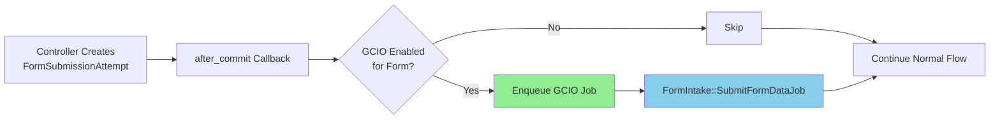
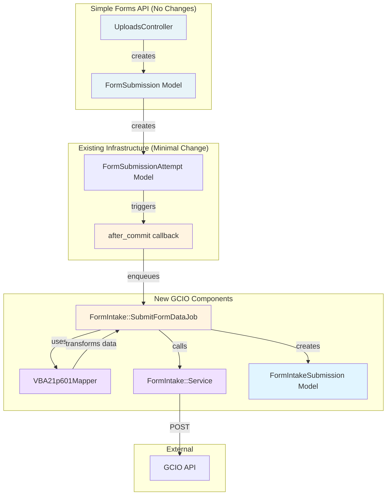

# Simple Forms Integration Guide for GCIO

## Quick Start

**Adding a new simple form to GCIO integration**:

1. Create mapper: `lib/form_intake/mappers/vba_21p_601_mapper.rb`
2. Register it: Add one line to `registry.rb`
3. Configure: Add to `ELIGIBLE_FORMS` and `FORM_FEATURE_FLAGS`
4. Add feature flag: `config/features.yml`
5. Write tests: `spec/lib/form_intake/mappers/vba_21p_601_mapper_spec.rb`
6. Enable: `Flipper.enable_percentage_of_actors(:form_intake_integration_601, 1)`

**Time estimate**: ~2-4 hours per form (mapper + tests)

**No changes needed to**: Controllers, services, or existing simple forms code

---

## Overview

The GCIO integration infrastructure is already built. You only need to create a mapper for your specific form that transforms vets-api JSON → GCIO API JSON format.

## How It Works (Already Built)

The GCIO integration automatically triggers via a callback on `FormSubmissionAttempt`. **You don't need to modify any controllers or services.**

```
Simple Form Submitted → FormSubmissionAttempt created
                              ↓
                      after_commit callback fires
                              ↓
                      Check: GCIO enabled for this form?
                              ↓ YES
                      Enqueue job → Use your mapper → Submit to GCIO
```

**Infrastructure already in place**:
- ✅ Callback in `FormSubmissionAttempt` model
- ✅ `FormIntake::SubmitFormDataJob` Sidekiq job
- ✅ `FormIntake::Service` API client
- ✅ `FormIntake::Mappers::Registry` pattern
- ✅ Database table for tracking

**What you need to add**: Just your form's mapper!

## Adding Your Form to GCIO (4 Simple Steps)

### Prerequisites

Before starting, ensure:
- [ ] Your form works in simple forms (generates PDF, submits to Lighthouse)
- [ ] You have sample form data for testing
- [ ] You know the GCIO API format for your form type
- [ ] Feature flag name decided (e.g., `form_intake_integration_601` for 21P-601)



---

## Step 1: Create Your Form Mapper

Create a mapper class that transforms your form's data to GCIO format.

**File**: `lib/form_intake/mappers/vba_21p_601_mapper.rb`

### Template

```ruby
# lib/form_intake/mappers/vba_21p_601_mapper.rb
module FormIntake
  module Mappers
    class VBA21p601Mapper < BaseMapper
      # Transform vets-api form data to GCIO API format
      def to_gcio_payload
        form_data = JSON.parse(@form_submission.form_data)
        
        {
          # GCIO required fields
          form_number: '21P-601',
          submission_id: @form_submission.id,
          benefits_intake_uuid: @benefits_intake_uuid,
          submitted_at: @form_submission.created_at.iso8601,
          
          # Veteran information
          veteran: {
            first_name: form_data.dig('veteran', 'full_name', 'first'),
            last_name: form_data.dig('veteran', 'full_name', 'last'),
            middle_name: form_data.dig('veteran', 'full_name', 'middle'),
            ssn: map_ssn(form_data.dig('veteran', 'ssn')),
            va_file_number: form_data.dig('veteran', 'va_file_number'),
            date_of_birth: form_data.dig('veteran', 'date_of_birth'),
            date_of_death: form_data.dig('veteran', 'date_of_death')
          },
          
          # Claimant information
          claimant: {
            first_name: form_data.dig('claimant', 'full_name', 'first'),
            last_name: form_data.dig('claimant', 'full_name', 'last'),
            middle_name: form_data.dig('claimant', 'full_name', 'middle'),
            email: form_data.dig('claimant', 'email'),
            phone: map_phone(form_data.dig('claimant', 'phone')),
            address: map_address(form_data.dig('claimant', 'address')),
            relationship_to_deceased: form_data.dig('claimant', 'relationship_to_deceased')
          },
          
          # Burial/Death information
          burial: {
            funeral_home_name: form_data.dig('burial', 'funeral_home', 'name'),
            place_of_burial: form_data.dig('burial', 'place_of_burial'),
            burial_date: form_data.dig('burial', 'date'),
            plot_number: form_data.dig('burial', 'plot_number')
          },
          
          # Remarriage information (if applicable)
          remarriage: form_data['remarriage'] ? map_remarriage(form_data['remarriage']) : nil
        }.compact
      end
      
      private
      
      def map_ssn(ssn_parts)
        return nil unless ssn_parts
        "#{ssn_parts['first3']}#{ssn_parts['middle2']}#{ssn_parts['last4']}"
      end
      
      def map_phone(phone_parts)
        return nil unless phone_parts
        "#{phone_parts['area_code']}#{phone_parts['prefix']}#{phone_parts['line_number']}"
      end
      
      def map_address(address)
        return nil unless address
        {
          street: address['street'],
          street2: address['street2'],
          city: address['city'],
          state: address['state'],
          country: address['country'],
          postal_code: address.dig('zip_code', 'first5')
        }
      end
      
      def map_remarriage(remarriage_data)
        {
          remarried: true,
          spouse_name: remarriage_data['spouse_name'],
          spouse_ssn: map_ssn(remarriage_data['spouse_ssn']),
          spouse_date_of_birth: remarriage_data['spouse_date_of_birth'],
          date_of_marriage: remarriage_data['date_of_marriage'],
          termination_date: remarriage_data['termination_date']
        }
      end
    end
  end
end
```

## Step 2: Register Your Mapper

Add your mapper to the registry.

**File**: `lib/form_intake/mappers/registry.rb`

```ruby
# Find this existing hash and add your form
FORM_MAPPERS = {
  '21P-601' => FormIntake::Mappers::VBA21p601Mapper,   # ← Add your line
  '21-0966' => FormIntake::Mappers::VBA210966Mapper,   # Existing
  # ... other forms
}.freeze
```

## Step 3: Add to Configuration

Add your form to the eligible list.

**File**: `config/initializers/form_intake_integration.rb`

```ruby
module FormIntake
  # Add your form ID here
  ELIGIBLE_FORMS = %w[
    21P-601      # ← Add your form
    21-0966      # Existing
    21-4138      # Existing
  ].freeze
  
  # Map your form to its feature flag
  FORM_FEATURE_FLAGS = {
    '21P-601' => :form_intake_integration_601,   # ← Add your mapping
    '21-0966' => :form_intake_integration_0966,  # Existing
    # ... other forms
  }.freeze
end
```

## Step 4: Add Feature Flag

Add a feature flag for your form.

**File**: `config/features.yml`

```yaml
form_intake_integration_601:
  actor_type: user_account
  description: Enable GCIO integration for form 21P-601 (Accrued Benefits)
```

## Step 5: Write Tests

Test your mapper transforms data correctly.

**File**: `spec/lib/form_intake/mappers/vba_21p_601_mapper_spec.rb`

```ruby
require 'rails_helper'

RSpec.describe FormIntake::Mappers::VBA21p601Mapper do
  let(:form_data) do
    {
      veteran: { full_name: { first: 'John', last: 'Doe' } },
      claimant: { email: 'test@example.com' },
      # ... your form's data
    }.to_json
  end
  
  let(:form_submission) do
    create(:form_submission, form_type: '21P-601', form_data:)
  end
  
  let(:mapper) { described_class.new(form_submission, 'uuid-123') }
  
  describe '#to_gcio_payload' do
    it 'includes required fields' do
      payload = mapper.to_gcio_payload
      
      expect(payload[:form_number]).to eq('21P-601')
      expect(payload[:benefits_intake_uuid]).to eq('uuid-123')
      expect(payload[:veteran][:first_name]).to eq('John')
      expect(payload[:claimant][:email]).to eq('test@example.com')
    end
    
    # Test each section of your form
    it 'maps veteran information correctly'
    it 'maps claimant information correctly'
    it 'maps burial information correctly'
    it 'handles optional fields'
  end
end
```

## Step 6: Enable and Test

Enable your form's feature flag in development/staging.

```ruby
# Rails console (development/staging)

# Enable for your test user
user = UserAccount.find_by(icn: 'your-test-icn')
Flipper.enable_actor(:form_intake_integration_601, user)

# Or enable for all in staging
Flipper.enable(:form_intake_integration_601)

# Verify
FormIntake.enabled_for_form?('21P-601', user)  # => true

# Submit test form through UI or API
# Check logs for: "GCIO job enqueued"
# Check database: FormIntakeSubmission.last
```

---

## That's It! 

Your form is now integrated with GCIO. The infrastructure handles:
- ✅ Automatic triggering after Lighthouse upload
- ✅ Async job processing with retries
- ✅ Error handling and logging
- ✅ Database tracking
- ✅ Metrics and monitoring

You just provided the form-specific mapping logic!

---

## Reference: How Infrastructure Works (Already Built)

### Component Diagram



### Trigger Flow (Already Built)

```
FormSubmissionAttempt.create
  ↓
after_commit callback
  ↓
FormIntake.enabled_for_form?('21P-601') ← Checks your flag
  ↓ YES
FormIntake::SubmitFormDataJob.perform_async
  ↓
Get your mapper from registry
  ↓
mapper.to_gcio_payload ← YOUR CODE RUNS HERE
  ↓
POST to GCIO API
```

**You only write**: The mapper that transforms your form's data

---

## Common Mapper Helpers (Available to You)

Your mapper inherits from `BaseMapper` which provides:

```ruby
class YourMapper < FormIntake::Mappers::BaseMapper
  # Available methods:
  
  form_data              # Parsed JSON hash of form data
  form_type              # Form type string (e.g., '21P-601')
  benefits_intake_uuid   # UUID from Lighthouse submission
  user_account           # User who submitted
  form_submission        # Full FormSubmission record
  
  # Your implementation:
  def to_gcio_payload
    {
      form_number: form_type,
      benefits_intake_uuid: benefits_intake_uuid,
      # ... your form-specific mapping
    }
  end
end
```


## FAQ for Form Implementers

### Q: Do I need to modify my controller?
**A:** No. The callback in `FormSubmissionAttempt` handles everything.

### Q: What if my form's data structure is complex?
**A:** Your mapper can be as complex as needed. Use helper methods, inherit utilities from `BaseMapper`.

### Q: How do I test my mapper?
**A:** Unit test it with sample form data. No need to test the infrastructure.

### Q: What if GCIO doesn't support my form yet?
**A:** Don't add it to `ELIGIBLE_FORMS`. Simple form works normally.

### Q: Can I test in staging without affecting others?
**A:** Yes. Enable your form's flag only for your test user account.

### Q: What if my mapper has a bug?
**A:** The job will retry 16 times. Fix your mapper, deploy, retries continue.

### Q: What if I map a field incorrectly?
**A:** GCIO might reject it. Job retries. Fix mapper, deploy, job succeeds on next retry.

### Q: How do I know if it worked?
**A:** Check `FormIntakeSubmission` table for your form submissions or watch DataDog metrics.

### Q: My form has optional fields - how to handle?
**A:** Use `.compact` to remove nils from your payload, or conditionally build sections.

---

