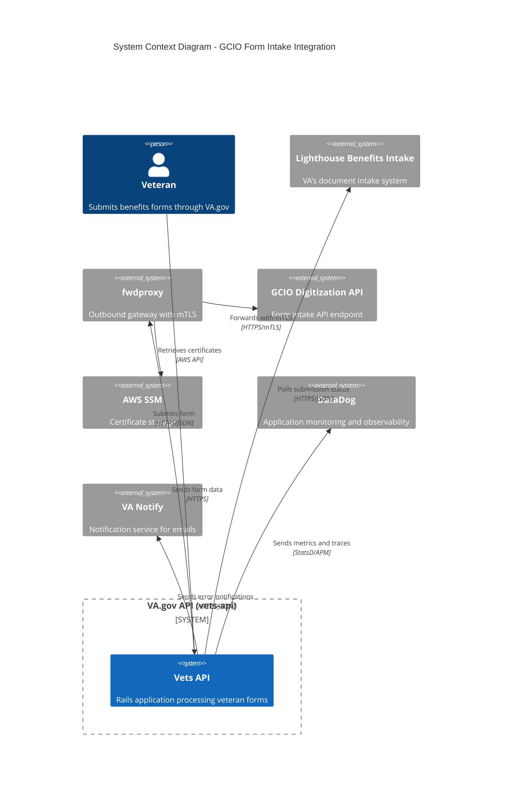
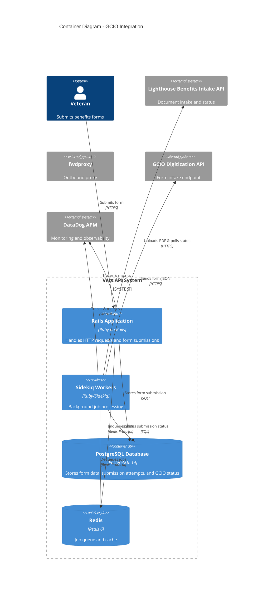
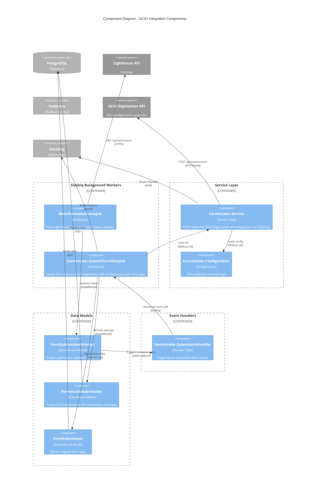
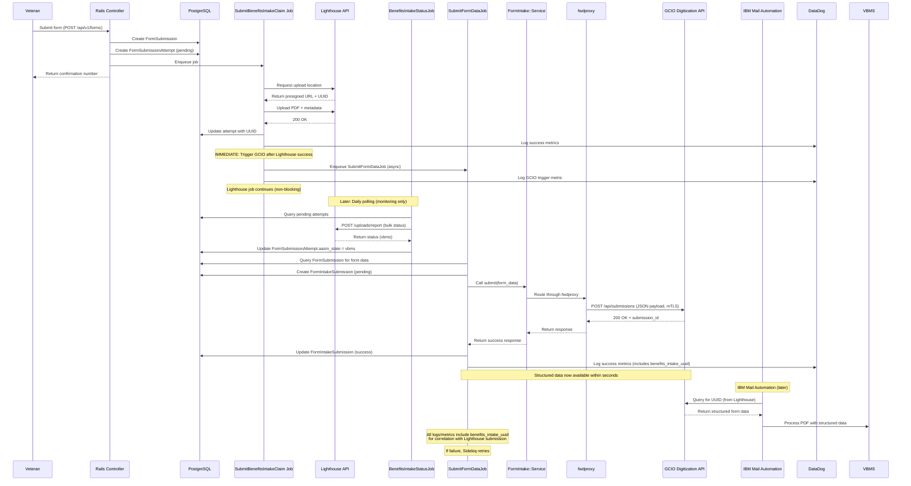
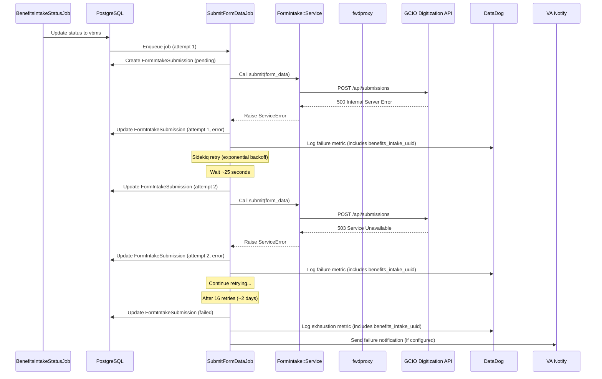
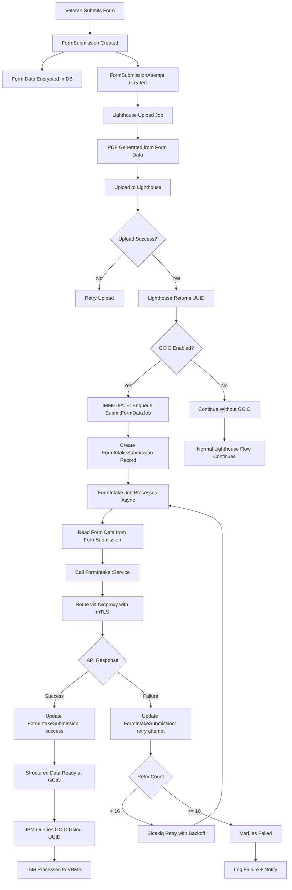
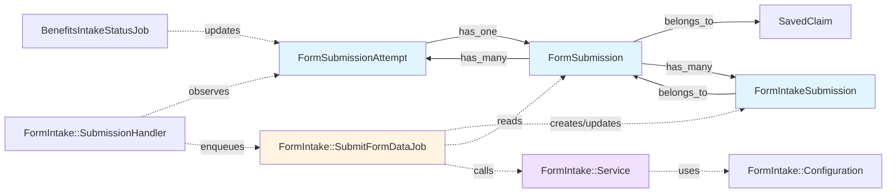

# C4 Architecture Diagrams - GCIO Form Intake Integration

## Level 1: System Context Diagram

This diagram shows how the GCIO Form Intake Integration fits within the broader VA.gov ecosystem.

## Level 2: Container Diagram

This diagram shows the major containers (applications/services) and how they interact for GCIO integration.

## Level 3: Component Diagram

This diagram shows the internal components of the GCIO integration within the vets-api system.

## Sequence Diagram: Successful Flow

This sequence diagram shows the end-to-end flow when everything succeeds.

## Sequence Diagram: Failure and Retry Flow

This sequence diagram shows what happens when GCIO digitization API calls fail.

## Data Flow Diagram

This diagram shows how data flows through the system.

## Component Dependencies

---

## Diagram Legends

### C4 Notation
- **Person**: External user interacting with the system
- **System**: Software system
- **Container**: Application, database, or service
- **Component**: Module or class within a container
- **Rel**: Relationship/interaction between elements

### Color Coding
- Blue (#e1f5ff): Data models
- Yellow (#fff4e1): Background jobs
- Purple (#f0e1ff): Service classes
- Gray (default): External systems

