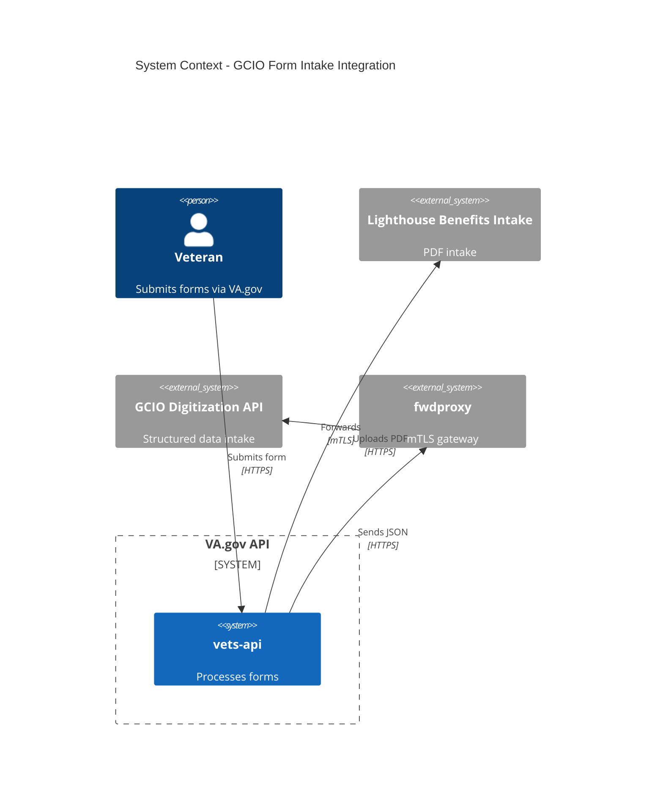
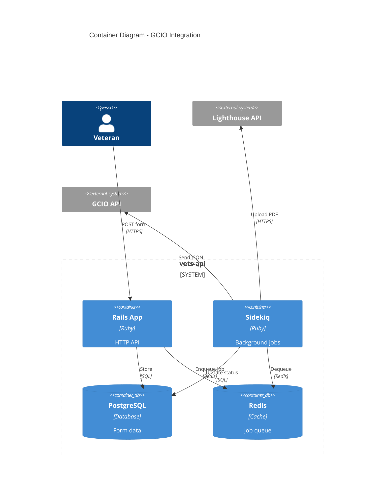
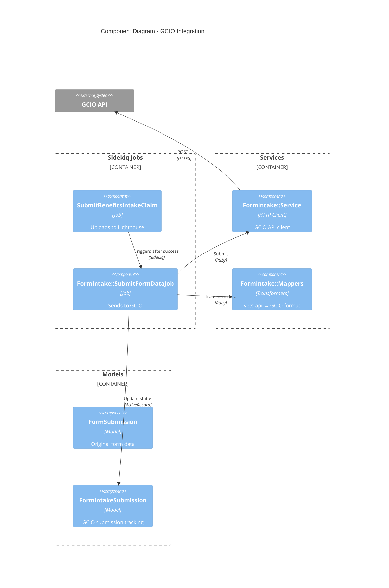
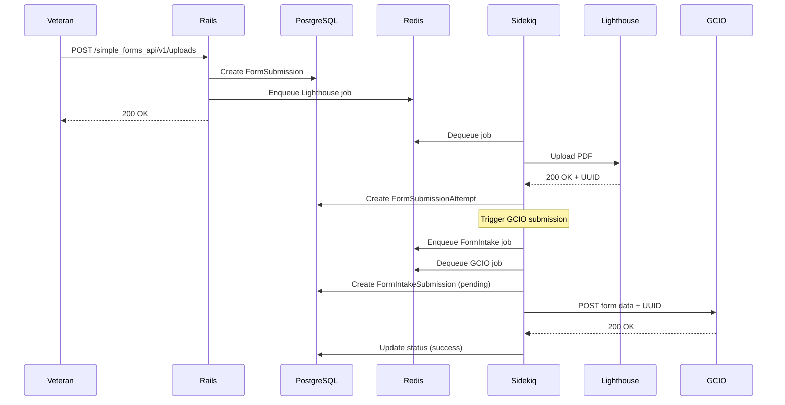
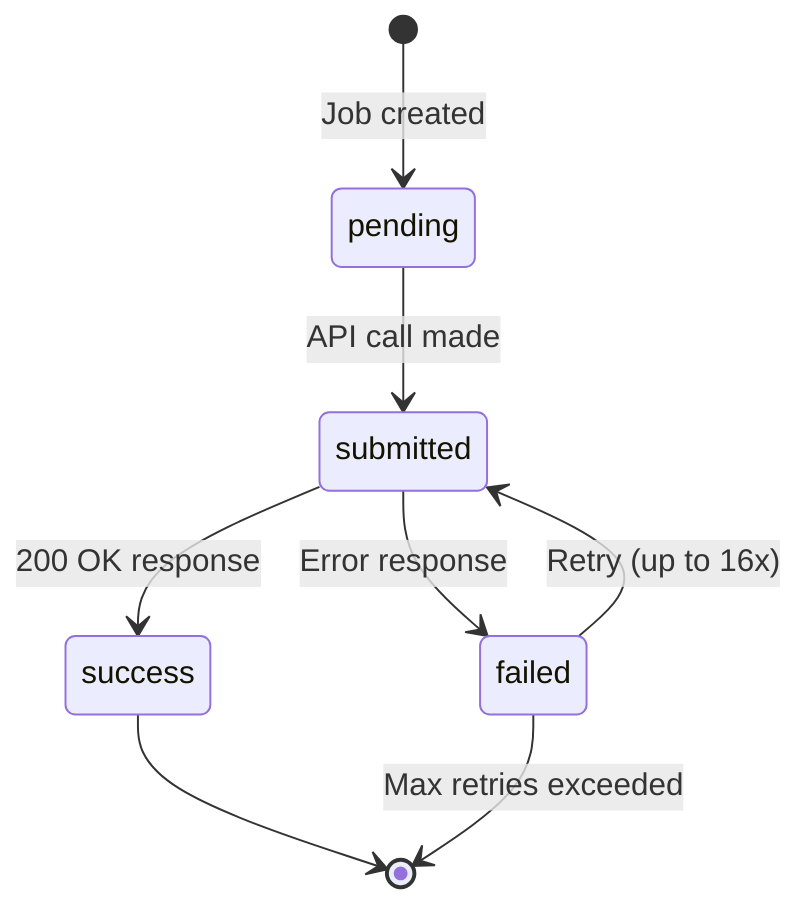
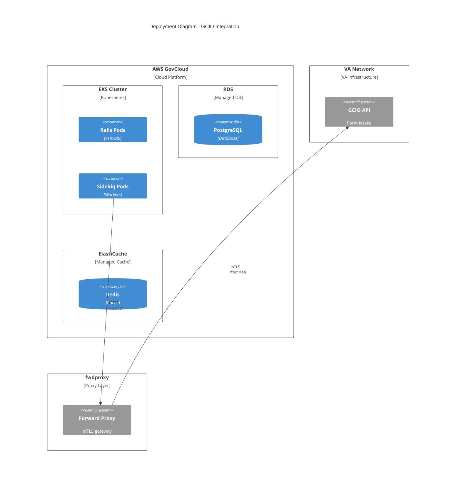

# C4 Architecture Diagrams - GCIO Form Intake Integration

## Overview

These diagrams follow the [C4 model](https://c4model.com/) to show the GCIO integration architecture at different levels of detail.

---

## Level 1: System Context

Shows how GCIO integration fits in the VA.gov ecosystem.

```mermaid
C4Context
    title System Context - GCIO Form Intake Integration

    Person(veteran, "Veteran", "Submits forms via VA.gov")
    
    System_Boundary(vagovapi, "VA.gov API") {
        System(vetsapi, "vets-api", "Processes forms")
    }
    
    System_Ext(lighthouse, "Lighthouse Benefits Intake", "PDF intake")
    System_Ext(gcio, "GCIO Digitization API", "Structured data intake")
    System_Ext(fwdproxy, "fwdproxy", "mTLS gateway")
    
    Rel(veteran, vetsapi, "Submits form", "HTTPS")
    Rel(vetsapi, lighthouse, "Uploads PDF", "HTTPS")
    Rel(vetsapi, fwdproxy, "Sends JSON", "HTTPS")
    Rel(fwdproxy, gcio, "Forwards", "mTLS")
```

**Key points**:
- Veteran submits once, vets-api sends to two systems
- PDF goes to Lighthouse (existing flow)
- JSON goes to GCIO (new integration)
- fwdproxy handles mTLS authentication

---

## Level 2: Container Diagram

Shows applications and data stores involved.

```mermaid
C4Container
    title Container Diagram - GCIO Integration

    Person(veteran, "Veteran")
    
    System_Boundary(vetsapi, "vets-api") {
        Container(rails, "Rails App", "Ruby", "HTTP API")
        Container(sidekiq, "Sidekiq", "Ruby", "Background jobs")
        ContainerDb(postgres, "PostgreSQL", "Database", "Form data")
        ContainerDb(redis, "Redis", "Cache", "Job queue")
    }
    
    System_Ext(lighthouse, "Lighthouse API")
    System_Ext(gcio, "GCIO API")
    
    Rel(veteran, rails, "POST form", "HTTPS")
    Rel(rails, postgres, "Store", "SQL")
    Rel(rails, redis, "Enqueue job", "Redis")
    Rel(sidekiq, redis, "Dequeue", "Redis")
    Rel(sidekiq, lighthouse, "Upload PDF", "HTTPS")
    Rel(sidekiq, gcio, "Send JSON", "HTTPS")
    Rel(sidekiq, postgres, "Update status", "SQL")
```

**Key points**:
- Rails handles HTTP requests
- Sidekiq processes async jobs
- PostgreSQL stores form data and submission status
- Redis manages job queue

---

## Level 3: Component Diagram

Shows internal components of GCIO integration.

```mermaid
C4Component
    title Component Diagram - GCIO Integration

    Container_Boundary(jobs, "Sidekiq Jobs") {
        Component(lighthouse_job, "SubmitBenefitsIntakeClaim", "Job", "Uploads to Lighthouse")
        Component(gcio_job, "FormIntake::SubmitFormDataJob", "Job", "Sends to GCIO")
    }
    
    Container_Boundary(services, "Services") {
        Component(gcio_service, "FormIntake::Service", "HTTP Client", "GCIO API client")
        Component(mapper, "FormIntake::Mappers", "Transformers", "vets-api → GCIO format")
    }
    
    Container_Boundary(models, "Models") {
        Component(form_sub, "FormSubmission", "Model", "Original form data")
        Component(intake_sub, "FormIntakeSubmission", "Model", "GCIO submission tracking")
    }
    
    System_Ext(gcio, "GCIO API")
    
    Rel(lighthouse_job, gcio_job, "Triggers after success", "Sidekiq")
    Rel(gcio_job, mapper, "Transform data", "Ruby")
    Rel(gcio_job, gcio_service, "Submit", "Ruby")
    Rel(gcio_service, gcio, "POST", "HTTPS")
    Rel(gcio_job, intake_sub, "Update status", "ActiveRecord")
```

**Key points**:
- Lighthouse job triggers GCIO job after PDF upload
- Mappers transform vets-api JSON to GCIO format
- Service handles HTTP communication
- FormIntakeSubmission tracks state

---

## Sequence Diagram: Submission Flow

End-to-end flow from form submission to GCIO.

```mermaid
sequenceDiagram
    participant V as Veteran
    participant R as Rails
    participant DB as PostgreSQL
    participant Q as Redis
    participant S as Sidekiq
    participant LH as Lighthouse
    participant G as GCIO

    V->>R: POST /simple_forms_api/v1/uploads
    R->>DB: Create FormSubmission
    R->>Q: Enqueue Lighthouse job
    R-->>V: 200 OK

    S->>Q: Dequeue job
    S->>LH: Upload PDF
    LH-->>S: 200 OK + UUID
    S->>DB: Create FormSubmissionAttempt
    
    Note over S: Trigger GCIO submission
    S->>Q: Enqueue FormIntake job
    
    S->>Q: Dequeue GCIO job
    S->>DB: Create FormIntakeSubmission (pending)
    S->>G: POST form data + UUID
    G-->>S: 200 OK
    S->>DB: Update status (success)
```

**Key points**:
- User gets immediate response (async processing)
- Lighthouse job triggers GCIO job after success
- GCIO submission tracked independently
- UUID links PDF and JSON data

---

## State Diagram: FormIntakeSubmission

Tracks GCIO submission lifecycle.

```mermaid
stateDiagram-v2
    [*] --> pending: Job created
    pending --> submitted: API call made
    submitted --> success: 200 OK response
    submitted --> failed: Error response
    failed --> submitted: Retry (up to 16x)
    success --> [*]
    failed --> [*]: Max retries exceeded
```

**States**:
- **pending**: Job enqueued, not yet attempted
- **submitted**: API call in progress
- **success**: GCIO confirmed receipt
- **failed**: All retries exhausted

---

## Deployment Diagram

Shows runtime environment and external dependencies.

```mermaid
C4Deployment
    title Deployment Diagram - GCIO Integration

    Deployment_Node(aws, "AWS GovCloud", "Cloud Platform") {
        Deployment_Node(eks, "EKS Cluster", "Kubernetes") {
            Container(rails, "Rails Pods", "vets-api")
            Container(sidekiq, "Sidekiq Pods", "Workers")
        }
        
        Deployment_Node(rds, "RDS", "Managed DB") {
            ContainerDb(postgres, "PostgreSQL", "Database")
        }
        
        Deployment_Node(elasticache, "ElastiCache", "Managed Cache") {
            ContainerDb(redis, "Redis", "Cache")
        }
    }
    
    Deployment_Node(va_network, "VA Network", "VA Infrastructure") {
        System_Ext(gcio, "GCIO API", "Form intake")
    }
    
    Deployment_Node(proxy, "fwdproxy", "Proxy Layer") {
        System_Ext(fwdproxy, "Forward Proxy", "mTLS gateway")
    }
    
    Rel(sidekiq, fwdproxy, "HTTPS", "Port 443")
    Rel(fwdproxy, gcio, "mTLS", "Port 443")
```

**Key points**:
- Runs in AWS GovCloud EKS
- Uses managed services (RDS, ElastiCache)
- fwdproxy handles mTLS to VA network
- Certificates stored in AWS SSM

---

## For More Details

- **ADRs**: See `adrs/` folder for architectural decisions
- **Integration Guide**: See `SIMPLE-FORMS-INTEGRATION.md`
