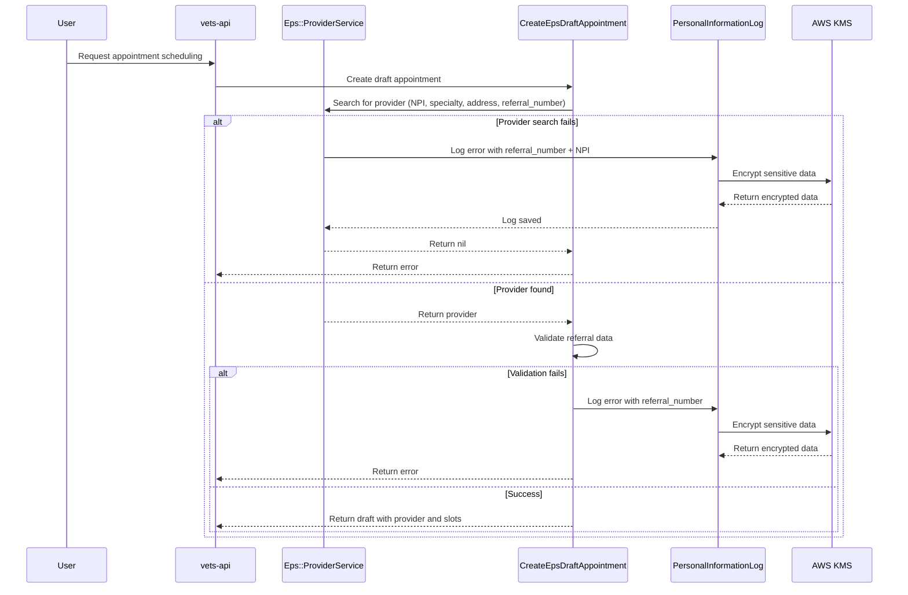

# Personal Information Logging for Error Tracking

## Overview

To improve debugging and support for Community Care appointment scheduling failures, we've implemented encrypted logging of personally identifiable information (PII) when errors occur. This allows support teams to trace issues back to specific referrals and providers while maintaining HIPAA compliance through encryption.

## Implementation

All PII logging uses the `PersonalInformationLog` model, which:

- Encrypts sensitive data using KMS (Key Management Service)
- Stores error classification and encrypted data separately
- Provides secure access to support and engineering teams for troubleshooting

## Logged Error Scenarios

### 1. Provider Service Errors (`Eps::ProviderService`)

The provider search and validation process logs the following failure scenarios:

| Error Class                        | Trigger Condition                                                 | Logged Data                                                            |
| ---------------------------------- | ----------------------------------------------------------------- | ---------------------------------------------------------------------- |
| `eps_provider_npi_missing`         | NPI parameter is blank or missing                                 | referral_number, search_params (specialty, address)                    |
| `eps_provider_specialty_missing`   | Specialty parameter is blank                                      | referral_number, npi, search_params (address)                          |
| `eps_provider_address_missing`     | Address parameter is blank                                        | referral_number, npi, search_params (specialty)                        |
| `eps_provider_no_providers_found`  | EPS API returns no providers for given NPI                        | referral_number, npi                                                   |
| `eps_provider_no_self_schedulable` | No providers have self-schedulable Office Visit appointment types | referral_number, npi                                                   |
| `eps_provider_specialty_mismatch`  | No providers match the requested specialty                        | referral_number, npi, search_params (specialty)                        |
| `eps_provider_address_mismatch`    | No providers match the facility address                           | referral_number, npi, search_params (address, specialty_matches_count) |

**Example logged data structure:**

```ruby
{
  npi: "1234567890",
  referral_number: "VA0000007241",
  user_uuid: "user-uuid-123",
  search_params: { specialty: "Cardiology", address: { city: "Denver", state: "CO" } },
  failure_reason: "No providers match specialty 'Cardiology'"
}
```

### 2. Draft Appointment Creation Errors (`VAOS::V2::CreateEpsDraftAppointment`)

The draft appointment creation process logs the following scenarios:

| Error Class                                   | Trigger Condition                                                    | Logged Data                              |
| --------------------------------------------- | -------------------------------------------------------------------- | ---------------------------------------- |
| `eps_draft_referral_validation_failed`        | Referral data is missing required fields or has invalid dates        | referral_number, npi, missing_attributes |
| `eps_draft_existing_appointment_check_failed` | Error occurred while checking if referral already has an appointment | referral_number, error_details           |
| `eps_draft_referral_already_used`             | Referral has already been used to create an appointment              | referral_number                          |
| `eps_draft_appointment_types_missing`         | Provider has no appointment_types data available                     | referral_number, npi                     |

**Note:** Provider search failures are logged by `Eps::ProviderService`, so they are not duplicated in the draft appointment service. Similarly, the check for missing self-schedulable appointment types is defensive validation only - if it triggers, it indicates a data consistency issue since providers should have already been filtered for self-schedulability.

**Example logged data structure:**

```ruby
{
  referral_number: "VA0000007241",
  npi: "1234567890",
  user_uuid: "user-uuid-123",
  failure_reason: "Required referral data is missing or incomplete: provider_npi, referral_date"
}
```

## Data Flow



## Security Considerations

1. **Encryption**: All PII data is encrypted at rest using AWS KMS
2. **Graceful Failure**: If PII logging fails, the error is logged to Rails.logger but does not disrupt the main business logic
3. **Data Retention**: PII logs follow the same retention policies as other encrypted VA data
4. **Access Control**: Access to decrypted PII logs is restricted to authorized support and engineering personnel

## Logging Best Practices

1. **No Duplication**: Each error scenario is logged exactly once at the point where it occurs with the most context
2. **Referral Number Propagation**: The `referral_number` parameter is passed through the entire call chain to ensure it's available for logging at any failure point
3. **Defensive Logging**: All logging operations are wrapped in rescue blocks to prevent logging failures from affecting appointment scheduling

## Troubleshooting with PII Logs

When investigating appointment scheduling failures:

1. Query `PersonalInformationLog` by `error_class` to find similar issues
2. Use `referral_number` to trace the complete flow for a specific referral
3. Check `failure_reason` for human-readable error descriptions
4. Review `search_params` to understand what criteria were used

**Example query:**

```ruby
# Find all provider specialty mismatches in the last week
PersonalInformationLog
  .where(error_class: 'eps_provider_specialty_mismatch')
  .where('created_at >= ?', 1.week.ago)
  .last_week
```

## Error Class Reference

### Complete List of Error Classes

| Service           | Error Class                                   | Description                           |
| ----------------- | --------------------------------------------- | ------------------------------------- |
| Provider Service  | `eps_provider_npi_missing`                    | NPI parameter validation failed       |
| Provider Service  | `eps_provider_specialty_missing`              | Specialty parameter validation failed |
| Provider Service  | `eps_provider_address_missing`                | Address parameter validation failed   |
| Provider Service  | `eps_provider_no_providers_found`             | EPS API returned no providers for NPI |
| Provider Service  | `eps_provider_no_self_schedulable`            | No self-schedulable providers found   |
| Provider Service  | `eps_provider_specialty_mismatch`             | No providers matched specialty        |
| Provider Service  | `eps_provider_address_mismatch`               | No providers matched address          |
| Draft Appointment | `eps_draft_referral_validation_failed`        | Referral data validation failed       |
| Draft Appointment | `eps_draft_existing_appointment_check_failed` | Error checking existing appointments  |
| Draft Appointment | `eps_draft_referral_already_used`             | Referral already used for appointment |
| Draft Appointment | `eps_draft_appointment_types_missing`         | Provider missing appointment types    |

## Implementation Details

### Code Locations

- **Provider Service**: `modules/vaos/app/services/eps/provider_service.rb`
- **Draft Appointment Service**: `modules/vaos/app/services/vaos/v2/create_eps_draft_appointment.rb`
- **PII Model**: `app/models/personal_information_log.rb`

### Key Methods

#### Provider Service Logging

```ruby
def log_personal_information_error(error_class, data)
  PersonalInformationLog.create!(
    error_class:,
    data: {
      npi: data[:npi],
      referral_number: data[:referral_number],
      user_uuid: data[:user_uuid] || @user&.uuid,
      search_params: data[:search_params],
      failure_reason: data[:failure_reason]
    }.compact
  )
rescue => e
  Rails.logger.error("#{CC_APPOINTMENTS}: Failed to log personal information error", {
    original_error_class: error_class,
    logging_error: e.message
  }.merge(common_logging_context))
end
```

#### Draft Appointment Logging

```ruby
def log_personal_information_error(error_class, data)
  PersonalInformationLog.create!(
    error_class:,
    data: {
      npi: data[:npi],
      referral_number: data[:referral_number],
      user_uuid: data[:user_uuid] || @current_user&.uuid,
      search_params: data[:search_params],
      failure_reason: data[:failure_reason]
    }.compact
  )
rescue => e
  Rails.logger.error("#{CC_APPOINTMENTS}: Failed to log personal information error", {
    original_error_class: error_class,
    logging_error: e.message
  }.merge(common_logging_context))
end
```

## Testing

All PII logging scenarios are covered by RSpec tests:

- **Provider Service Tests**: `modules/vaos/spec/services/eps/provider_service_spec.rb`
- **Draft Appointment Tests**: `modules/vaos/spec/services/vaos/v2/create_eps_draft_appointment_spec.rb`

### Test Coverage

Tests verify that:

1. `PersonalInformationLog.create!` is called with correct error_class
2. Logged data includes all expected fields (referral_number, npi, etc.)
3. Logging failures don't disrupt the main business logic
4. All error scenarios trigger appropriate logging

## Future Enhancements

- Dashboard for visualizing common failure patterns
- Automated alerts for spike in specific error classes
- Integration with monitoring tools for real-time error tracking
- Analytics on most common failure reasons by error class
- Correlation analysis between error types and time of day/facility

## Related Documentation

- [Community Care Technical Documentation](https://github.com/department-of-veterans-affairs/va.gov-team/blob/master/products/health-care/appointments/va-online-scheduling/engineering/architecture/cc-direct-scheduling/community-care-technical-documentation.md)
- [EPS API Documentation](https://wellhive.github.io/api-docs/)
- VA Data Encryption Standards
- HIPAA Compliance Guidelines
