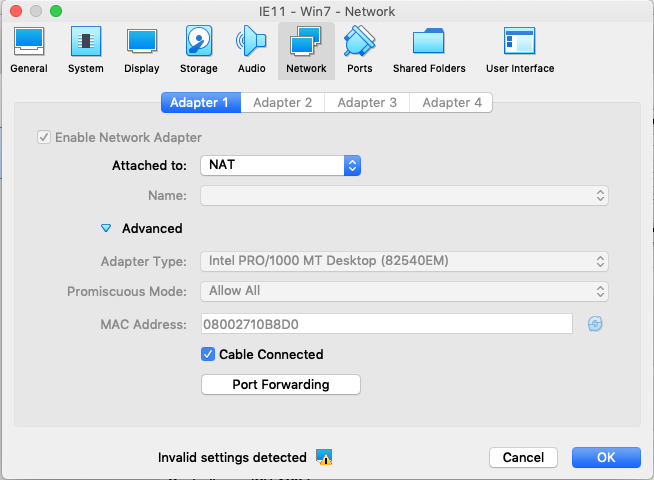
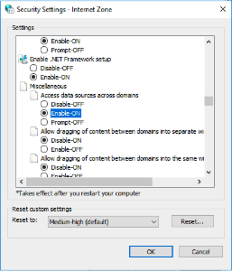

## Virtual Machine Access

These changes will work for accessing a local deploy from within in a virtual machine.

1. Find the IP of the host machine from inside the VM. For VirtualBox this tends to be `10.0.2.2`.
1. [Run vets-website](https://github.com/department-of-veterans-affairs/vets-website/#building-vets-website)
1. In `settings.local.yml` 
    1. Add `http://10.0.2.2:3000` and `http://10.0.2.2:3001` to `web_origin`
    1. Add `"10.0.2.2"` to `virtual_hosts`
    1. Set `virual_host_localhost` to `10.0.2.2`
    
   ```
   # For CORS requests; separate multiple origins with a comma
   web_origin: http://10.0.2.2:3000, http://10.0.2.2:3001

   virtual_hosts: ["127.0.0.1", "localhost", "10.0.2.2"]
   virtual_host_localhost: 10.0.2.2
   ```
1. Make sure to rebuild vets-api before starting

   ```
   make rebuild; 
   make up;
   ```
   
1. Make sure the VM can correctly access the host machine running vets-website and vets-api
   - [VirtualBox](#virtualbox)
1. Make sure the OS can correctly access the host machine running vets-website and vets-api
   - [Windows](#windows)
1. From within the VM go to `10.0.2.2:3001`


### Additional Virtual Machine Configurations

#### VirtualBox

VirtualBox has an issue with changing `Promiscuous Mode`.

1. In the virtual machine settings. 
   1. Make the network configuration of your virtual machine look like below
      
   1. In order to change `Promiscuous Mode`
      1. Change `Attached to` to `Bridged Adapter`, this allows `Promiscuous Mode` to be changed.
      1. Change `Promiscuous Mode` to "Allow All"
      1. Change `Attached to` to "NAT"
      1. Click OK
      
#### Windows
1. Access `Internet Options` > `Security` > `Custom Level...`
1. Change `Access data sources across domains` to `Enable-ON`

