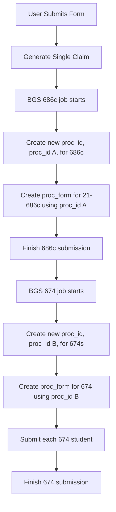
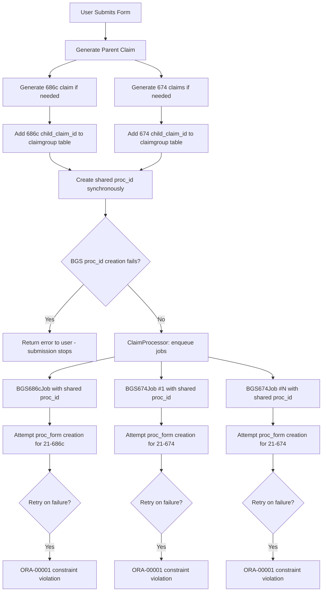
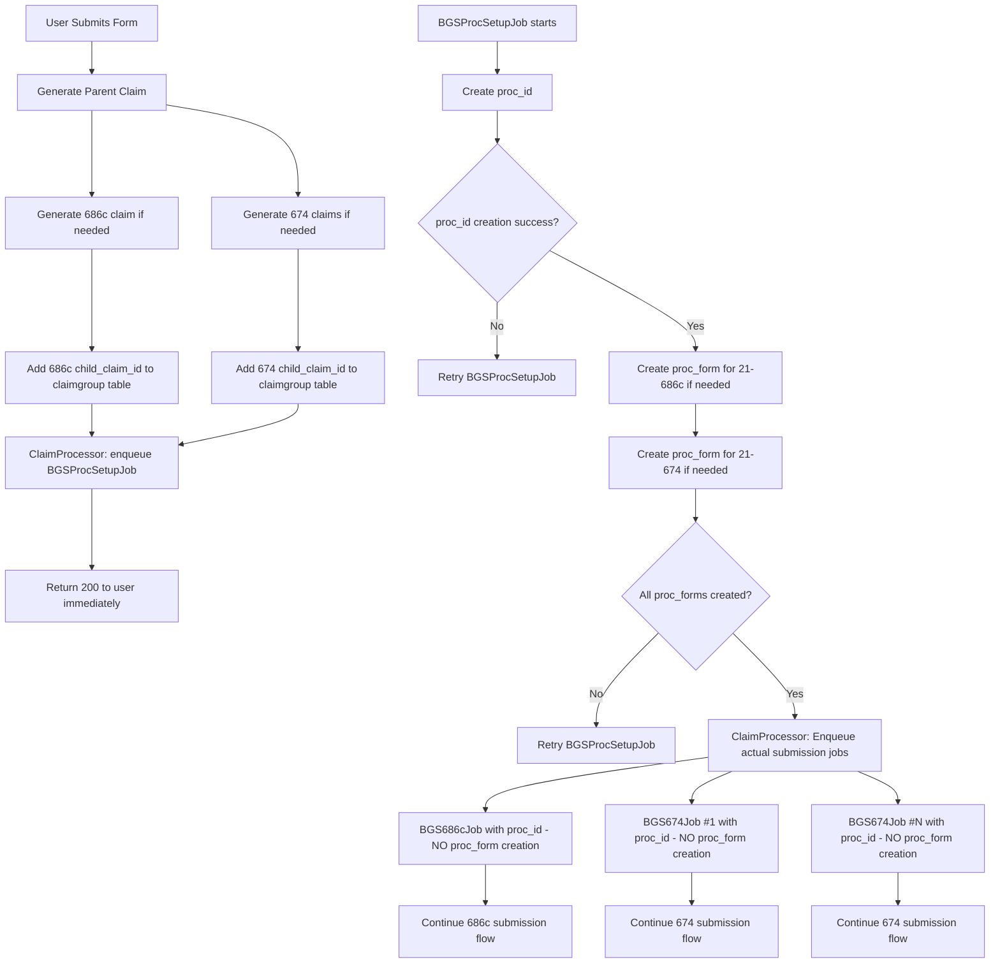

# ADR: Form 674 Proc ID and Proc Form Management

## Status
Proposed

## Context

The dependents benefits module handles Form 674 (school attendance) and Form 686c (dependent status changes) submissions through BGS integration. A critical issue has emerged with the current module implementation regarding `proc_id` and `proc_form` creation that causes unique constraint violations on retries.

### Problem Statement

The current module implementation creates a shared `proc_id` synchronously during form submission, then attempts to create `proc_form` records within each individual BGS job. This approach violates the BGS database constraint `PK_VNP_PROC_FORM` when jobs retry, as the database only allows one instance of each `proc_id` for each `form_id`.

The RBPS team has confirmed that:
1. A shared `proc_id` should be used for both 686c and 674 forms
2. There should only be one `proc_form` of each type per `proc_id`

## Previous Implementation

The legacy implementation handled this by creating new `proc_id` values for each form creation attempt, avoiding the unique constraint issue entirely.

**Characteristics:**
- New `proc_id` created per form type per attempt
- Maximum of 2 `proc_form` records per submission
- All 674 studends submitted under one proc_form/proc_id and in one BGS job
- No shared `proc_id` between form types
- No unique constraint violations on retries

## Current Module Implementation

The current implementation creates a shared `proc_id` synchronously, then attempts `proc_form` creation within individual jobs, leading to constraint violations on retries.

**Issues:**
- Synchronous BGS call can cause immediate user-facing failures
- Multiple jobs attempt to create the same `proc_form` type
- Retries cause unique constraint violations
- Error: `ORA-00001: unique constraint (CORPPROD.PK_VNP_PROC_FORM) violated`

## Proposed Implementation (Option C)

Create a dedicated async job for `proc_id` and `proc_form` setup, which then triggers the actual submission jobs.

**Benefits:**
- No synchronous BGS failures affecting user experience
- Single point of `proc_form` creation prevents constraint violations
- Maintains shared `proc_id` as required by RBPS
- Retryable setup process with proper error handling
- Clean separation of concerns

### Potential Risk: Unknown Downstream Constraints

While this solution addresses the known `proc_form` constraint violation, there is a risk of "kicking the can down the road." After `proc_id` and `proc_form` creation, both `BGS686cJob` and `BGS674Job` continue with additional BGS operations that utilize the shared `proc_id` (such as dependent creation, relationship establishment, and benefit claim processing). 

We believe these downstream operations are neutral with respect to `proc_id` reuse and should not have similar unique constraints. RBPS has been investigating this case for us, but has yet to definitively determine if there are any constraints on `proc_id` reuse. 

If our assumption is incorrect and there are currently unknown BGS database constraints related to repeated `proc_id` usage in these later operations, we could encounter similar constraint violations when `BGS686cJob` or `BGS674Job` retry after successful `BGSProcSetupJob` completion. 

This risk is considered acceptable given our current understanding of BGS operations. 

## Alternative Options Considered

### Option A: Move proc_id Creation to Individual Jobs

**Approach:** Move `proc_id` creation back into individual BGS jobs alongside `proc_form` creation.

**Pros:**
- No synchronous BGS failures
- Simple implementation
- Similar to previous working approach

**Cons:**
- Violates RBPS requirement for shared `proc_id` between 686c and 674
- Would require consolidating all 674 jobs into a single job
- Goes against the architectural direction of separate jobs per form

### Option B: Move proc_form Creation to Synchronous Step

**Approach:** Create both `proc_id` and all required `proc_forms` during the synchronous submission step.

**Pros:**
- Simplest implementation
- Guarantees `proc_forms` exist before job execution
- No constraint violations

**Cons:**
- Increases synchronous processing time
- More points of failure in the user-facing request
- Additional BGS calls that could fail synchronously
- Goes against the goal of moving BGS calls to async processing

## Decision

We will implement **Option C**: Create a dedicated `BGSProcSetupJob` that handles `proc_id` and `proc_form` creation asynchronously, then triggers the actual submission jobs.

### Monitoring Considerations
- Track `BGSProcSetupJob` success/failure rates
- Alert on setup job failures that could block submissions
- Maintain existing submission job monitoring

## Implementation Plan

1. Create `BGSProcSetupJob` with proc setup logic
   - Creates shared `proc_id`
   - Creates `proc_form` for 21-686c (if 686c claim exists)
   - Creates `proc_form` for 21-674 (if 674 claims exist)
   - On success: tells processor to enqueue actual BGS submission jobs
   - On failure: retries with exponential backoff
   - On exhaustion: triggers backup job
2. Modify `ClaimProcessor` to enqueue setup job instead of submission jobs
3. Remove `proc_form` creation from `BGS686cJob` and `BGS674Job` 

