# Backup Job Flow

[← Back to Overview](./full_data_flow.md)

This diagram shows what happens when `DependentBackupJob` is triggered after permanent failures in the primary submission jobs. The backup job submits claims to Lighthouse Benefits Intake API as a fallback mechanism.

```mermaid
graph TD
    Start[DependentBackupJob#perform<br/>claim_id triggered] --> LoadClaim[Load SavedClaim]
    
    LoadClaim --> CreateRecords[Create DB Records]
    CreateRecords --> DB1[(DB: Lighthouse::Submission<br/>find_or_create)]
    DB1 --> DB2[(DB: Lighthouse::SubmissionAttempt<br/>create)]
    
    DB2 --> InitService[Initialize LighthouseSubmission<br/>BenefitsIntakeService::Service]
    InitService --> GetUUID[Get UUID from service]
    GetUUID --> UpdateUUID[(DB: Update SubmissionAttempt<br/>benefits_intake_uuid)]
    
    UpdateUUID --> PrepareSubmission[Prepare Submission<br/>add_veteran_info<br/>get_files_from_claim]
    
    PrepareSubmission --> CollectClaims[Collect Child Claims<br/>686c and 674 PDFs]
    CollectClaims --> ProcessPDFs[Process Each PDF<br/>DatestampPdf with VA.GOV<br/>Add FDC Reviewed stamp]
    ProcessPDFs --> SetMainForm[Set Main Form Path<br/>686c if present, else first 674]
    SetMainForm --> CollectAttachments[Collect Attachments<br/>Remaining 674s + persistent attachments]
    
    CollectAttachments --> GenerateMetadata[Generate Lighthouse Metadata<br/>veteran name, file_number, zip<br/>doc_type, claim_date, business_line: CMP]
    
    GenerateMetadata --> Upload[Upload to Lighthouse<br/>BenefitsIntakeService.upload_form<br/>main_document + attachments]
    
    Upload --> Success{Success?}
    
    Success -->|Yes| UpdateSuccess[(DB: SubmissionAttempt<br/>status: success)]
    UpdateSuccess --> MarkProcessing[(DB: Parent SavedClaimGroup<br/>status: PROCESSING<br/>Overwrite previous FAILED)]
    MarkProcessing --> SendNotification[Send In-Progress Email<br/>Accepted by service]
    SendNotification --> Cleanup[Cleanup Temp Files<br/>Delete PDFs]
    Cleanup --> Complete[Job Complete]
    
    Success -->|No - Transient| UpdateFailed[(DB: SubmissionAttempt<br/>status: failed)]
    UpdateFailed --> RetryCheck{Retries<br/>< 16?}
    RetryCheck -->|Yes| RetryJob[Sidekiq Retry<br/>exponential backoff]
    RetryJob -.Retry.-> Start
    
    RetryCheck -->|No| Exhausted[Retries Exhausted]
    Exhausted --> SendFailure[Send Failure Email<br/>Final notification to user]
    SendFailure --> LogFailure[Log Silent Failure Avoided<br/>Datadog monitoring]
    LogFailure --> CleanupFinal[Cleanup Temp Files]
    CleanupFinal --> Failed[Job Failed Permanently]
    
    Success -->|No - Permanent| UpdatePermFailed[(DB: SubmissionAttempt<br/>status: failed)]
    UpdatePermFailed --> SendFailure
    
    %% Styling
    classDef trigger fill:#e8eaf6,stroke:#3f51b5,stroke-width:2px
    classDef process fill:#c8e6c9,stroke:#1b5e20,stroke-width:2px
    classDef database fill:#e3f2fd,stroke:#1976d2,stroke-width:2px
    classDef service fill:#fff3e0,stroke:#e65100,stroke-width:2px
    classDef decision fill:#fff9c4,stroke:#f57f17,stroke-width:2px
    classDef failure fill:#ffcdd2,stroke:#b71c1c,stroke-width:2px
    
    class Start trigger
    class LoadClaim,CreateRecords,GetUUID,PrepareSubmission,CollectClaims,ProcessPDFs,SetMainForm,CollectAttachments,GenerateMetadata,SendNotification,SendFailure,LogFailure,Complete,Cleanup,CleanupFinal,RetryJob,Exhausted process
    class DB1,DB2,UpdateUUID,UpdateSuccess,UpdateFailed,UpdatePermFailed,MarkProcessing database
    class InitService,Upload service
    class Success,RetryCheck decision
    class Failed failure
```

## Key Points

- **Lighthouse Only**: Backup job only submits to Lighthouse Benefits Intake API
- **PDF Generation**: Generates PDFs for all child claims (686c and 674s)
- **PDF Stamping**: Adds VA.GOV and FDC Reviewed datestamps to all documents
- **Database Tracking**: Lighthouse::Submission and Lighthouse::SubmissionAttempt
- **Status Override**: On success, marks parent SavedClaimGroup as PROCESSING (overwrites previous FAILED status)
- **Notifications**:
  - **Success**: In-progress email (claim accepted, awaiting VBMS processing)
  - **Failure**: Final failure email after exhausting retries
- **Monitoring**: Logs to Datadog to track backup job outcomes

## Retry Logic

- Up to 16 retries with exponential backoff for transient failures
- Permanent failures or retry exhaustion result in failure notification
- No further backup mechanism - this is the last resort
