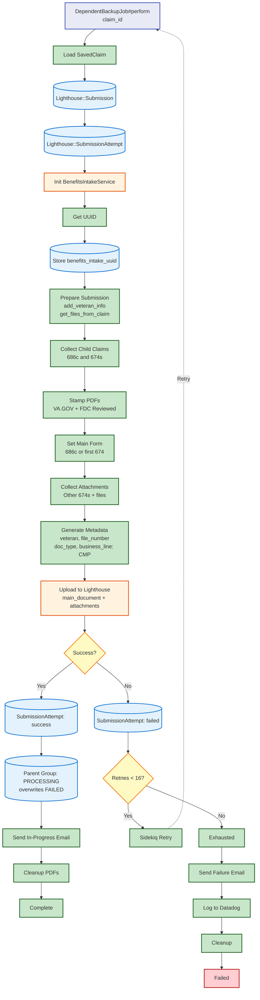

# Backup Job Flow

[← Back to Overview](./full_data_flow.md)

Shows `DependentBackupJob` triggered after permanent failures. Submits to Lighthouse Benefits Intake API as fallback.

## Key Points

- **Lighthouse Only**: Submits to Lighthouse Benefits Intake API only
- **PDF Processing**: Generates PDFs for all child claims, stamps with VA.GOV + FDC Reviewed
- **Main Form**: 686c if present, else first 674
- **Attachments**: Remaining 674s + persistent attachments
- **Metadata**: Veteran info, file_number, doc_type, business_line: CMP
- **Status Override**: Success marks parent as PROCESSING (overwrites FAILED)
- **Notifications**: In-progress email on success, failure email after 16 retries
- **Last Resort**: No further backup mechanism
