# Backup Job Flow

[← Back to Overview](./full_data_flow.md)

This diagram shows what happens when `DependentBackupJob` is triggered after permanent failures in the primary submission jobs. The backup job submits claims to Lighthouse Benefits Intake API as a fallback mechanism.

```mermaid
graph TD
    Start[DependentBackupJob#perform<br/>parent_claim_id triggered] --> LoadClaim[Load SavedClaim<br/>by parent_claim_id]
    
    LoadClaim --> CreateRecords[Create DB Records]
    CreateRecords --> DB1[(DB: Lighthouse::Submission<br/>find_or_create_by saved_claim_id)]
    DB1 --> DB2[(DB: Lighthouse::SubmissionAttempt<br/>create with submission)]
    
    DB2 --> InitService[LighthouseSubmission.initialize_service<br/>BenefitsIntakeService::Service.new]
    InitService --> GetUUID[Generate UUID from service]
    GetUUID --> UpdateUUID[(DB: Update SubmissionAttempt<br/>benefits_intake_uuid)]
    
    UpdateUUID --> PrepareSubmission[LighthouseSubmission.prepare_submission<br/>add_veteran_info to saved_claim]
    
    PrepareSubmission --> CollectClaims[Collect Child Claims<br/>ClaimProcessor.collect_child_claims<br/>686c and/or 674 claims]
    CollectClaims --> ProcessPDFs[For EACH child claim:<br/>claim.to_pdf + process_pdf<br/>Add VA.GOV datestamp<br/>Add FDC Reviewed stamp]
    ProcessPDFs --> SetMainForm[Set Main Form Path<br/>686c if present, else first 674]
    SetMainForm --> CollectAttachments[Collect Attachments<br/>Remaining 674s + persistent_attachments]
    
    CollectAttachments --> GenerateMetadata[Generate Lighthouse Metadata<br/>veteran first/last name, file_number<br/>zip, doc_type, claim_date<br/>source: 'va.gov backup dependent claim submission'<br/>business_line: CMP]
    
    GenerateMetadata --> Upload[LighthouseSubmission.upload_to_lh<br/>lighthouse_service.upload_form<br/>main_document + attachments + metadata]
    
    Upload --> Success{Success?}
    
    Success -->|Yes| UpdateSuccess[(DB: SubmissionAttempt<br/>status: success)]
    UpdateSuccess --> MarkProcessing[(DB: Parent SavedClaimGroup<br/>status: PROCESSING<br/>Overwrites FAILED status)]
    MarkProcessing --> Cleanup[Cleanup Temp Files<br/>Delete form_path + attachment_paths PDFs]
    Cleanup --> Complete[Job Complete]
    
    Success -->|No - Transient| UpdateFailed[(DB: SubmissionAttempt<br/>status: failed)]
    UpdateFailed --> RetryCheck{Retries<br/>< 16?}
    RetryCheck -->|Yes| RetryJob[Sidekiq Retry<br/>exponential backoff]
    RetryJob -.Retry.-> Start
    
    RetryCheck -->|No| Exhausted[Retries Exhausted<br/>sidekiq_retries_exhausted callback]
    Exhausted --> SendFailure[Send Error Notification<br/>notification_email.send_error_notification]
    SendFailure --> LogFailure[Log Silent Failure Avoided<br/>monitor.log_silent_failure_avoided]
    LogFailure --> Failed[Job Failed Permanently]
    
    %% Styling
    classDef trigger fill:#e8eaf6,stroke:#3f51b5,stroke-width:2px
    classDef process fill:#c8e6c9,stroke:#1b5e20,stroke-width:2px
    classDef database fill:#e3f2fd,stroke:#1976d2,stroke-width:2px
    classDef service fill:#fff3e0,stroke:#e65100,stroke-width:2px
    classDef decision fill:#fff9c4,stroke:#f57f17,stroke-width:2px
    classDef failure fill:#ffcdd2,stroke:#b71c1c,stroke-width:2px
    
    class Start trigger
    class LoadClaim,CreateRecords,GetUUID,PrepareSubmission,CollectClaims,ProcessPDFs,SetMainForm,CollectAttachments,GenerateMetadata,SendFailure,LogFailure,Complete,Cleanup,RetryJob,Exhausted process
    class DB1,DB2,UpdateUUID,UpdateSuccess,UpdateFailed,MarkProcessing database
    class InitService,Upload service
    class Success,RetryCheck decision
    class Failed failure
```

## Key Points

- **Lighthouse Only**: Backup job only submits to Lighthouse Benefits Intake API
- **Parameter**: Takes `parent_claim_id` (not individual claim_id) since it processes all child claims
- **Skips Parent Group Check**: Unlike primary jobs, backup job always runs (parent_group_failed? returns false)
- **PDF Generation**: Iterates through all child claims collected by ClaimProcessor, generates PDF for each
- **PDF Stamping**: Adds VA.GOV datestamp and FDC Reviewed text stamp to all documents
- **Main Form Priority**: 686c form used as main_document if present, otherwise first 674 is promoted
- **Database Tracking**: `Lighthouse::Submission` and `Lighthouse::SubmissionAttempt` records
- **Status Override**: On success, marks parent SavedClaimGroup as PROCESSING (overwrites previous FAILED status)
- **Notifications**:
  - **Success**: None (submitted notification already sent by controller after job enqueuing)
  - **Failure**: Error notification via `send_error_notification` after exhausting retries
- **Monitoring**: Uses DependentsBenefits::Monitor to track events and log failures
- **Cleanup**: Always deletes temporary PDF files in `ensure` block

## Retry Logic

- Up to 16 retries with exponential backoff (inherited from DependentSubmissionJob)
- No permanent failure detection - all errors treated as transient and retried
- Retry exhaustion triggers `sidekiq_retries_exhausted` callback which sends error notification
- No further backup mechanism - this is the last resort
- Does NOT mark parent group as FAILED on exhaustion (allows manual reprocessing)
