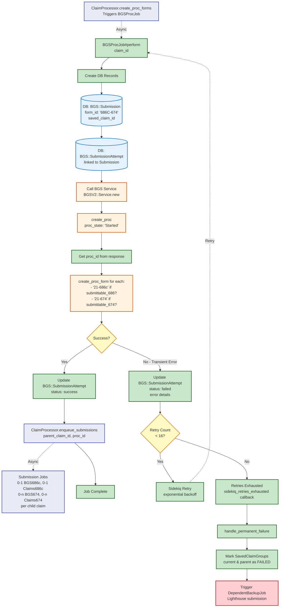

# BGS Proc Job Flow

[← Back to Overview](./full_data_flow.md)

This diagram shows what happens inside `BGSProcJob#perform` after being triggered by `ClaimProcessor.create_proc_forms`.

## Key Points

- **BGS Service**: Creates vnp_proc and proc_form records in BGS
- **Database Tracking**: BGS::Submission and BGS::SubmissionAttempt track the operation
- **Retry Logic**: Up to 16 retries with exponential backoff for transient failures
- **Success Path**: Triggers submission jobs for actual form submission
- **Failure Path**: Triggers backup job after exhausting retries

## Next Steps

- **On Success**: [Submission Jobs](./submission_jobs_flow.md) - Four parallel jobs submit to BGS and Lighthouse
- **On Failure**: [Backup Job](./backup_job_flow.md) - Lighthouse-only submission as fallback
