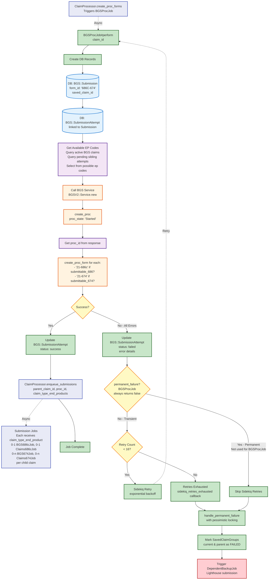

# BGS Proc Job Flow

[← Back to Overview](./full_data_flow.md)

This diagram shows what happens inside `BGSProcJob#perform` after being triggered by `ClaimProcessor.create_proc_forms`.

## Key Points

- **EP Code Selection**: Queries active BGS claims and pending sibling submission attempts, then selects available codes from `[130, 131, 132, 134, 136, 137, 138, 139]` to prevent duplicate claim errors
- **BGS Service**: Creates vnp_proc and proc_form records in BGS, associating them with the selected EP codes
- **Database Tracking**: BGS::Submission and BGS::SubmissionAttempt track the operation
- **EP Code Propagation**: Selected EP codes passed to child submission jobs via `claim_type_end_product` option
- **Retry Logic**: Up to 16 retries with exponential backoff for all failures (BGSProcJob treats all errors as transient)
- **Success Path**: Triggers submission jobs with EP codes for actual form submission
- **Failure Path**: After 16 retries, triggers backup job with pessimistic locking to prevent race conditions
- **Error Handling**: On success handler failure, sends backup job immediately

## Next Steps

- **On Success**: [Submission Jobs](./submission_jobs_flow.md) - Parallel jobs submit to BGS and Lighthouse with assigned EP codes
- **On Failure**: [Backup Job](./backup_job_flow.md) - Lighthouse-only submission as fallback
