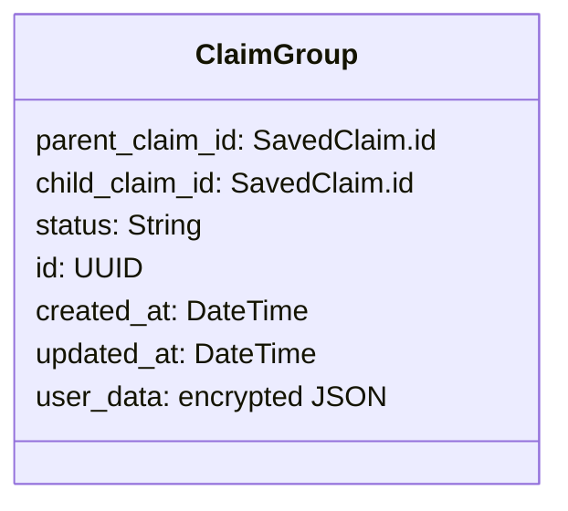
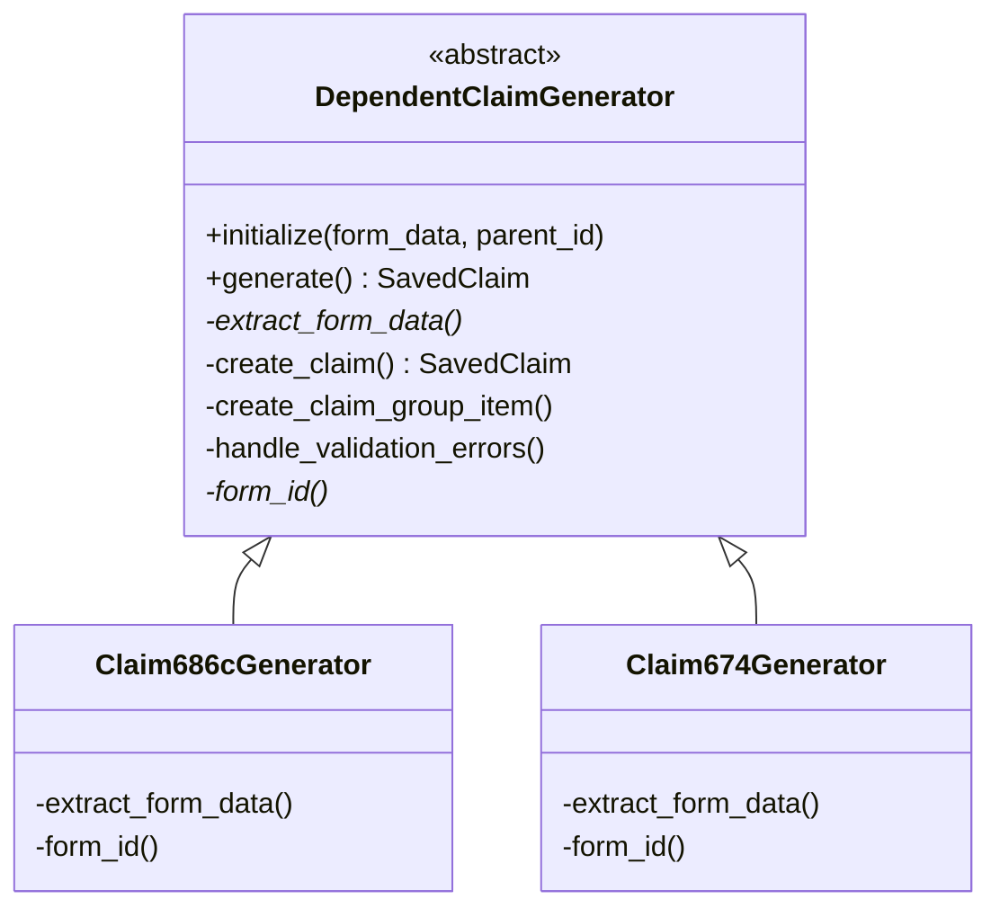
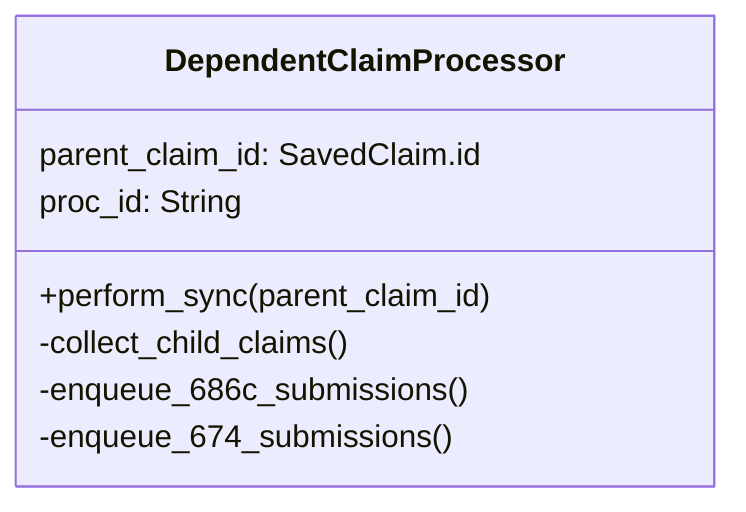
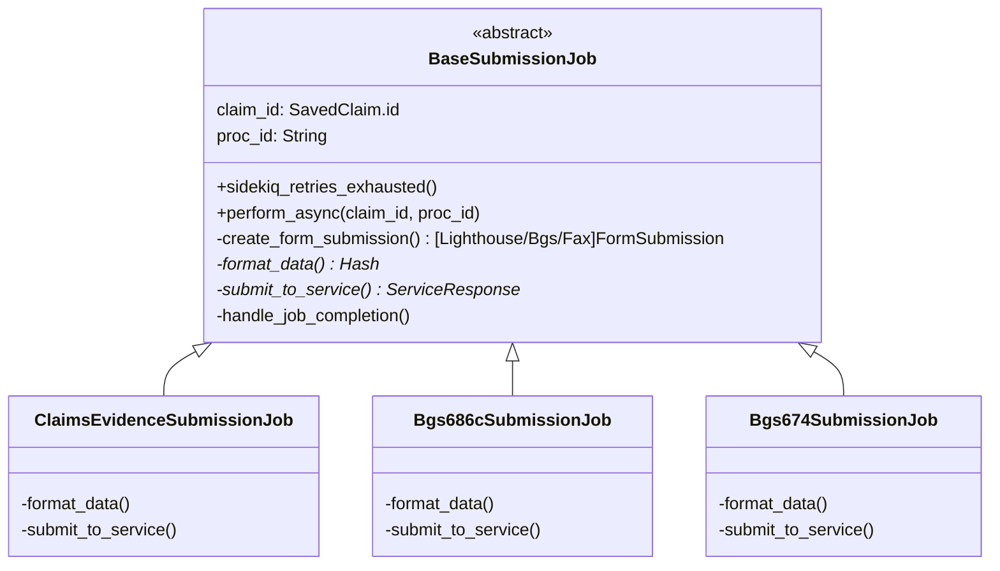

## Class Diagrams 

```mermaid
classDiagram
class ClaimGroup {
	parent_claim_id: SavedClaim.id
	child_claim_id: SavedClaim.id
	status: String
	id: UUID
	created_at: DateTime
	updated_at: DateTime
	user_data: encrypted JSON
}
```

```mermaid
classDiagram
    class DependentClaimGenerator {
        <<abstract>>
        +initialize(form_data, parent_id)
        +generate() SavedClaim
        -extract_form_data()*
        -create_claim() SavedClaim
        -create_claim_group_item()
        -handle_validation_errors()
        -form_id()*
    }

    class Claim686cGenerator {
        -extract_form_data()
        -form_id()
    }

    class Claim674Generator {
        -extract_form_data()
        -form_id()
    }

    DependentClaimGenerator <|-- Claim686cGenerator
    DependentClaimGenerator <|-- Claim674Generator
```

```mermaid
classDiagram
    class DependentClaimProcessor {
        parent_claim_id: SavedClaim.id
        proc_id: String
        +perform_sync(parent_claim_id)
        -collect_child_claims()
        -enqueue_686c_submissions()
        -enqueue_674_submissions()
    }
```

```mermaid
classDiagram
    class BaseSubmissionJob {
        <<abstract>>
        claim_id: SavedClaim.id
        proc_id: String
        +sidekiq_retries_exhausted()
        +perform_async(claim_id, proc_id)
        -create_form_submission() [Lighthouse/Bgs/Fax]FormSubmission
        -format_data()* Hash
        -submit_to_service()* ServiceResponse
        -handle_job_completion()
    }

    class ClaimsEvidenceSubmissionJob {
        -format_data()
        -submit_to_service()
    }
    class Bgs686cSubmissionJob {
        -format_data()
        -submit_to_service()
    }
    class Bgs674SubmissionJob {
        -format_data()
        -submit_to_service()
    }

    BaseSubmissionJob <|-- ClaimsEvidenceSubmissionJob
    BaseSubmissionJob <|-- Bgs686cSubmissionJob
    BaseSubmissionJob <|-- Bgs674SubmissionJob
```

