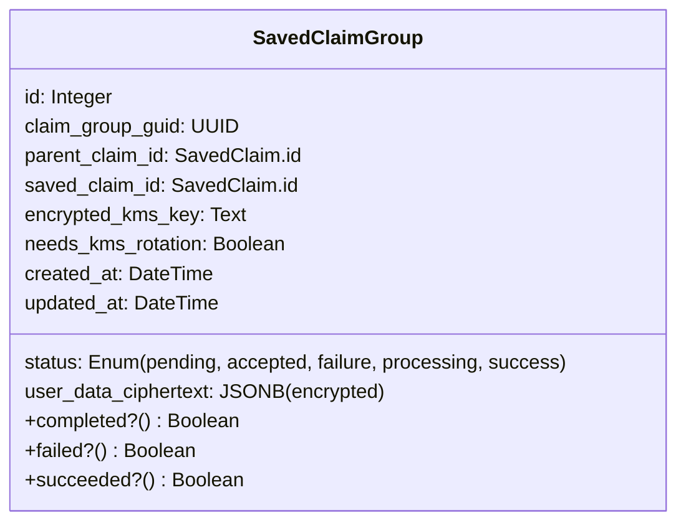
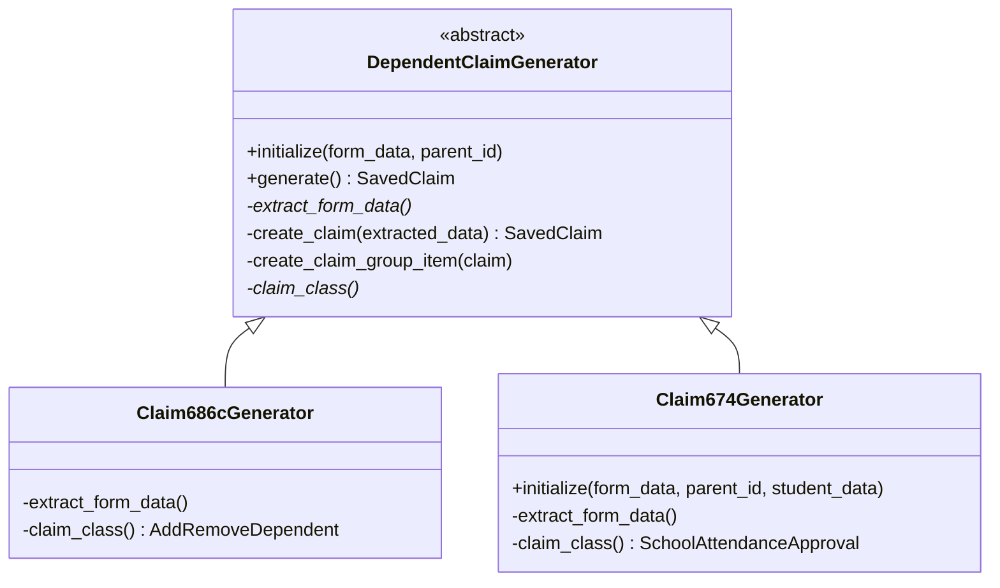
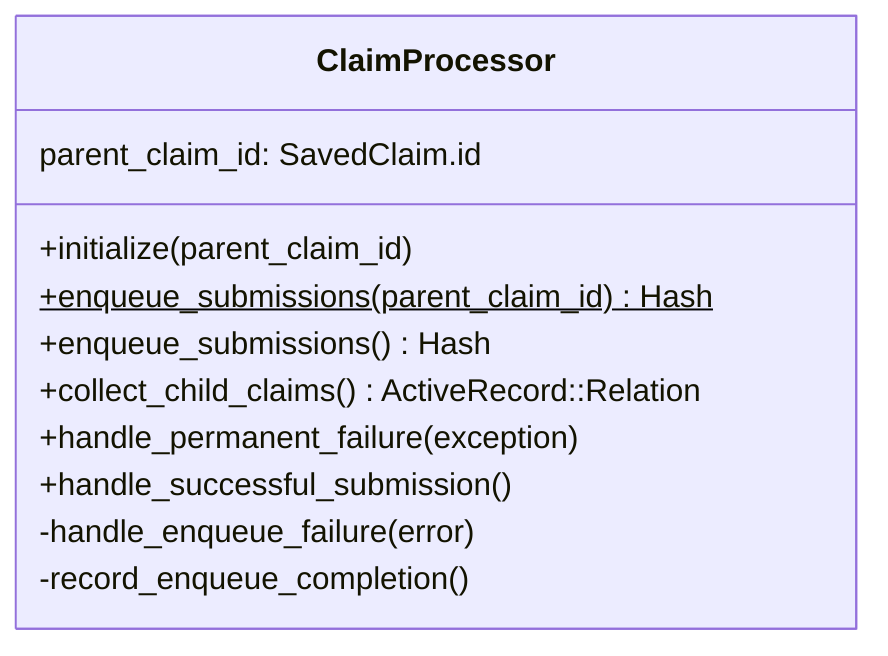
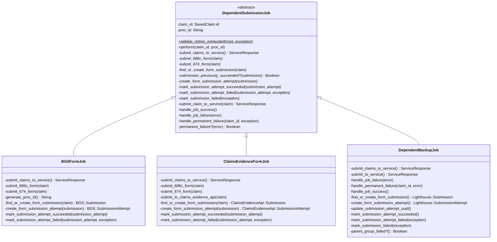

## Class Diagrams 

```mermaid
classDiagram
class SavedClaimGroup {
	id: Integer
	claim_group_guid: UUID
	parent_claim_id: SavedClaim.id
	saved_claim_id: SavedClaim.id
	status: Enum (pending, accepted, failure, processing, success)
	user_data_ciphertext: JSONB (encrypted)
	encrypted_kms_key: Text
	needs_kms_rotation: Boolean
	created_at: DateTime
	updated_at: DateTime
	+completed?() Boolean
	+failed?() Boolean
	+succeeded?() Boolean
}
```

```mermaid
classDiagram
    class DependentClaimGenerator {
        <<abstract>>
        +initialize(form_data, parent_id)
        +generate() SavedClaim
        -extract_form_data()*
        -create_claim(extracted_data) SavedClaim
        -create_claim_group_item(claim)
        -claim_class()*
    }

    class Claim686cGenerator {
        -extract_form_data()
        -claim_class() AddRemoveDependent
    }

    class Claim674Generator {
        +initialize(form_data, parent_id, student_data)
        -extract_form_data()
        -claim_class() SchoolAttendanceApproval
    }

    DependentClaimGenerator <|-- Claim686cGenerator
    DependentClaimGenerator <|-- Claim674Generator
```

```mermaid
classDiagram
    class ClaimProcessor {
        parent_claim_id: SavedClaim.id
        +initialize(parent_claim_id)
        +enqueue_submissions(parent_claim_id)$ Hash
        +enqueue_submissions() Hash
        +collect_child_claims() ActiveRecord::Relation
        +handle_permanent_failure(exception)
        +handle_successful_submission()
        -handle_enqueue_failure(error)
        -record_enqueue_completion()
    }
```

```mermaid
classDiagram
    class DependentSubmissionJob {
        <<abstract>>
        claim_id: SavedClaim.id
        proc_id: String
        +sidekiq_retries_exhausted(msg, exception)$
        +perform(claim_id, proc_id)
        -submit_claims_to_service()* ServiceResponse
        -submit_686c_form(claim)*
        -submit_674_form(claim)*
        -find_or_create_form_submission(claim)*
        -submission_previously_succeeded?(submission)* Boolean
        -create_form_submission_attempt(submission)*
        -mark_submission_attempt_succeeded(submission_attempt)*
        -mark_submission_attempt_failed(submission_attempt, exception)*
        -mark_submission_failed(exception)*
        -submit_claim_to_service(claim) ServiceResponse
        -handle_job_success()
        -handle_job_failure(error)
        -handle_permanent_failure(claim_id, exception)
        -permanent_failure?(error) Boolean
    }

    class BGSFormJob {
        -submit_claims_to_service() ServiceResponse
        -submit_686c_form(claim)
        -submit_674_form(claim)
        -generate_proc_id() String
        -find_or_create_form_submission(claim) BGS::Submission
        -create_form_submission_attempt(submission) BGS::SubmissionAttempt
        -mark_submission_attempt_succeeded(submission_attempt)
        -mark_submission_attempt_failed(submission_attempt, exception)
    }

    class ClaimsEvidenceFormJob {
        -submit_claims_to_service() ServiceResponse
        -submit_686c_form(claim)
        -submit_674_form(claim)
        -submit_to_claims_evidence_api(claim)
        -find_or_create_form_submission(claim) ClaimsEvidenceApi::Submission
        -create_form_submission_attempt(submission) ClaimsEvidenceApi::SubmissionAttempt
        -mark_submission_attempt_succeeded(submission_attempt)
        -mark_submission_attempt_failed(submission_attempt, exception)
    }

    class DependentBackupJob {
        -submit_claims_to_service() ServiceResponse
        -submit_to_service() ServiceResponse
        -handle_job_failure(error)
        -handle_permanent_failure(claim_id, error)
        -handle_job_success()
        -find_or_create_form_submission() Lighthouse::Submission
        -create_form_submission_attempt() Lighthouse::SubmissionAttempt
        -update_submission_attempt_uuid()
        -mark_submission_attempt_succeeded()
        -mark_submission_attempt_failed(exception)
        -mark_submission_failed(exception)
        -parent_group_failed?() Boolean
    }

    DependentSubmissionJob <|-- BGSFormJob
    DependentSubmissionJob <|-- ClaimsEvidenceFormJob
    DependentSubmissionJob <|-- DependentBackupJob
```

