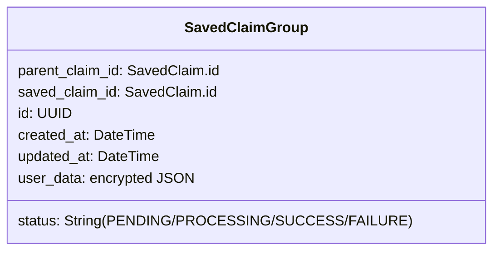
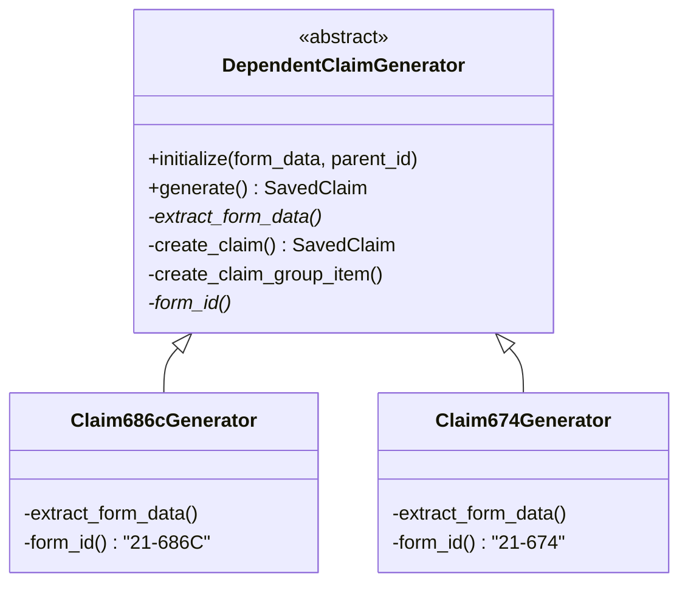
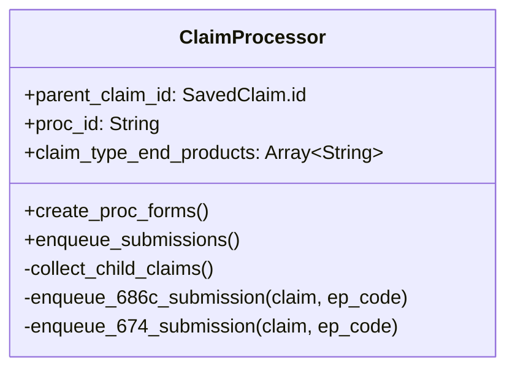
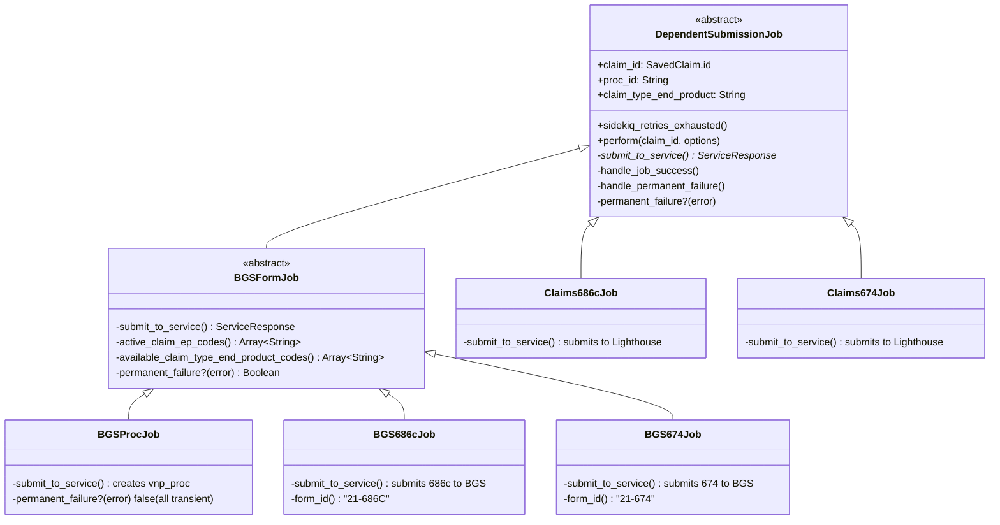

## Class Diagrams 

```mermaid
classDiagram
class SavedClaimGroup {
	parent_claim_id: SavedClaim.id
	saved_claim_id: SavedClaim.id
	status: String (PENDING/PROCESSING/SUCCESS/FAILURE)
	id: UUID
	created_at: DateTime
	updated_at: DateTime
	user_data: encrypted JSON
}
```

```mermaid
classDiagram
    class DependentClaimGenerator {
        <<abstract>>
        +initialize(form_data, parent_id)
        +generate() SavedClaim
        -extract_form_data()*
        -create_claim() SavedClaim
        -create_claim_group_item()
        -form_id()*
    }

    class Claim686cGenerator {
        -extract_form_data()
        -form_id() "21-686C"
    }

    class Claim674Generator {
        -extract_form_data()
        -form_id() "21-674"
    }

    DependentClaimGenerator <|-- Claim686cGenerator
    DependentClaimGenerator <|-- Claim674Generator
```

```mermaid
classDiagram
    class ClaimProcessor {
        +parent_claim_id: SavedClaim.id
        +proc_id: String
        +claim_type_end_products: Array~String~
        +create_proc_forms()
        +enqueue_submissions()
        -collect_child_claims()
        -enqueue_686c_submission(claim, ep_code)
        -enqueue_674_submission(claim, ep_code)
    }
```

```mermaid
classDiagram
    class DependentSubmissionJob {
        <<abstract>>
        +claim_id: SavedClaim.id
        +proc_id: String
        +claim_type_end_product: String
        +sidekiq_retries_exhausted()
        +perform(claim_id, options)
        -submit_to_service()* ServiceResponse
        -handle_job_success()
        -handle_permanent_failure()
        -permanent_failure?(error)
    }

    class BGSFormJob {
        <<abstract>>
        -submit_to_service() ServiceResponse
        -active_claim_ep_codes() Array~String~
        -available_claim_type_end_product_codes() Array~String~
        -permanent_failure?(error) Boolean
    }

    class BGSProcJob {
        -submit_to_service() creates vnp_proc
        -permanent_failure?(error) false (all transient)
    }

    class BGS686cJob {
        -submit_to_service() submits 686c to BGS
        -form_id() "21-686C"
    }

    class BGS674Job {
        -submit_to_service() submits 674 to BGS
        -form_id() "21-674"
    }

    class Claims686cJob {
        -submit_to_service() submits to Lighthouse
    }

    class Claims674Job {
        -submit_to_service() submits to Lighthouse
    }

    DependentSubmissionJob <|-- BGSFormJob
    DependentSubmissionJob <|-- Claims686cJob
    DependentSubmissionJob <|-- Claims674Job
    BGSFormJob <|-- BGSProcJob
    BGSFormJob <|-- BGS686cJob
    BGSFormJob <|-- BGS674Job
```

