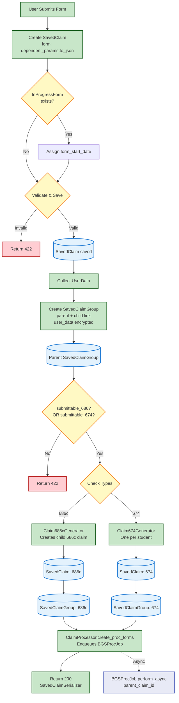

# Controller Data Flow

[← Back to Overview](./full_data_flow.md)

This diagram shows the flow through `DependentsBenefits::V0::ClaimsController` from form submission through job enqueue.

## Next Steps

After the controller returns 200, background processing begins:

- **[BGS Proc Job](./bgs_proc_job_flow.md)** - Creates vnp_proc in BGS and selects EP codes
- **[Submission Jobs](./submission_jobs_flow.md)** - Parallel submission jobs with EP codes
- **[Backup Job](./backup_job_flow.md)** - Lighthouse backup on failures
