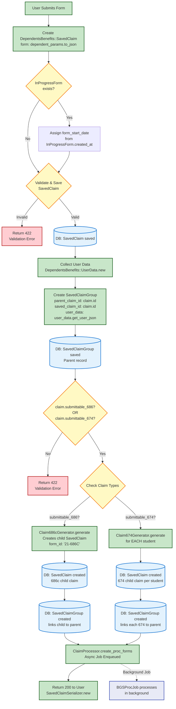

# Controller Data Flow

[← Back to Overview](./full_data_flow.md)

This diagram shows the complete flow through the `DependentsBenefits::V0::ClaimsController` from form submission through async job enqueue.

## Next Steps

After the controller returns 200 to the user, background processing begins:

- **[UserData Collection](./userdata_flow.md)** - Details of how user data is collected and fallbacks
- **[BGS Proc Job](./bgs_proc_job_flow.md)** - BGSProcJob creates vnp_proc in BGS
- **[Submission Jobs](./submission_jobs_flow.md)** - Four parallel submission jobs
- **[Backup Job](./backup_job_flow.md)** - Lighthouse backup submission on failures
