# Controller Data Flow

[← Back to Overview](./full_data_flow.md)

This diagram shows the complete flow through the `DependentsBenefits::V0::ClaimsController` from form submission through async job enqueue.

```mermaid
graph TD
    Start[User Submits Form] --> CreateClaim[Create PrimaryDependencyClaim<br/>form: dependent_params.to_json]
    
    CreateClaim --> CheckIPF{InProgressForm<br/>exists?}
    CheckIPF -->|Yes| AssignDate[Assign form_start_date<br/>from InProgressForm.created_at]
    CheckIPF -->|No| ValidateClaim
    AssignDate --> ValidateClaim{Validate & Save<br/>PrimaryDependencyClaim}
    
    ValidateClaim -->|Invalid| Error[Return 422<br/>Validation Error]
    ValidateClaim -->|Valid| DB1[(DB: SavedClaim saved)]
    
    DB1 --> CollectUser[Collect User Data<br/>DependentsBenefits::UserData.new]
    
    CollectUser --> CreateGroup[Create SavedClaimGroup<br/>claim_group_guid: claim.guid<br/>parent_claim_id: claim.id<br/>saved_claim_id: claim.id<br/>user_data: user_data.get_user_json]
    
    CreateGroup --> DB2[(DB: SavedClaimGroup saved<br/>Parent record)]
    
    DB2 --> ValidateType{claim.submittable_686?<br/>OR<br/>claim.submittable_674?}
    
    ValidateType -->|No| ErrorType[Raise ValidationErrors<br/>Returns 422]
    ValidateType -->|Yes| CheckType{Check Claim Types}
    
    CheckType -->|submittable_686?| Gen686[Claim686cGenerator.generate<br/>Creates AddRemoveDependent child claim<br/>form_id: '21-686C']
    CheckType -->|submittable_674?| Gen674Loop[For EACH student in<br/>student_information array]
    
    Gen686 --> DB3[(DB: SavedClaim created<br/>686c child claim)]
    DB3 --> DB4[(DB: SavedClaimGroup created<br/>links 686c child to parent)]
    
    Gen674Loop --> Gen674[Claim674Generator.generate<br/>Creates SchoolAttendanceApproval child claim<br/>form_id: '21-674']
    Gen674 --> DB5[(DB: SavedClaim created<br/>674 child claim per student)]
    DB5 --> DB6[(DB: SavedClaimGroup created<br/>links each 674 to parent)]
    
    DB4 --> Enqueue[ClaimProcessor.enqueue_submissions<br/>Enqueues BGSFormJob + ClaimsEvidenceFormJob<br/>Sends submitted notification]
    DB6 --> Enqueue
    
    Enqueue --> Return200[Return 200 to User<br/>SavedClaimSerializer.new]
    
    Enqueue -.Background Jobs.-> AsyncJob[BGSFormJob & ClaimsEvidenceFormJob<br/>process all child claims in parallel]
    
    %% Styling
    classDef process fill:#c8e6c9,stroke:#1b5e20,stroke-width:2px
    classDef database fill:#e3f2fd,stroke:#1976d2,stroke-width:2px
    classDef decision fill:#fff9c4,stroke:#f57f17,stroke-width:2px
    classDef error fill:#ffcdd2,stroke:#b71c1c,stroke-width:2px
    classDef trigger fill:#e8eaf6,stroke:#3f51b5,stroke-width:2px
    
    class Start,CreateClaim,CollectUser,CreateGroup,Gen686,Gen674Loop,Gen674,Enqueue,Return200 process
    class DB1,DB2,DB3,DB4,DB5,DB6 database
    class CheckIPF,ValidateClaim,ValidateType,CheckType decision
    class Error,ErrorType error
    class AsyncJob trigger
```

## Next Steps

After the controller returns 200 to the user, background processing begins:

- **[UserData Collection](./userdata_flow.md)** - Details of how user data is collected and fallbacks
- **[Submission Jobs](./submission_jobs_flow.md)** - BGSFormJob and ClaimsEvidenceFormJob process all child claims
- **[Backup Job](./backup_job_flow.md)** - DependentBackupJob for submission on permanent failures
