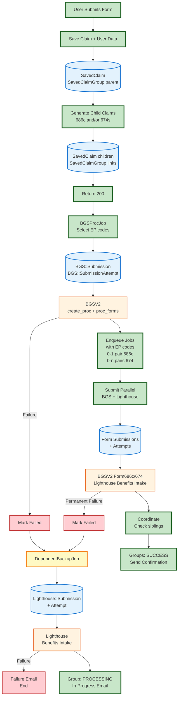

# Full Data Flow Documentation

Complete data flow for dependents benefits claims processing from submission to completion.

## Overview

Simplified end-to-end diagram showing happy path and failure branches. Click links below for detailed flows.

## Simplified End-to-End Flow

## Detailed Flow Diagrams

1. **[Controller Flow](./controller_flow.md)** - Form submission through job enqueue
   - SavedClaim, SavedClaimGroup (parent + children)
   - Claim686cGenerator, Claim674Generator
   - Validation

2. **[UserData Collection](./userdata_flow.md)** - User data collection with fallbacks
   - Sources: User object, claim data, VA Profile, BGS
   - Encrypted storage in SavedClaimGroup

3. **[BGS Proc Job](./bgs_proc_job_flow.md)** - Creates vnp_proc + selects EP codes
   - BGS::Submission, BGS::SubmissionAttempt
   - BGSV2 create_proc, create_proc_form
   - 16 retries → backup job

4. **[Submission Jobs](./submission_jobs_flow.md)** - Parallel BGS + Lighthouse jobs
   - 0-1 pair 686c, 0-n pairs 674
   - BGS jobs use EP codes
   - Coordination with pessimistic locking

5. **[Backup Job](./backup_job_flow.md)** - Lighthouse-only fallback
   - Lighthouse::Submission + Attempt
   - PDF generation + stamping
   - Last resort, no further backup
