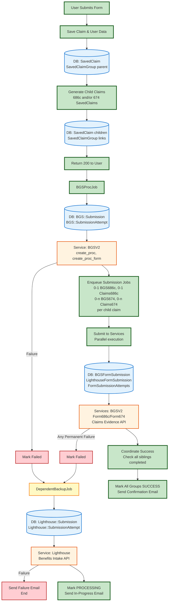

# Full Data Flow Documentation

This document describes the complete data flow for dependents benefits claims processing from the controller through completion.

## Overview

This simplified end-to-end diagram shows the complete happy path from form submission to completion, with failure paths branching off to the side. Click the links below to zoom into detailed flow diagrams for each step.

## Simplified End-to-End Flow

## Detailed Flow Diagrams

Each step in the simplified diagram above has a detailed flow diagram:

1. **[Controller Flow](./controller_flow.md)** - Complete controller flow from form submission through async job enqueue
   - Database: SavedClaim, SavedClaimGroup (parent and children)
   - Generators: Claim686cGenerator, Claim674Generator
   - Validation and error handling

2. **[UserData Collection](./userdata_flow.md)** - How user data is collected with fallback strategies
   - Data sources: User object, claim data, VA Profile, BGS
   - Fallback chains for each field
   - Error handling

3. **[BGS Proc Job](./bgs_proc_job_flow.md)** - BGSProcJob creates vnp_proc in BGS
   - Database: BGS::Submission, BGS::SubmissionAttempt
   - Services: BGSV2 create_proc, create_proc_form
   - Retry logic (up to 16 retries)
   - Success: Triggers submission jobs
   - Failure: Triggers backup job

4. **[Submission Jobs](./submission_jobs_flow.md)** - Parallel jobs submit to BGS and Lighthouse (one pair per child claim)
   - 0-1 BGS686cJob + 0-1 Claims686cJob (if 686c child claim exists)
   - 0-n BGS674Job + 0-n Claims674Job (one pair per 674 child claim)
   - Database: BGSFormSubmission, LighthouseFormSubmission, FormSubmissionAttempts
   - Services: BGSV2 Form686c/Form674, Claims Evidence
   - Coordination patterns for success and failure
   - Pessimistic locking for sibling coordination

5. **[Backup Job](./backup_job_flow.md)** - Lighthouse-only submission as last resort
   - Database: Lighthouse::Submission, Lighthouse::SubmissionAttempt
   - Services: Lighthouse Benefits Intake API
   - PDF generation and stamping
   - Success: Mark PROCESSING, send in-progress email
   - Failure: Send failure email, log to Datadog
