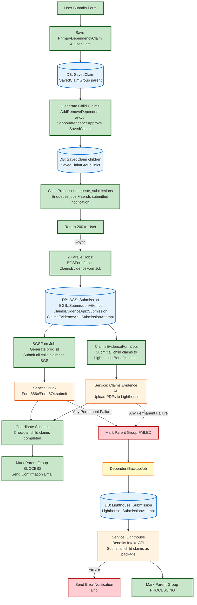

# Full Data Flow Documentation

This document describes the complete data flow for dependents benefits claims processing from the controller through completion.

## Overview

This simplified end-to-end diagram shows the complete happy path from form submission to completion, with failure paths branching off to the side. Click the links below to zoom into detailed flow diagrams for each step.

## Simplified End-to-End Flow

## Detailed Flow Diagrams

Each step in the simplified diagram above has a detailed flow diagram:

1. **[Controller Flow](./controller_flow.md)** - Complete controller flow from form submission through async job enqueue
   - Database: SavedClaim (PrimaryDependencyClaim), SavedClaimGroup (parent and children)
   - Generators: Claim686cGenerator (creates AddRemoveDependent), Claim674Generator (creates SchoolAttendanceApproval)
   - ClaimProcessor.enqueue_submissions enqueues BGSFormJob and ClaimsEvidenceFormJob
   - Validation and error handling

2. **[UserData Collection](./userdata_flow.md)** - How user data is collected with fallback strategies
   - Data sources: User object, claim data, VA Profile, BGS
   - Fallback chains for each field
   - Error handling

3. **[Submission Jobs](./submission_jobs_flow.md)** - Two parallel jobs that each process all child claims
   - **BGSFormJob**: Generates proc_id, then submits all child claims (686c and/or 674s) to BGS
   - **ClaimsEvidenceFormJob**: Submits all child claims (686c and/or 674s) to Lighthouse Benefits Intake
   - Database: BGS::Submission, BGS::SubmissionAttempt, ClaimsEvidenceApi::Submission, ClaimsEvidenceApi::SubmissionAttempt
   - Services: BGS::Form686c/Form674.submit, ClaimsEvidenceApi::Uploader
   - Coordination patterns for success and failure
   - Pessimistic locking for claim completion coordination

4. **[Backup Job](./backup_job_flow.md)** - Lighthouse-only submission as last resort
   - Triggered when primary jobs fail permanently or exhaust retries
   - Database: Lighthouse::Submission, Lighthouse::SubmissionAttempt
   - Services: Lighthouse Benefits Intake API
   - Processes all child claims together as a package
   - PDF generation, stamping with VA.GOV and FDC Reviewed marks
   - Success: Mark parent group PROCESSING (submitted notification already sent by controller)
   - Failure: Send error notification, log to monitoring
