# Submission Jobs Flow

[← Back to Overview](./full_data_flow.md)

This diagram shows what happens when `ClaimProcessor.enqueue_submissions` is called with a `parent_claim_id`. The processor enqueues two jobs in parallel: BGSFormJob and ClaimsEvidenceFormJob. Each job processes **all** child claims (both 686c and 674 types).

```mermaid
graph TD
    Start[ClaimProcessor.enqueue_submissions<br/>parent_claim_id] --> Split{Enqueue Jobs}
    
    Split -.Async.-> JobBGS[BGSFormJob#perform<br/>parent_claim_id]
    Split -.Async.-> JobClaims[ClaimsEvidenceFormJob#perform<br/>parent_claim_id]
    
    %% BGSFormJob Flow
    JobBGS --> CheckBGS{Parent Group<br/>Failed?}
    CheckBGS -->|Yes| SkipBGS[Early Exit]
    CheckBGS -->|No| GenerateProcID[Generate BGS proc_id<br/>BGS::Service.create_proc]
    GenerateProcID --> CollectBGS[Collect Child Claims<br/>from SavedClaimGroup]
    CollectBGS --> LoopBGS[For EACH child claim]
    
    LoopBGS --> DBBGS1[(DB: BGS::Submission<br/>find_or_create)]
    DBBGS1 --> DBBGS2[(DB: BGS::SubmissionAttempt<br/>create)]
    DBBGS2 --> CheckFormType{claim.form_id?}
    
    CheckFormType -->|21-686C| Submit686BGS[BGS::Form686c.submit<br/>Creates vnp_veteran, relationships,<br/>vnp_benefit_claim, BenefitClaim]
    CheckFormType -->|21-674| Submit674BGS[BGS::Form674.submit<br/>Creates school attendance records]
    
    Submit686BGS --> SuccessClaims{Success?}
    Submit674BGS --> SuccessClaims
    
    %% ClaimsEvidenceFormJob Flow
    JobClaims --> CheckClaims{Parent Group<br/>Failed?}
    CheckClaims -->|Yes| SkipClaims[Early Exit]
    CheckClaims -->|No| CollectClaims[Collect Child Claims<br/>from SavedClaimGroup]
    CollectClaims --> LoopClaims[For EACH child claim]
    
    LoopClaims --> DBClaims1[(DB: ClaimsEvidenceApi::Submission<br/>find_or_create)]
    DBClaims1 --> DBClaims2[(DB: ClaimsEvidenceApi::SubmissionAttempt<br/>create)]
    DBClaims2 --> SubmitClaims[Generate PDF<br/>Upload via ClaimsEvidenceApi::Uploader<br/>Lighthouse Benefits Intake]
    SubmitClaims --> SuccessClaims{Success?}
    
    %% Success Coordination for SubmissionJob
    subgraph SuccessFlow[Success Coordination Pattern]
        UpdateClaimsSuccess[Update SubmissionAttempt<br/>status: accepted]
        UpdateClaimsSuccess --> CheckSiblingsClaims{All Child Claims<br/>Submitted Successfully?}
        CheckSiblingsClaims -->|Yes| MarkGroupClaims[Mark Parent SavedClaimGroup<br/>status: SUCCESS]
        CheckSiblingsClaims -->|No| WaitClaims[Wait for Other Claims]
        MarkGroupClaims --> FinalClaims[Send Confirmation Email]
    end
    
    SuccessClaims -->|Yes| UpdateClaimsSuccess
    
    %% Failure Coordination for SubmissionJob
    subgraph FailureFlow[Failure Coordination Pattern]
        UpdateFailedClaims[Update SubmissionAttempt<br/>status: failed]
        UpdateFailedClaims --> PermFailureClaims{Permanent<br/>Failure?}
        PermFailureClaims -->|Yes| MarkFailedClaims[Mark Parent SavedClaimGroup<br/>status: FAILED]
        PermFailureClaims -->|No| RetryClaims{Retries<br/>< 16?}
        RetryClaims -->|Yes| RetryJobClaims[Sidekiq Retry<br/>Returns to Job Start]
        RetryClaims -->|No| MarkFailedClaims
        MarkFailedClaims --> BackupClaims[Trigger DependentBackupJob]
    end
    
    SuccessClaims -->|No| UpdateFailedClaims
    
    %% Styling
    classDef trigger fill:#e8eaf6,stroke:#3f51b5,stroke-width:2px
    classDef process fill:#c8e6c9,stroke:#1b5e20,stroke-width:2px
    classDef database fill:#e3f2fd,stroke:#1976d2,stroke-width:2px
    classDef service fill:#fff3e0,stroke:#e65100,stroke-width:2px
    classDef decision fill:#fff9c4,stroke:#f57f17,stroke-width:2px
    classDef failure fill:#ffcdd2,stroke:#b71c1c,stroke-width:2px
    
    class Start trigger
    class JobBGS,JobClaims,SkipBGS,SkipClaims,GenerateProcID,CollectBGS,CollectClaims,LoopBGS,LoopClaims,UpdateClaimsSuccess,UpdateFailedClaims,MarkFailedClaims,MarkGroupClaims,WaitClaims,FinalClaims,RetryJobClaims process
    class DBBGS1,DBBGS2,DBClaims1,DBClaims2 database
    class Submit686BGS,Submit674BGS,SubmitClaims service
    class Split,CheckBGS,CheckClaims,CheckFormType,SuccessClaims,RetryClaims,CheckSiblingsClaims,PermFailureClaims decision
    class BackupClaims failure
```

## Next Steps

- **On Permanent Failure**: [Backup Job](./backup_job_flow.md) - Lighthouse Benefits Intake submission as fallback
