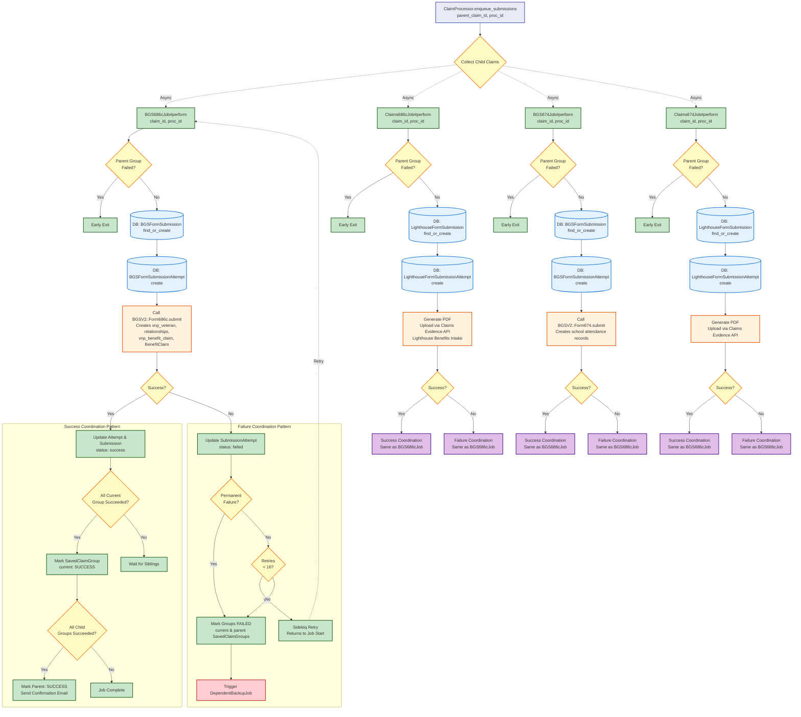

# Submission Jobs Flow

[← Back to Overview](./full_data_flow.md) | [← Back to BGS Proc Job](./bgs_proc_job_flow.md)

This diagram shows what happens when `ClaimProcessor.enqueue_submissions` is called with a `parent_claim_id` and `proc_id` after BGSProcJob succeeds. Jobs are enqueued in parallel based on which child claims exist: 0-1 pair for 686c forms (BGS686cJob + Claims686cJob) and 0-n pairs for 674 forms (one BGS674Job + Claims674Job per student).

## Key Points

- **Conditional Job Creation**: Jobs only created for child claims that exist
  - **686c**: 0-1 BGS686cJob + 0-1 Claims686cJob (if 686c child claim exists)
  - **674**: 0-n BGS674Job + 0-n Claims674Job (one pair per 674 child claim/student)
- **Parallel Execution**: All created jobs run in parallel
- **Early Exit**: Jobs check parent group status before processing
- **Two Submission Types**:
  - **BGS Jobs**: Submit directly to BGSV2 service
  - **Claims Jobs**: Generate PDF and upload to Lighthouse Benefits Intake
- **Success Coordination**: Uses pessimistic locking to coordinate sibling completion
- **Failure Coordination**: Permanent failures or retry exhaustion trigger backup job

## Coordination Patterns

Both success and failure coordination patterns are shown in detail for BGS686cJob. The other three jobs follow the same patterns with service-specific differences.

## Next Steps

- **On Permanent Failure**: [Backup Job](./backup_job_flow.md) - Lighthouse-only submission as fallback
