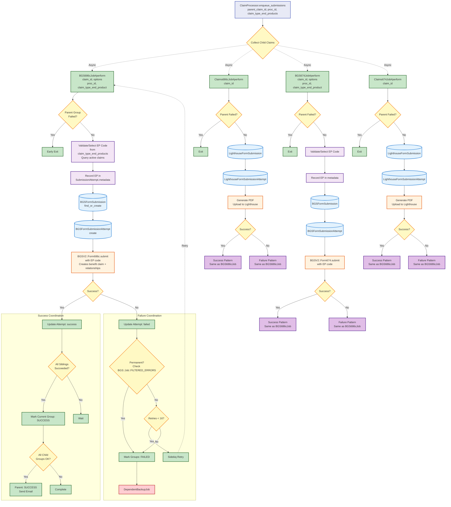

# Submission Jobs Flow

[← Back to Overview](./full_data_flow.md) | [← Back to BGS Proc Job](./bgs_proc_job_flow.md)

Shows what happens when `ClaimProcessor.enqueue_submissions` is called with `parent_claim_id`, `proc_id`, and `claim_type_end_products` after BGSProcJob succeeds. Jobs enqueued based on child claims: 0-1 pair for 686c, 0-n pairs for 674 (one per student).

## Key Points

- **EP Code Handling**: BGS jobs receive `claim_type_end_product` from BGSProcJob, validate/select from available codes, record in metadata
- **Conditional Jobs**: 0-1 pair for 686c, 0-n pairs for 674 (one per student)
- **Parallel Execution**: All jobs run in parallel
- **Early Exit**: Check parent group status before processing
- **Two Submission Types**:
  - **BGS Jobs**: Submit to BGSV2 with EP code
  - **Claims Jobs**: Generate PDF, upload to Lighthouse
- **Permanent Failure Detection**: BGS jobs check against `BGS::Job::FILTERED_ERRORS`
- **Coordination**: Pessimistic locking for sibling status checks
- **Retry/Backup**: 16 retries, then trigger backup job

## Next Steps

- **On Failure**: [Backup Job](./backup_job_flow.md) - Lighthouse-only fallback
