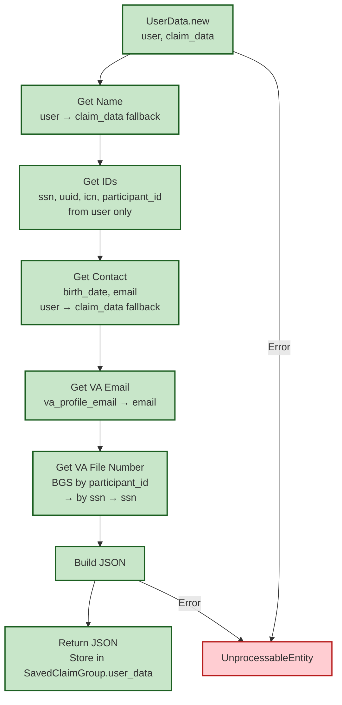

# UserData Collection Flow

[← Back to Overview](./full_data_flow.md) | [← Back to Controller Flow](./controller_flow.md)

Shows `DependentsBenefits::UserData.new(current_user, claim.parsed_form)` during controller flow.

## Key Points

- **Fallback Strategy**: User object preferred, claim_data fallback for name/contact
- **BGS Lookup**: VA File Number via participant_id → ssn → direct ssn fallback
- **Error Handling**: Raises UnprocessableEntity on failure
- **Storage**: JSON stored encrypted in `SavedClaimGroup.user_data` for background jobs
