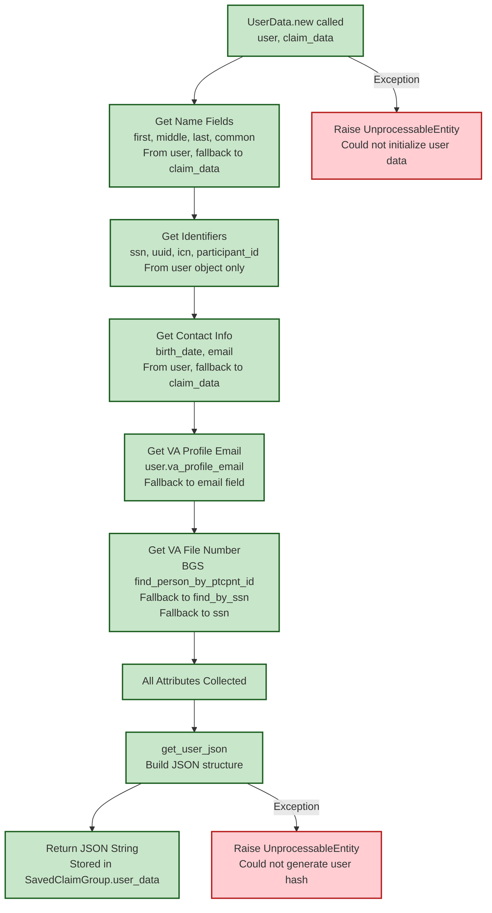

# UserData Collection Flow

[← Back to Overview](./full_data_flow.md) | [← Back to Controller Flow](./controller_flow.md)

This diagram shows what happens inside `DependentsBenefits::UserData.new(current_user, claim.parsed_form)` during the controller flow.

## Key Points

- **Fallback Strategy**: User object data is preferred, with claim_data as fallback for some fields
- **BGS Integration**: VA File Number requires BGS lookup with multiple fallback strategies
- **Error Handling**: Raises UnprocessableEntity if user data cannot be collected
- **Storage**: Final JSON stored in `SavedClaimGroup.user_data` for use by background jobs
