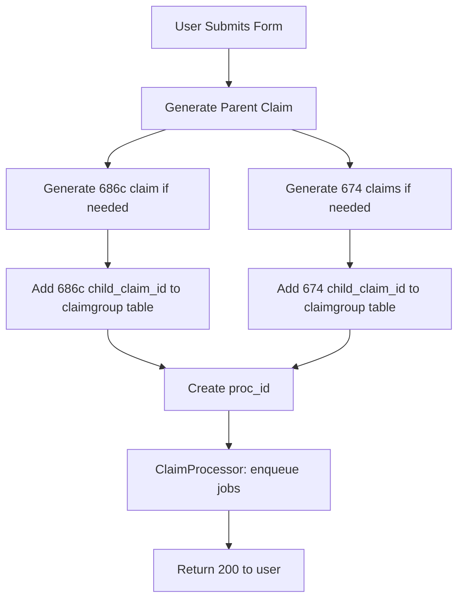
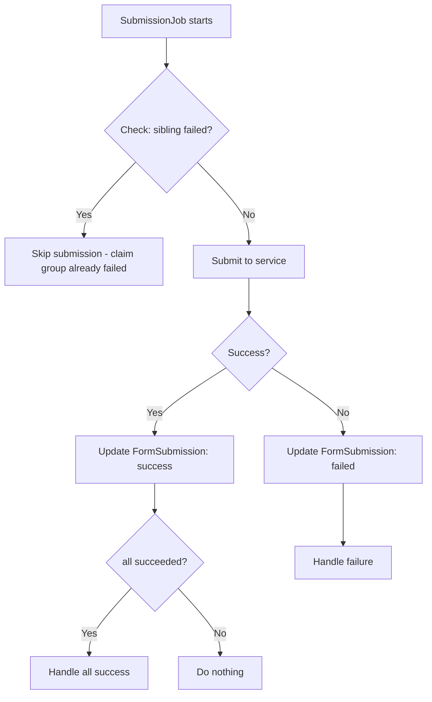

## Flows

DependentsApplicationController flow

```mermaid
flowchart TD    
    A[User Submits Form] --> B[Generate Parent Claim]
    
    B --> C[Generate 686c claim if needed]
    B --> D[Generate 674 claims if needed]
    
    C --> E[Add 686c child_claim_id to claimgroup table]
    D --> F[Add 674 child_claim_id to claimgroup table]

	E --> G[Create proc_id]
	F --> G
	
    G --> H[ClaimProcessor: enqueue jobs]
    
    H --> L[Return 200 to user]
```

BaseSubmissionJob flow

```mermaid
flowchart TD
    A[SubmissionJob starts] --> B{Check: sibling failed?}
    B -->|Yes| C[Skip submission - claim group already failed]
    B -->|No| E[Submit to service]
    E --> F{Success?}
    F -->|Yes| G[Update FormSubmission: success]
    F -->|No| H[Update FormSubmission: failed]
    
    G --> I{all succeeded?}
    I --> |Yes| K[Handle all success]
    I --> |No| M[Do nothing]
    H --> J[Handle failure]
```

