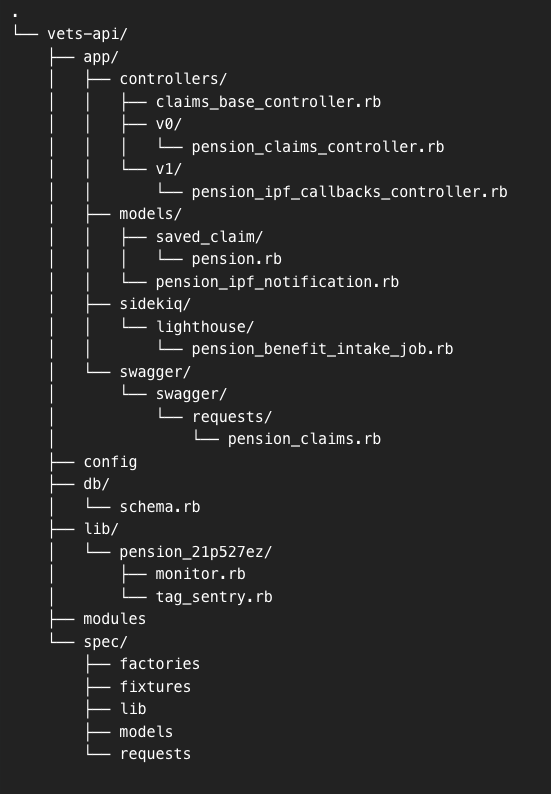
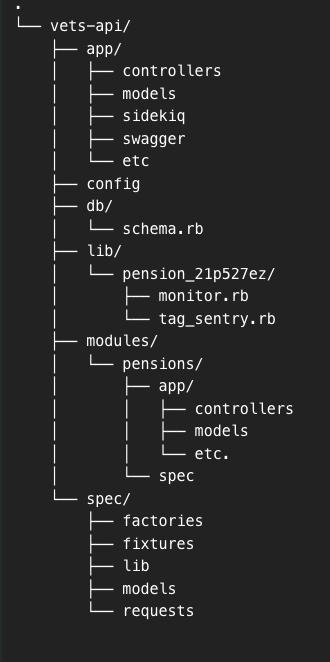

# Pensions Documentation

Pension & Burial Program (PBP)

## ADR

The pensions team uses [ADR Tools](https://github.com/npryce/adr-tools/tree/master) to document important engineering related decisions for the vets-api repo. The goal is to capture the technical decisions our group makes so that anyone new to our team or following behind will be able to understand the reasons for the decisions.

Additional architectural decisions made by other teams can be found here:
https://github.com/department-of-veterans-affairs/va.gov-team-sensitive/tree/master/teams/benefits/architectural-decision-records

| Decision                                                                                                    |
| ----------------------------------------------------------------------------------------------------------- |
| [Use ADR to document important engineering decisions](./adr/0001-record-architecture-decisions.md)          |
| [Move the pensions specific code to the modules folder](./adr/0002-use-modules-folder-for-pensions-code.md) |
|                                                                                                             |

## Folder structure

For more information on the Ruby on Rails directory structure, please refer to https://github.com/jwipeout/rails-directory-structure-guide

#### June 2024

The current folder structure generally follows the default directory structure that **Ruby on Rails** comes with.

##### App Folder

- At a high level, within the app folder, there are [controllers](https://guides.rubyonrails.org/action_controller_overview.html) and [models](https://guides.rubyonrails.org/active_record_basics.html). Ruby on Rails uses a MVC (model, view, controller) architecture pattern. There is little historical context or documentation on the choice of V0 or V1 for the controllers.
- There are also a [sidekiq](https://github.com/sidekiq/sidekiq) and [swagger](https://swagger.io/) folders.

##### DB Folder

- The db folder contains the schema and migrations used for the application.

##### Lib Folder

- The lib folder is intended for common code or code that can be reused by other teams. It is also where the code for interfacing with external APIs lives.

##### Config Folder

- The config folder is where most of the configuration files for the main rails app, plugins, etc. are housed

##### Spec Folder

- Contains the tests for vets-api

Summary Folder Structure

#### Planned Folder Structure

As discussed in this [ADR decision](./adr/0002-use-modules-folder-for-pensions-code.md), the pensions team has decided to move as much pension specific code out of the `app` folder as possible.

The new folder structure will look like:

## Team

| Name            | Email Address                |
| ------------    | -------------------------    |
| Matt Knight     | matt.knight@coforma.io       |
| Wayne Weibel    | wayne.weibel@adhocteam.us    |
| Tai Wilkin      | tai.wilkin@coforma.io        |
| Todd Rizzolo    | todd.rizzolo@adhocteam.us    |
| Daniel Lim      | daniel.lim@adhocteam.us      |
| Bryan Alexander | bryan.alexander@adhocteam.us |

## Troubleshooting

##
