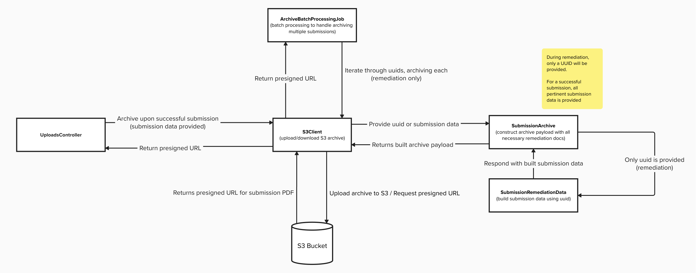

# Form Remediation Archiving

This solution is designed to remediate form submissions older than two weeks, which have failed processing. It includes Ruby on Rails service objects, a Rake task, and a Sidekiq job, utilizing S3 for secure storage.

**Primary Use Case**: This remediation solution processes form submissions to generate an archive payload that includes:

1. Original form submission data, with remediation-specific files:
   - Hydrated submission data and attachments.
   - JSON metadata file with submission details.
   - CSV manifest for tracking submissions.
2. Zips and uploads the archive to an S3 bucket, with optional presigned URL access.
3. Supports single PDF uploads of original submissions.

The following image depicts how this solution is architected:



---

## Table of Contents

- [Form Remediation Archiving](#form-remediation-archiving)
  - [Table of Contents](#table-of-contents)
  - [Getting Started](#getting-started)
    - [Settings](#settings)
    - [Configuration](#configuration)
  - [Usage](#usage)
    - [Rake Task Example](#rake-task-example)
    - [Batch Processing Job](#batch-processing-job)
  - [Extending Functionality](#extending-functionality)
    - [Overrideable Classes](#overrideable-classes)
    - [Directory and File Structure](#directory-and-file-structure)
      - [Structure Overview](#structure-overview)
    - [Naming Conventions](#naming-conventions)
  - [AWS S3 Bucket Setup](#aws-s3-bucket-setup)

---

## Getting Started

This solution is flexible, allowing extensive customization to suit various teams.

### Settings

Only the `region` and `bucket` settings for AWS S3 are required. The `vets-api` role accesses AWS credentials by default.

To use the provided uploader, ensure credentials are configured in `Settings` as follows:

```yml
bucket: <YOUR_TEAM_BUCKET>
region: <YOUR_TEAM_REGION>
```

If your settings differ, override the `s3_settings` method in your configuration class:

```ruby
# frozen_string_literal: true

require 'simple_forms_api/form_remediation/configuration/base'

class NewConfig < SimpleFormsApi::FormRemediation::Configuration::Base
  def s3_settings
    settings = Settings.<YOUR_TEAM>.<AWS_S3_SETTINGS>
    OpenStruct.new(bucket: settings.your_bucket_name, region: settings.your_region_name)
  end
end
```

For adding a `Settings` entry, refer to [Platform Documentation](https://depo-platform-documentation.scrollhelp.site/developer-docs/settings).

### Configuration

Set up a custom configuration by creating a subclass of `Base`, ensuring the `s3_settings` method is implemented:

```ruby
# frozen_string_literal: true

require 'simple_forms_api/form_remediation/configuration/base'

class NewConfig < SimpleFormsApi::FormRemediation::Configuration::Base
  def s3_settings
    Settings.<YOUR_TEAM>.<AWS_S3_SETTINGS>
  end
end
```

This solution uses the `:benefits_intake_uuid` identifier by default for querying `FormSubmission`, but this can be customized by setting `id_type` in your configuration.

---

## Usage

### Rake Task Example

A Rake task for batch processing is available for reference, using `ArchiveBatchProcessingJob` to archive multiple form submissions and retrieve presigned URLs:

```sh
# Default type:
bundle exec rails simple_forms_api:archive_forms_by_uuid[abc-123 def-456]

# Custom type:
bundle exec rails simple_forms_api:archive_forms_by_uuid[abc-123 def-456,submission]
```

In `archive_forms_by_uuid`, `benefits_intake_uuids` specifies a collection of submission identifiers, and `type` defines the upload type (default is `remediation`). This task initializes a configuration object (`VffConfig`) and triggers the batch job, printing presigned URLs upon completion.

Note: **THIS RAKE TASK IS FOR REFERENCE ONLY!!** This rake task is specifically configured to interact with the Veteran Facing Forms team's S3 bucket, so please don't use it for your team.

### Batch Processing Job

The `ArchiveBatchProcessingJob` handles batch processing of form submissions, iterating through each submission identifier to archive and upload it to S3. This job will initiate the archiving and uploading process directly through the `perform` method.

To initiate batch processing, use the following example:

```ruby
config = YourTeamsConfig.new
job = SimpleFormsApi::FormRemediation::ArchiveBatchProcessingJob.perform(ids: your_teams_ids, config:)
```

In this example:

- `perform` initiates the batch job, which processes each ID in `your_teams_ids` and uploads it based on the configuration provided.
- Presigned URLs for accessing uploaded files will be logged or otherwise handled as configured within the job. Ensure your configuration handles any post-upload actions required for your team.

Alternatively, you can create a custom job for specific team requirements:

```ruby
config = YourTeamsConfig.new
job = YourTeamsUniqueJob.perform(ids: your_teams_ids, config:)
```

In both cases, presigned URLs are not directly returned from `perform`. If your team needs to access presigned URLs programmatically after job completion, consider modifying the job’s output or handling the URLs as part of the logging or post-upload configuration.

---

## Extending Functionality

Each component of this solution can be extended or customized to meet team requirements.

1. Review extensible components in the [Base Configuration](../../../../../../../lib/simple_forms_api/form_remediation/configuration/base.rb).
2. Create subclasses for required functionality.
3. Register the subclass in your configuration:

```ruby
# frozen_string_literal: true

require 'simple_forms_api/form_remediation/configuration/base'

class NewUploader < SimpleFormsApi::FormRemediation::Uploader
  def size_range
    (1.byte)...(50.megabytes)
  end
end
```

```ruby
# frozen_string_literal: true

require 'simple_forms_api/form_remediation/configuration/base'

class NewConfig < SimpleFormsApi::FormRemediation::Configuration::Base
  def s3_settings
    Settings.<YOUR_TEAM>.<AWS_S3_SETTINGS>
  end

  def uploader_class
    NewUploader
  end
end
```

```ruby
config = NewConfig.new
job = SimpleFormsApi::FormRemediation::ArchiveBatchProcessingJob.new
presigned_urls = job.perform(ids: benefits_intake_uuids, config:, type: :remediation)
```

### Overrideable Classes

- `submission_archive_class`: Customize archive generation.
- `s3_client`: Customize S3 interactions.
- `remediation_data_class`: Customize data processing for submissions.
- `uploader_class`: Customize file upload and S3 handling.
- `submission_type`: Define `FormSubmission` model queries.
- `attachment_type`: Define attachment model queries.

---

### Directory and File Structure

The S3 upload structure is organized to group archived files for each form submission. Files are stored based on a directory path that includes details like submission type and form-specific information, ensuring organized and traceable storage.

#### Structure Overview

1. **Base Directory (`parent_dir`)**: This is defined by your configuration and determines the top-level folder in the S3 bucket for all archived submissions.
2. **Upload Type Directory**: Submissions are stored in subdirectories based on the upload type (`:remediation` or `:submission`).
3. **Dated Directory**: Each submission includes a subdirectory named with a date-stamped identifier and the form number, such as `<MM.DD.YY>-Form<FormNumber>`, which is generated in the `dated_directory_name` method. This structure keeps submissions organized by date and form type.
4. **Files in Each Directory**:
   - **Archive File**: If the upload type is `:remediation`, the submission data and attachments are zipped into a single `.zip` file. This zip file contains:
     - **PDF of Submission**: The PDF representation of the original form submission.
     - **JSON Metadata**: A file with the original metadata from the submission.
     - **Attachments**: Any additional documents submitted with the form.
   - **PDF File**: For `:submission` type, only the original form submission is uploaded as a standalone `.pdf` file.

The following example illustrates the folder structure:

```bash
<parent_dir>/
└── remediation/
   ├── 10.28.24-Form21-10210/
   │   ├── 10.28.24_form_21-10210_vagov_abc123.zip  # Archive of PDF, metadata, and attachments
   │   ├── 10.28.24_form_21-10210_vagov_bcd234.zip
   │   └── manifest_10.28.24-Form21-10210.csv  # Manifest file for tracking
   └── 10.28.24-Form20-10207/
       ├── 10.28.24_form_20-10207_vagov_ghi123.zip
       ├── 10.28.24_form_20-10207_vagov_jkl456.zip
       └── manifest_10.28.24-Form20-10207.csv
```

### Naming Conventions

- **Dated Directory**: Follows `<MM.DD.YY>-Form<FormNumber>` format.
- **Zip Files**: Named `<MM.DD.YY>_form_<FormNumber>_vagov_<ID>.zip`.
- **PDF Files**: Named `<MM.DD.YY>_form_<FormNumber>_vagov_<ID>.pdf`.
- **Manifest Files**: Named `manifest_<MM.DD.YY>-Form<FormNumber>.csv`, which logs submission details and helps track archives uploaded to S3.

This structure and naming convention provides clear organization, helping locate specific submission archives by type, date, and form number.

---

## AWS S3 Bucket Setup

- [Please refer to the AWS S3 Bucket Setup Documentation here.](aws_s3_bucket_setup.md)
