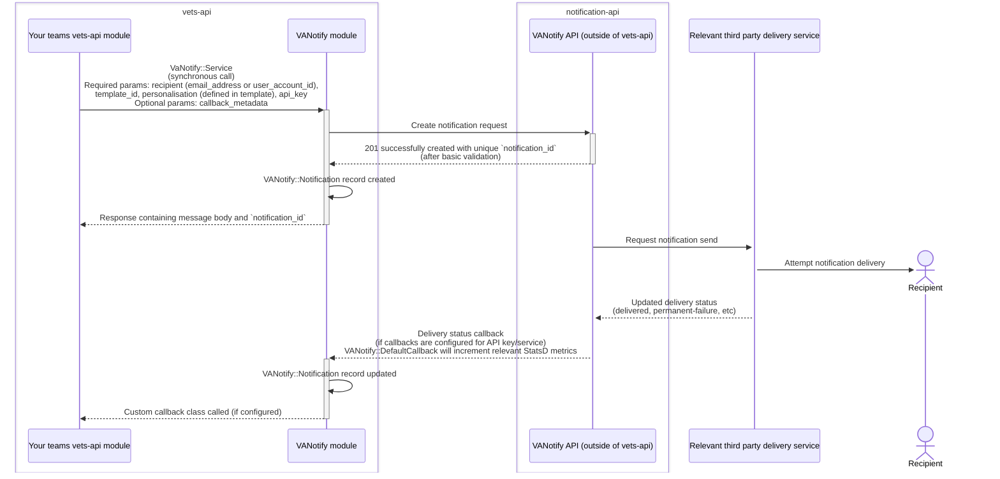
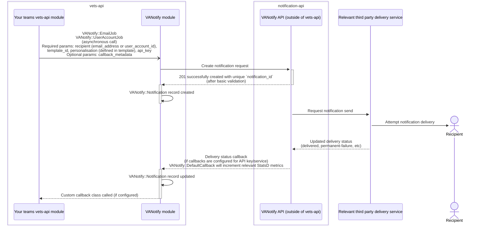

<a name="top"></a>
# Table of Contents
- [Introduction](#introduction)
- [Getting Started](#getting-started)
    - [API Key Structure](#api-key-structure)
        - [API Key Name](#api-key-name)
- [Using VANotify: How It Works](#how-it-works)
    - [Delivery Workflow](#delivery-workflow)
    - [Sending Options](#sending-options)
        - [Synchronous/inline](#sync)
        - [Asynchronous](#async)
- [Using Custom Callbacks](#using-custom-callbacks)
    - [Why Use Callbacks?](#why-use-callbacks)
    - [Option 1: Default Callback Class](#callbacks-option-1)
    - [Option 2: Custom Callback Class](#callbacks-option-2)
- [Testing](#testing)
- [Debugging](#debugging)
- [Contact Us](#contact-us)

# VA Notify
## Introduction <a name="introduction"></a>

The VANotify service enables internal VA teams and systems to send notifications to Veterans, their families, and the people who support them. Within the `vets-api` ecosystem, there is a VANotify-specific module that provides a way for teams to easily integrate these notification sends into their own business flows and monitor their performance.

[Back to top](#top)

## Getting Started <a name="getting-started"></a>

Depending on which business line you fall under, you may require a new Service/API key to be set up for your use case. If your team's `vets-api` module already references something like `Settings.vanotify.services.<your service name>.<optional details>.api_key`, you probably already have one set up. However, if you think you have a reason for a new API key or aren't sure of your team's status, reach out in the #va-notify-public channel and please provide the following pieces of information so our support engineers can assist:
- the name of your team or service/business line
- your VA email address

It is important to understand that the service IDs, template IDs, and API keys are all specific to each environment (prod, staging, etc.), so you will need to update the [Parameter Store](https://depo-platform-documentation.scrollhelp.site/developer-docs/settings-and-parameter-store) to properly reference the correct values for each environment. A common pitfall during testing is accidentally referencing another environment's IDs/keys, so this is always a good place to start debugging when unexpected issues occur.

[Back to top](#top)

### API Key Structure <a name="api-key-structure"></a>
API keys follow a specific structure that must be adhered to. There are three components:
- KEY_NAME: VANotify's internal name for your API key (usually provided with key; if not, see the "API Key Name" section below)
- YOUR_VANOTIFY_SERVICE_ID: the UUID corresponding to your VANotify service
- API_KEY: The actual API key

So if your key name was `foo-bar-key`, your service ID was `aaaa-aa-aaaa`, and your API key was `bbbb-bbb-bbbb`, the final expected format of your key would be:

`foo-bar-key-aaaa-aa-aaaa-bbbb-bbb-bbbb`

[Back to top](#top)

#### API Key Name <a name="api-key-name"></a>
This value is typically provided to your team when the API key was issued. If this is no longer known, please reach out in the #va-notify-public channel and provide the following pieces of information so our support engineers can assist:
- the service_id for the VANotify service in your request
- request that your need is for the API key name and type

Once we've shared the name, details about the API key type can be found in the VANotify portal in the [Developers section under Technical Information](https://notifications.va.gov/developer/tech_info).

[Back to top](#top)

## Using VANotify: How It Works <a name="how-it-works"></a>

While the VANotify module can be used synchronously or asynchronously, it follows the same flow for the sending of notifications. Once your team's code invokes the module, it creates and sends a request to the `notification-api` service, which performs basic validation and returns a `notification_id` when successful. This is sent back to the VANotify module, which then creates a `VANotify::Notification` record used to track the delivery status. If performed synchronously, the module will return the `notification_id` and message response immediately.

At that point, the `notification-api` service uses its internal delivery workflow to attempt delivery of the notification to the recipient. The status results of that delivery are returned to `notification-api`, which will then send the update back to the VANotify module, at which point the `VANotify::Notification` record will be updated. If your team has custom callbacks configured, the VANotify module will pass along those updates via your callback configuration. Updates may include statuses like "delivered," "failed," or "temporary failure." (See the [VA Notify Error Status Mapping Table](https://github.com/department-of-veterans-affairs/vanotify-team/blob/main/Support/error_status_reason_mapping.md#error-table) for a more complete and descriptive list of end-states.) Finally, logs and StatsD metrics are incremented and capture the outcome for reporting and troubleshooting.

[Back to top](#top)

### Delivery Workflow <a name="delivery-workflow"></a>
Our delivery workflow includes retries for errors that may be temporary in nature, like service availability. If your API request includes a recipient_identifier, then VA Notify kicks off our lookup integrations. First, we use MPI to do a deceased check and identify the correlated VA Profile ID. Once we have the VA Profile ID, we use VA Profile to retrieve the email address on file for the Veteran. If there are issues finding the Veteran’s profile or contact information, then VA Notify is unable to deliver the notification. This would indicate that the Veteran needs an alternative communication method or an updated email address. If an email address is successfully retrieved or the API request includes the email address directly, then the notification moves on to delivery via our email provider.

There are a couple of reasons that can cause an email notification to fail such as hard bounces and soft bounces. Hard bounces indicate a permanent failure due to an invalid, unreachable email address. Soft bounces indicate a temporary failure. However, there’s many reasons for soft bounces, some of which require manual effort by the recipient or recipient’s organization if they are utilizing a managed email service (e.g. a work email). Email settings could be blocking these notifications from being delivered. If your notification continues to soft bounce, it’s unlikely to succeed with more send attempts.

[Back to top](#top)

### Sending Options <a name="sending-options"></a>

#### Synchronous/inline <a name="sync"></a>
With synchronous sending, you will receive a response back right away. To do this, you will want to invoke `VaNotify::Service`. An example is shown here with a placeholder api key:

```
# Observe the argument passed to new, specifically `your_va_notify_service_name_here`
notify_client = VaNotify::Service.new(Settings.vanotify.services.your_va_notify_service_name_here.api_key)

# send email using an email address
notify_client.send_email(
  {
    email_address: 'some_email@example.com',
    template_id: Settings.vanotify.services.your_va_notify_service_name_here.template_id.some_template_name,
    personalisation: { # using the British-English spelling
      'fname' => 'first_name',
      'date_submitted' => '01/02/2023',
    }
  }
)

# send email using an ICN (utilizing MPI/VA Profile)
notify_client.send_email(
  {
    recipient_identifier: { id_value: 'ICN_VALUE_HERE', id_type: 'ICN' },
    template_id: Settings.vanotify.services.your_va_notify_service_name_here.template_id.some_template_name,
    personalisation: {
      'fname' => 'first_name',
      'date_submitted' => '01/02/2023',
    }
  }
)
```

After invoking this, you will immediately either 1) receive the message body and newly created `notification_id` back as a response, or 2) see an exception raised if it fails.
- If you are using the `VANotify::Service` class to process the user's request inline (like a form submission), the exception will propagate up through the application (unless you have error handling that catches the failure) and cause the entire request to fail (which will then show the user an error message).
- If you are using the `VANotify::Service` class within the context of your _own_ Sidekiq job, a VANotify error will cause your Sidekiq job to retry (unless you have error handling that catches the failure). You will need to have your own error handling in place to handle this scenario.

The overall sequence flow for synchronous sending is shown in the diagram below.



[Back to top](#top)

#### Asynchronous <a name="async"></a>
With async sending, you will NOT immediately receive a response back, as it will be sent to Sidekiq for processing. For async sendings, there are two options available: `VANotify::EmailJob`, and for sending via an ICN, `VANotify::UserAccountJob` (note that this does not persist or log the ICN, as it is [considered to be PII](https://depo-platform-documentation.scrollhelp.site/developer-docs/personal-identifiable-information-pii-guidelines#PersonalIdentifiableInformation(PII)guidelines-NotesandpoliciesregardingICNs)).

Note that `VANotify::EmailJob` will default to using the API key for VA.gov, but you can provide your service's key as shown in the example below:
```
    VANotify::EmailJob.perform_async(
      email,
      Settings.vanotify.services.your_vanotify_service_name_here.template_id.your_template_id_here,
      {
        'first_name' => parsed_form.dig('veteranFullName', 'first')&.upcase.presence,
        'date_submitted' => Time.zone.today.strftime('%B %d, %Y'),
        'confirmation_number' => guid
      },
      Settings.vanotify.services.your_vanotify_service_name_here.api_key
    )
```
Because this is an async call, the job will not fail inline. Instead, it would fail once picked up by a worker in the Sidekiq queue. The job will automatically retry if it fails for any reason. If it continues to fail, it will eventually be moved to the [dead queue of the Sidekiq dashboard](https://api.va.gov/sidekiq/morgue), and will also be reflected in the [Datadog dashboard](https://app.ddog-gov.com/sb/f327ad72-c02a-11ec-a50a-da7ad0900007-260dfe9b82780fef7f07b002e4355281).

The overall sequence flow for asynchronous sending is shown in the diagram below.



[Back to top](#top)

## Using Custom Callbacks <a name="using-custom-callbacks"></a>
Unfortunately, a successful request to the VANotify module does not guarantee that the notification was successfully delivered to its recipient. To help with this, VA Notify has a custom callback option that allows teams to more effectively track the status of individual notifications. We have two options available: a default callback class and a custom callback handler.

[Back to top](#top)

### Why Use Callbacks? <a name="why-use-callbacks"></a>
Callbacks are crucial for determining if a notification was successfully delivered or if it failed. Without callbacks, a team would be unaware of issues that may arise during the delivery process, such as:
- email hard bounces
- soft bounces
- other unforeseen delivery problems

By implementing callbacks in their modules, teams are empowered to:
- Monitor delivery success rates and identify issues
- Improve user experience by taking timely corrective actions when notifications fail
- Maintain compliance and consistency in Veteran communications
- Ensure that alternative contact methods can be utilized in case of persistent issues

That being said, a failure to receive a response in your custom callback class does not necessarily signify failure to deliver a notification (hiccups can still happen between services).

[Back to top](#top)

### Option 1: Default Callback Class <a name="callbacks-option-1"></a>
The default callback class offers a standard, ready-to-use implementation for handling callbacks. We recommend this path for most use cases. This relies on using the `callback_options` Hash to pass metadata through:
```
# define the callback_options

callback_options = {
    callback_metadata: {
      notification_type: 'error',
      form_number: 'ExampleForm1234',
      statsd_tags: { service: 'DefaultService', function: 'DefaultFunction' }
    }
}

# VANotify::EmailJob (also used for VANotify::UserAccountJob)
# Must specify email, template_id, personalisations, API key, callback_options

VANotify::EmailJob.perform_async(
  user.va_profile_email,
  template_id,
  get_personalisation(first_name),
  Settings.vanotify.services.your_va_notify_service_name_here.api_key,
  callback_options #from above
)

# VANotify::Service
# must specify API key, callback_options

notify_client = VaNotify::Service.new(Settings.vanotify.services.your_va_notify_service_name_here.api_key, callback_options) # from above

notify_response = notify_client.send_email(....)
```

Note that your team will need to review and determine if the `notification_type` should be `error` or another option specific to your use case.

[Back to top](#top)

### Option 2: Custom Callback Class <a name="callbacks-option-2"></a>
The custom callback handler allows team to create a bespoke solution tailored to their specific requirements. Unlike option 1, this approach offers complete control over how delivery statuses are processed and logged. A `callback_klass` argument referencing the name of your custom class must be included.

To proceed with this option, several additional steps are needed. First, you will need to define a class in your module for handling callbacks, which must include a class-level method for `.call`. Next, you will need to [create a feature flag](https://depo-platform-documentation.scrollhelp.site/developer-docs/flipper-ui-access). Once your feature flag is created, you must choose a notification trigger and update the callback data you are passing in to include `callback_klass`.

Here's an example of what a callback handler class might look like:
```
# MUST be accessible from an autoloaded directory; Rails.autoloaders.main.dirs

module ExampleTeam
  class CustomNotificationCallback
    def self.call(notification)
      case notification.status
      when 'delivered'
        # success
        StatsD.increment('api.vanotify.notifications.delivered')
      when 'permanent-failure', 'temporary-failure'
        # delivery failed
        # possibly log error or increment metric and use the optional metadata - notification_record.callback_metadata
        # temporary-failure is considered an end-state and will not be retried
        StatsD.increment('api.vanotify.notifications.permanent_failure')
        Rails.logger.error(notification_id: notification.notification_id, source: notification.source_location,
                           status: notification.status, status_reason: notification.status_reason)
      else
        StatsD.increment('api.vanotify.notifications.other')
        Rails.logger.error(notification_id: notification.notification_id, source: notification.source_location,
                           status: notification.status, status_reason: notification.status_reason)
      end
    end
  end
end
```
And here is an example of you might update a trigger to use this new custom callback handler class:
```
# VANotify::EmailJob or VANotify::UserAccountJob

if Flipper.enabled?(:custom_callback_handler)
  VANotify::EmailJob.perform_async(
    user.va_profile_email,
    template_id,
    get_personalization(first_name),
    Settings.vanotify.services.your_va_notify_service_name_here.api_key,
    { callback_klass: 'ExampleTeam::CustomNotificationCallback', callback_metadata: {  statsd_tags: { service: 'ExampleTeam' } } }
  )
else
  # Default logic
end
```

[Back to top](#top)

## Testing <a name="testing"></a>

For development, we strongly recommend the use of [Flipper feature flags](https://depo-platform-documentation.scrollhelp.site/developer-docs/flipper-ui-access), particularly while rolling out a new callback. All testing is performed in `staging`.

[Back to top](#top)

## Debugging <a name="debugging"></a>

If you have SOCKS proxy access and know the template_id of the notification being sent, we recommend debugging notification delivery issues using the Rails console that's available via [ArgoCD](https://depo-platform-documentation.scrollhelp.site/developer-docs/vets-api-on-eks#VetsAPIonEKS-Terminalaccess). You can access the console's terminal by clicking on the `vets-api-staging` option there, which will open up terminal access to the portal. Once that's open, type `bundle exec rails c` to open the Rails console. Once there, you can use a script like this to trigger the notification:

```
VANotify::EmailJob.new.perform(
  "your.valid-email@example.com",
  Settings.vanotify.services.va_gov.template_id.SOME_TEMPLATE,
  { "first_name": "hello" },
  Settings.vanotify.services.SOME_SERVICE.api_key,
  {
    :callback_metadata=>{
      :notification_type=>"example_notification_type", # :notification_type=>"other"
      :form_number=>"123",
      :statsd_tags=>{"service"=>"test_service", "function"=>"test_function"}
    }
  }
)
```
If it succeeds, you should receive an email. If it fails, you will be able to view the error message directly in the console and be able to debug further from there. You will also be able to find the errors in Datadog.

[Back to top](#top)

## Contact Us <a name="contact-us"></a>

If the VANotify module does not provide the functionality you need, feel free to reach out to us and explain what your team's requirements are. While we can't guarantee that every request will be implemented, we will thoughtfully consider each request and do our best to accommodate your team.

For that or any other help during the integration process, feel free to reach out to us on Slack via [#va-notify-public](https://dsva.slack.com/archives/C010R6AUPHT)

[Back to top](#top)
