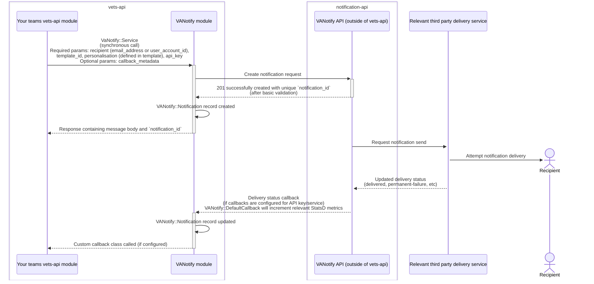
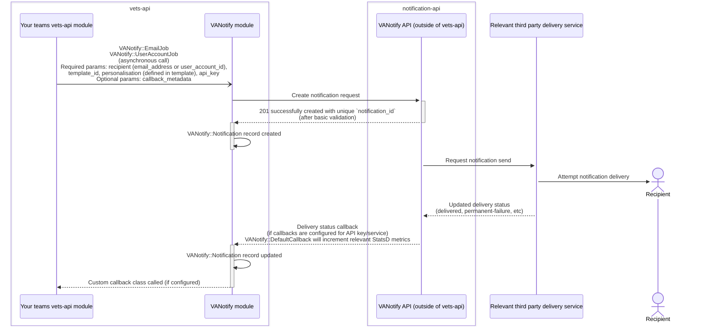

<a id="top"></a>

| Table of Contents |
|---|
| [Introduction](#vanotify) |
| [Using `VANotify::Service` class directly (inline)][3] |
| [Using one of our Sidekiq wrapper classes (async sending)][4] |
| [API key details][5] |
| [Zero Silent Failure (ZSF) Initiative][6] |
| [Default Callbacks][1] |
| [Custom Callbacks][2] |
| [Delivery Status Reference][9] |
| [Contact us][8] |

<br><br>

# VaNotify

VANotify enables internal VA teams and systems to integrate and send notifications to Veterans, their families, and the people who support them both inside and outside the VA.

This module will allow for teams inside `vets-api` to easily integrate with VaNotify.

Depending on which business line you fall under, you may need to have a new Service/API key setup for your use case. Reach out in the [#va-notify-public](https://dsva.slack.com/archives/C010R6AUPHT) channel if you have any questions. Service ID, Template ID, and API keys are specific to each env (prod, staging, etc.), so you will need to update the devops repo(s) to properly reference the correct values for each relevant env). https://depo-platform-documentation.scrollhelp.site/developer-docs/settings

There are several options for interacting with the `VaNotify` module

[Back to top][7]
<a id="inline"></a>
### Using the `VANotify::Service` class directly (inline/synchronous sending)

Example usage to send an email using the `VaNotify::Service` class (using a theoretical api_key)

Contact us in [#va-notify-public](https://dsva.slack.com/archives/C010R6AUPHT) if you're unsure if your team is setup with an api-key.

```ruby
# Observe the argument passed to new, specifically `your_va_notify_service_name_here`
notify_client = VaNotify::Service.new(Settings.vanotify.services.your_va_notify_service_name_here.api_key)

# send email using an email address
notify_client.send_email(
  {
    email_address: 'some_email@example.com',
    template_id: Settings.vanotify.services.your_va_notify_service_name_here.template_id.some_template_name,
    personalisation: { # using the British-English spelling
      'fname' => 'first_name',
      'date_submitted' => '01/02/2023',
    }
  }
)

# send email using an ICN (utilizing MPI/VA Profile)
notify_client.send_email(
  {
    recipient_identifier: { id_value: 'ICN_VALUE_HERE', id_type: 'ICN' },
    template_id: Settings.vanotify.services.your_va_notify_service_name_here.template_id.some_template_name,
    personalisation: {
      'fname' => 'first_name',
      'date_submitted' => '01/02/2023',
    }
  }
)
```

Please note the spelling of the `personalisation` param.

Example sequence flow when utilizing `VaNotify::Service`.



[Back to top][7]
<a id="wrapper"></a>
### Using one of our wrapper Sidekiq class (async sending)

Example usage to send an email using the `VANotify::EmailJob` (there is also a `VANotify::UserAccountJob` for sending via an ICN, [without persisting or logging the ICN](#misc)).
This class defaults to using the va.gov service's api key but you can provide your own service's api key as show below.

```ruby
    VANotify::EmailJob.perform_async(
      email,
      Settings.vanotify.services.your_vanotify_service_name_here.template_id.your_template_id_here,
      {
        'first_name' => parsed_form.dig('veteranFullName', 'first')&.upcase.presence,
        'date_submitted' => Time.zone.today.strftime('%B %d, %Y'),
        'confirmation_number' => guid
      },
      Settings.vanotify.services.your_vanotify_service_name_here.api_key
    )
```

Example sequence flow when utilizing one of VANotify's sidekiq jobs (`VANotify::EmailJob` or `VANotify::UserAccountJob`).



### API key details

Api keys need to be structured using the following format:
`NAME_OF_API_KEY-YOUR_VANOTIFY_SERVICE_UUID-API_KEY`

- `NAME_OF_API_KEY` - VANotify's internal name for your api key (Usually provided with key; if not, see [below](#name-of-api-key))
- `YOUR_VANOTIFY_SERVICE_ID` - The UUID corresponding to your VANotify service
- `API_KEY` - Actual API key

Example for a VANotify service with the following attributes:

- Name of Api key: `foo-bar-normal-key`
- VANotify Service id: `aaaaaaaa-aaaa-aaaa-aaaa-aaaaaaaaaaaa`
- Api key: `bbbbbbbb-bbbb-bbbb-bbbb-bbbbbbbbbbbb`

Expected format: `foo-bar-normal-key-aaaaaaaa-aaaa-aaaa-aaaa-aaaaaaaaaaaa-bbbbbbbb-bbbb-bbbb-bbbb-bbbbbbbbbbbb`

#### Name of API Key

The value to use for the `NAME_OF_API_KEY` is typically provided when the API Key is issued.

If this value is not known, please reach out via [#va-notify-public](https://dsva.slack.com/archives/C010R6AUPHT) and request the "api key name and type" and share the service_id of your VANotify service in you request.

Once an api_key name and type is shared, details regarding API key type can be found in the VANotify Portal under `/developers/technical_information`

Please reach out via [#va-notify-public](https://dsva.slack.com/archives/C010R6AUPHT) if you have any questions.

### Misc

ICNs are considered PII and therefore should not be logged or stored. https://depo-platform-documentation.scrollhelp.site/developer-docs/personal-identifiable-information-pii-guidelines#PersonalIdentifiableInformation(PII)guidelines-NotesandpoliciesregardingICNs

[Back to top][7]
# Zero Silent Failures Initiative

Providing some additional context around using VA Notify in `vets-api` and preventing silent failures for notifications

## VA Notify Error Classifications

### API Requests - System Availability, Request Authorization, and Data Validation

When a client makes an API call to VA Notify, the API first authorizes the request, and then confirms all required fields are present and in the appropriate format. Once this has been validated, the API will return a success code and notification_id, ending the transaction. You should save that notification_id for troubleshooting, and future status updates. From there, the notification proceeds to a delivery workflow.

### Notification Delivery - Contact Lookups and Deliverability

Our delivery workflow includes retries for errors that may be temporary in nature, like service availability. If your API request includes a recipient_identifier, then VA Notify kicks off our lookup integrations. First, we use MPI to do a deceased check and identify the correlated VA Profile ID. Once we have the VA Profile ID, we use VA Profile to retrieve the email address on file for the Veteran. If there are issues finding the Veteran’s profile or contact information, then VA Notify is unable to deliver the notification. This would indicate that the Veteran needs an alternative communication method or an updated email address. If an email address is successfully retrieved or the API request includes the email address directly, then the notification moves on to delivery via our email provider.

There are a couple of reasons that can cause an email notification to fail such as hard bounces and soft bounces. Hard bounces indicate a permanent failure due to an invalid, unreachable email address. Soft bounces indicate a temporary failure. However, there’s many reasons for soft bounces, some of which require manual effort by the recipient or recipient’s organization if they are utilizing a managed email service (e.g. a work email). Email settings could be blocking these notifications from being delivered. If your notification continues to soft bounce, it’s unlikely to succeed with more send attempts.

## API Requests - VA system to system communication.

### VA Notify provides a Rails module that exposes two ways of integrating.

1. Service class - eg `VaNotify::Service.new(Settings.vanotify.services.your_va_notify_service_name_here.api_key).send_email(some_args)` basic example [here](https://github.com/department-of-veterans-affairs/vets-api/tree/master/modules/va_notify#using-the-service-class-directly-inlinesynchronous-sending).
2. Prebuilt sidekiq jobs eg `VANotify::EmailJob.perform_async(some_args)` basic example [here](https://github.com/department-of-veterans-affairs/vets-api/tree/master/modules/va_notify#using-the-wrapper-sidekiq-class-async-sending).

Using option #1:

- The VA Notify service class operates synchronously and will raise an exception whenever a request to the VA Notify API fails.
  - If you are using the `VANotify::Service` class to process the user's request inline (like a form submission) the exception will propagate up through the application (unless you have error handling that catches the failure) and cause the entire request to fail (which will then show the user an error message).
  - If you are using the `VANotify::Service` class within your own sidekiq job, a VA Notify error will cause your sidekiq job to retry (unless you have error handling that catches the failure). You will need to have your own error handling in place to handle this scenario.

Using option #2:

- Invoking the sidekiq job via `.perform_async` - because this is an async call it will not fail inline.
- The sidekiq job could fail when it is picked by a sidekiq worker - if the job fails for any reason it will automatically [retry](https://github.com/department-of-veterans-affairs/vets-api/blob/master/modules/va_notify/app/sidekiq/va_notify/email_job.rb#L7) If the job continues to fail it will eventually go to the dead queue (visible in the [sidekiq dashboard](https://api.va.gov/sidekiq/morgue) and this Datadog [dashboard](https://app.ddog-gov.com/sb/f327ad72-c02a-11ec-a50a-da7ad0900007-260dfe9b82780fef7f07b002e4355281)).

---

[Back to top][7]

### VA Notify Callback Integration Guide for Vets-API

### Are you using our custom callbacks solution for the first time?

If so, please [CONTACT US](https://dsva.slack.com/archives/C010R6AUPHT) so we can configure a bearer token for your team/service.

#### Details

To effectively track the status of individual notifications, VA Notify provides service callbacks. These callbacks allow you to determine if a notification was successfully delivered or if it failed.

#### Why Teams Need to Integrate with Callback Logic

A successful request to the VA Notify API does **not** guarantee that the recipient will receive the notification.

Similarly, a failure to receive a response in your custom callback class does not **specifically** signify failure to deliver a notification.

Properly configured callbacks are crucial because they provide updates on the actual delivery status of each notification sent.

Without callbacks, a team would be unaware of issues that may arise during the delivery process, such as:
  - email hard bounces
  - soft bounces
  - other delivery problems

Integrating callback logic allows teams to:

- Monitor delivery success rates and identify issues
- Improve user experience by taking timely corrective actions when notifications fail
- Maintain compliance and consistency in Veteran communications
- Ensure that alternative contact methods can be utilized in case of persistent issues

#### How Teams Can Integrate with Callbacks

Reminder: [Flippers](https://depo-platform-documentation.scrollhelp.site/developer-docs/flipper-ui-access) can help alleviate issues during rollout


**Option 1: Default Callback Class**
<a id="default-callback"></a>

The Default Callback Class offers a standard, ready-to-use implementation for handling callbacks

Here are 2 example implementations, both using a Hash of `callback_options`:

```rb
# define the callback_options

callback_options = {
    callback_metadata: {
      notification_type: 'error',
      form_number: 'ExampleForm1234',
      statsd_tags: { service: 'DefaultService', function: 'DefaultFunction' }
    }
}

# VANotify::EmailJob (also used for VANotify::UserAccountJob)
# Must specify email, template_id, personalisations, API key, callback_options

VANotify::EmailJob.perform_async(
  user.va_profile_email,
  template_id,
  get_personalisation(first_name),
  Settings.vanotify.services.your_va_notify_service_name_here.api_key,
  callback_options #from above
)

# VANotify::Service
# must specify API key, callback_options

notify_client = VaNotify::Service.new(Settings.vanotify.services.your_va_notify_service_name_here.api_key, callback_options) # from above

notify_response = notify_client.send_email(....)
```

**Option 2: Custom Callback Handler**
<a id="custom-callback"></a>

The Custom Callback Handler allows teams to create a bespoke solution tailored to their specific requirements. This approach offers complete control over how delivery statuses are processed and logged.

Example Implementation

Step 1: Create a Callback Handler Class: Define a class in your module to handle callbacks, which must implement a class-level method `.call`.

```rb
# MUST be accessible from an autoloaded directory; Rails.autoloaders.main.dirs

module ExampleTeam
  class CustomNotificationCallback
    def self.call(notification)
      case notification.status
      when 'delivered'
        # success
        StatsD.increment('api.vanotify.notifications.delivered')
      when 'permanent-failure', 'temporary-failure'
        # delivery failed
        # possibly log error or increment metric and use the optional metadata - notification_record.callback_metadata
        # temporary-failure is considered an end-state and will not be retried
        StatsD.increment('api.vanotify.notifications.permanent_failure')
        Rails.logger.error(notification_id: notification.notification_id, source: notification.source_location,
                           status: notification.status, status_reason: notification.status_reason)
      else
        StatsD.increment('api.vanotify.notifications.other')
        Rails.logger.error(notification_id: notification.notification_id, source: notification.source_location,
                           status: notification.status, status_reason: notification.status_reason)
      end
    end
  end
end
```

Step 2: Integrate Callback Logic in Notification Triggers: Behind a feature flag, choose one of your notification triggers and update the way you are invoking VA Notify to pass in your callback data.

Here is an example:

```rb
# VANotify::EmailJob or VANotify::UserAccountJob

if Flipper.enabled?(:custom_callback_handler)
  VANotify::EmailJob.perform_async(
    user.va_profile_email,
    template_id,
    get_personalization(first_name),
    Settings.vanotify.services.your_va_notify_service_name_here.api_key,
    { callback_klass: 'ExampleTeam::CustomNotificationCallback', callback_metadata: {  statsd_tags: { service: 'ExampleTeam' } } }
  )
else
  # Default logic
end
```

---

#### Behind the Scenes: How Callbacks Work

Here's a high-level overview of what happens behind the scenes when using VA Notify callbacks:

1. Notification Sending: When a notification is sent via the VA Notify API, a notification_id is generated and returned. This ID should be saved to track the delivery status.

2. Delivery Processing: VA Notify attempts to deliver the notification using its internal delivery workflow. This includes retries for temporary issues and contact lookups if an ICN is used.

3. Callback Triggered: As the delivery progresses, VA Notify sends status updates to the configured callback URL. Updates may include statuses like "delivered," "failed," or "temporary failure" (an end-state).

4. Processing Callback: Your application receives the callback and processes it to determine if further action is needed—such as notifying the user of a failed delivery, retrying, or marking the notification as successfully delivered.

5. Monitoring: Metrics and logs capture the outcome for reporting and troubleshooting.

---

#### Delivery Status Reference

Refer to the [VA Notify Error Status Mapping Table](https://github.com/department-of-veterans-affairs/vanotify-team/blob/main/Support/error_status_reason_mapping.md#error-table) for detailed status codes and their meanings.

---

#### Module changes

If the `va_notify` module does not provide the functionality you need feel free to reach out to us and explain what your team needs. While we can't guarantee that every request will be implemented, we will thoughtfully consider each request and do our best to accommodate your team without causing unintended issues for other teams.

---

#### Contact Us

If you need any further clarification or help during the integration process, feel free to reach out:

- Slack Channel: [#va-notify-public](https://dsva.slack.com/archives/C010R6AUPHT)

[Back to top][7]

[1]: #default-callback
[2]: #custom-callback
[3]: #inline
[4]: #wrapper
[5]: #api-key-details
[6]: #zero-silent-failures-initiative
[7]: #top
[8]: #contact-us
[9]: #delivery-status-reference