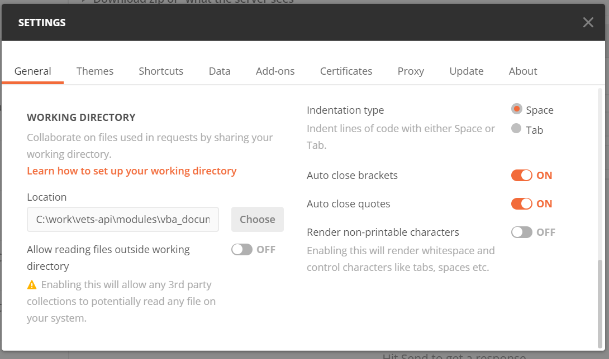
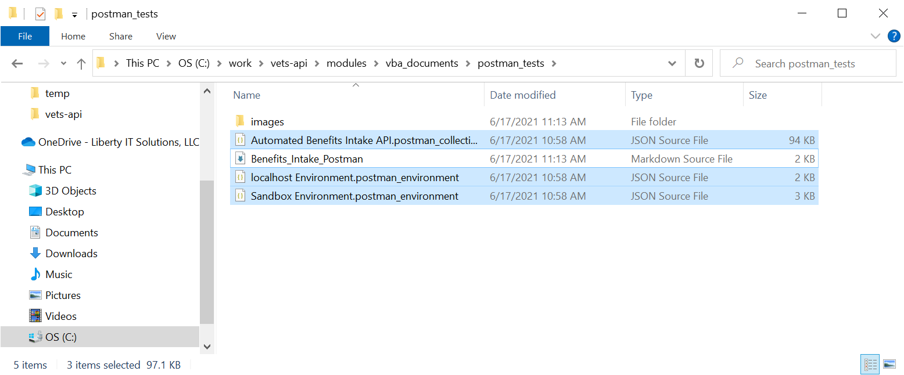
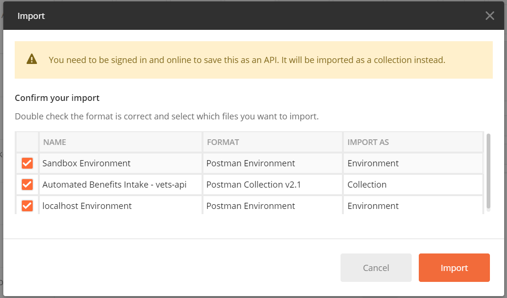
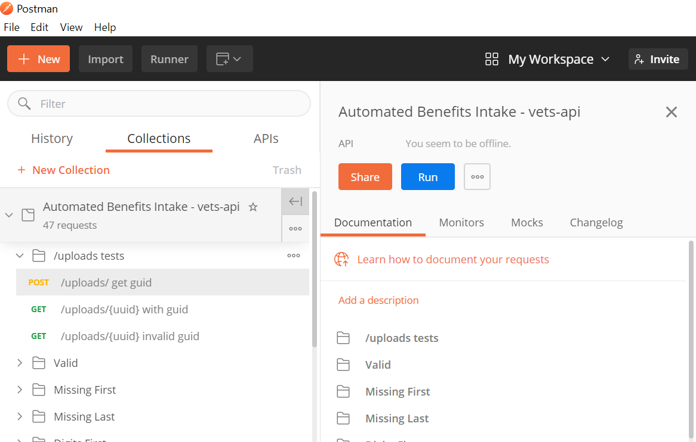

# Postman Setup

### Setting the working directory
The Benefits Intake API uploads files so you'll need to set the working directory for 
Postman to know where the files are. To do so, go to File -> Settings. Most testing 
files are in the following directory: `vets-api/modules/vba_documents/spec/fixtures`

### Importing collections and environments
You'll need to select Import and drag the files from their Github locations:
- `vets-api/modules/vba_documents/postman_tests/Automated Benefits Intake API.postman_collection`
- `vets-api/modules/vba_documents/postman_tests/localhost Environment.postman_environment`
- `vets-api/modules/vba_documents/postman_tests/Sandbox Environment.postman_environment`

### Saving changes to git
Updates to Postman files will have to be exported as JSON files to the 
correct location in git and **then** committed. Postman has cloud syncing capabilities; however, 
it doesn't integrate into a git repo and costs money.

### Setting the apikey
These APIs use an apikey to authorize requests. After importing the environments, 
you'll need to place your apikey in each environment you want to use.

**NOTE:** If you are saving changes to git, make sure to remove your apikey before
 committing changes

## Running a collection
Hover over a collection -> click the 3 dots -> Run collection or your version may look like the screen shot below.

Make sure you have the desired Environment selected.

From the collection runner, you can select which requests to run. For example, if 
I only want to upload a valid file to the Benefits Intake API for debugging purposes, 
I can Deselect All and select only the following requests:
- POST /uploads/ - location
- PUT /paths - upload valid document to location
- GET /uploads/{uuid} valid

**NOTE:** check the Save Responses checkbox to be able to view the results of the 
collection runner.

Hit Run and the runner will perform each request and run the respective tests.