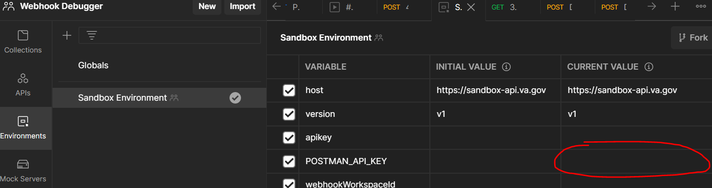
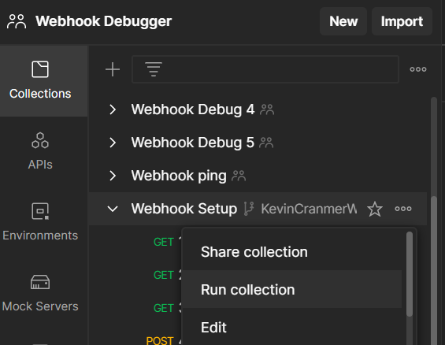
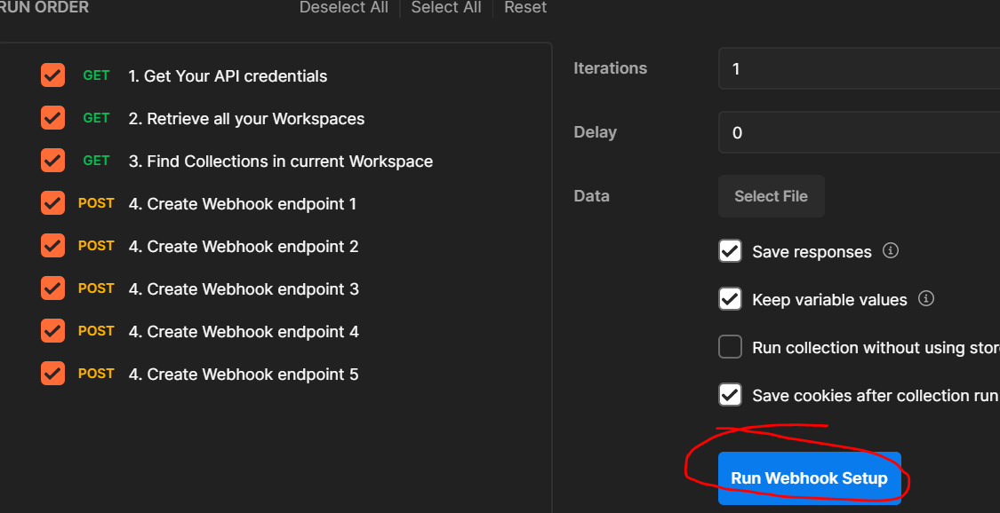
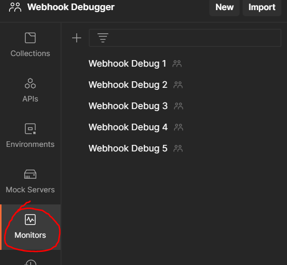

##Note: Webhooks are still in development. The testing files will be updated once the request/response data is designed.
# Webhook Testing Guide

Utilizing Postman, we can create and send webhook URLs to our Benefits 
Intake API and verify that our webhook implementation is sending the 
correct responses back to the provided URLs.

### 1. Create a new Postman workspace name "Webhook Debugger"
Create a new Postman workspace. The new workspace HAS to be named 
"Webhook Debugger" in order for the setup to work automatically.

### 2. Import relevant collections/environments
Import all collections in this directory into your new workspace. 
Import the environment files from /vets-api/modules/vba_documents/postman_tests

### 3. Generate your postman API key
Create your own API key in your [settings page](https://postman.co/settings/me/api-keys). 
Then, past your API key in the POSTMAN_API_KEY variable in your environment:

### 4. Run the Webhook Setup collection
Running this collection will create 5 webhook URL endpoints that we 
will use to send to our Benefits Intake API.

### 5. Verify the Monitors were created
Close and re-open Postman to refresh. Then check Monitors; there should be 5. 
These are essentially http servers that will be receiving the webhook responses.

### 6. Send a Benefits Intake request
First, we have to set some variables. Set the number of webhook urls you 
want to test (1-5) in the environment variables num_webhook_urls. Set your
 vets-api apikey in the apikey variable.

Then run the Benefits Intake Webhook test collection. Same as we did for the Webhook 
Setup collection. You can view the Monitors to see the different test cases.

### Testing the webhook setup
Running the Webhook ping collection will send a dummy response to num_webhook_urls 
of the monitors to verify if the setup was completed successfully.

